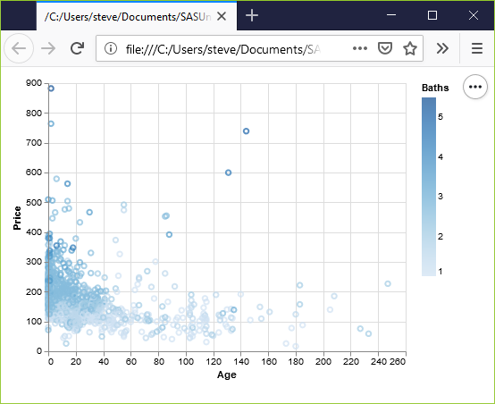
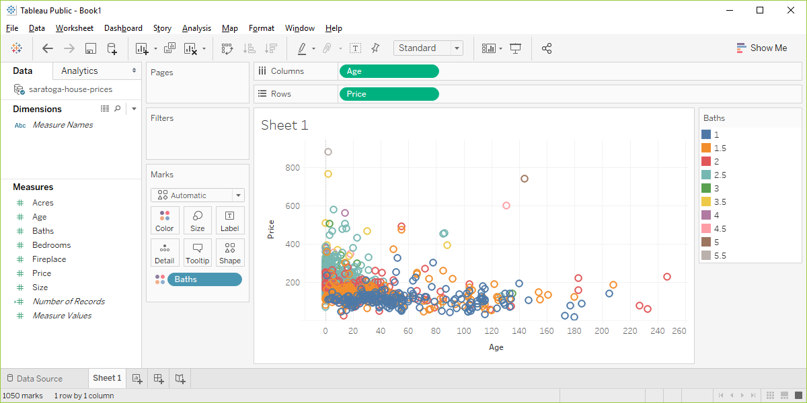

```{r child="../../common-files/src/component-header.Rmd"}
```

### Exercise, change the color
+ Use the Saratoga housing data set.
+ Draw a plot of all of the data where
  + X=Age,
  + Y=Price,
  + Color=Bathrooms.
  
<div class="notes">

Revisit your scatterplot. Draw a plot with x representing the age of the house, y representing the price, and the color representing the number of bathrooms.

</div>

### Exercise, Python code
+ Here's the Python code.
```
ch2 = alt.Chart(df).mark_point().encode(
  x="Age", y="Price", color="Baths")
```

### Exercise, Python output



### Exercise, R code
+ Here's the R code.
```
ggplot(saratoga_houses, aes(x=Age, y=Price)) + 
  geom_point(aes(color=factor(Bathrooms)))
```

### Exercise, R output

```{r bathroom-colors}
load("../../common-files/data/houses.RData")
initiate_image()
ggplot(saratoga_houses, aes(x=Age, y=Price)) + 
  geom_point(aes(color=factor(Bathrooms)))
finalize_image("R scatterplot mapping bathrooms to color")
```

`r display_image`

### Exercise, Tableau output



