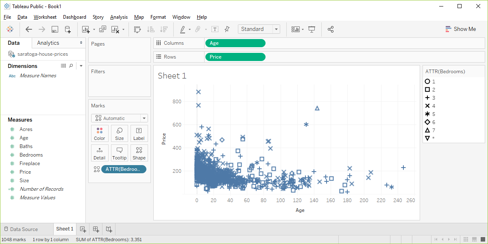

```{r echo=FALSE}
knitr::opts_chunk$set(echo = FALSE)
source("../../common-files/src/setup.R")
```

```{r}
if (!exists("redraw_graphs")) redraw_graphs <- FALSE
```

### Exercise, change the shape

+ Use the Saratoga housing data set.
+ Draw a plot of all of the data where
  + X=Age,
  + Y=Price,
  + Symbol=number of bedrooms.
  
<div class="notes">

Revisit your scatterplot. Draw a plot with x representing the age of the house, y representing the price, and the symbol representing the number of bedrooms.

</div>

### Exercise, Python code 
+ Here's the Python code.

```{}
ch5 = alt.Chart(df).mark_point().encode(
      x='Age',y='Price', shape='Bedrooms:N')
```

### Exercise, Python output


### Exercise, R code 
+ Here's the R code.

```{}
ggplot(saratoga_houses, aes(x=Age, y=Price)) + 
  geom_point(aes(shape=factor(Bedrooms)))
```

### Exercise, R output

```{r shape-bedrooms}
initiate_image()
ggplot(saratoga_houses, aes(x=Age, y=Price)) + 
  geom_point(aes(shape=factor(Bedrooms)))
finalize_image("R scatterplot mapping bedrooms to shape")
```

`r display_image`

<div class="notes">

Here is what the R graph looks like. I don't particularly like this graph. It is confusing, especially with all the overprinting.

</div>

### Exercise, Tableau output



<div class="notes">

Here are the steps in Tableau. First revert to the earlier scatterplot where Age is in the Column fields and Price is in the Rows field. Then drag and drop Bedrooms on top of the Shape icon. Change from SUM(Bedrooms) to ATTR(Bedrooms). 

</div>
