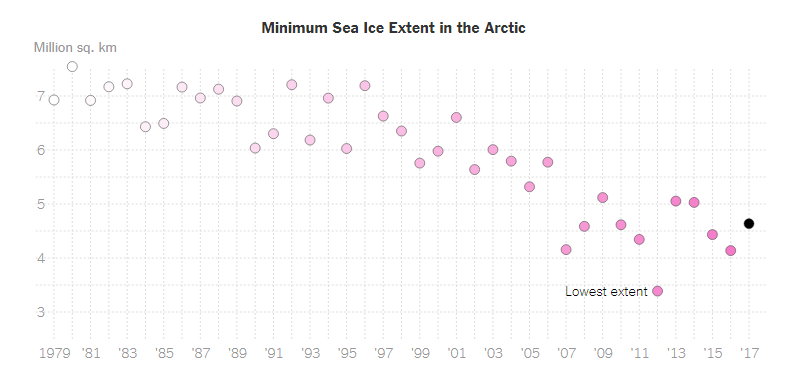

### Group exercise (1 of 2)

This one of two graphs that you saw earlier. It was published in

Popvich, N., Fountain, H., & Pearce, A. (2017, September 22). We Charted Arctic Sea Ice for Nearly Every Day Since 1979. You’ll See a Trend. - The New York Times. The New York Times. Retrieved from https://www.nytimes.com/interactive/2017/09/22/climate/arctic-sea-ice-shrinking-trend-watch.html

Split into pairs. Review the article briefly (about 5 minutes) and look at the graph. Explain to your partner what the graph is trying to show. Your partner will get a different graph and do the same thing with you listening this time.

### Group exercise (2 of 2)

This is one of two graphs that you saw earlier. It was published in 

Kevin Litman-Navarro. We Read 150 Privacy Policies. They Were an Incomprehensible Disaster. The New York Times. Retrieved from https://www.nytimes.com/interactive/2019/06/12/opinion/facebook-google-privacy-policies.html

Split into pairs. Review the article briefly (about 5 minutes) and look at the graph. Explain to your partner what the graph is trying to show. Your partner will get a different graph and do the same thing with you listening this time.

### In small groups

+ Read the article associated with your graph
+ Review your graph
+ Identify what aesthetics were used
  + Location
  + Color
  + Shape
  + Size
+ What asesthetics were not used?
+ What variables are associated with what aesthetics?
  

There is a newspaper article associated with the graph you have been given. Read the newspaper article and then look at the graph again. Try to summarize briefly what message the authors were trying to convey with this graph.

