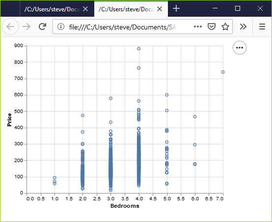

```{r echo=FALSE}
knitr::opts_chunk$set(echo = FALSE)
source("../../common-files/setup.R")
```

### Basic exercise - location

+ Use the Saratoga housing data set.
+ Revise the plot so that the location of the points represents x=Bedrooms and Y=Price.

### Here's the Python code

Here's the Python code.

```{}
ch4 = alt.Chart(df).mark_point().encode(
      x='Bedrooms',y='Price')
```

### Here's the result in Python



### Here's the R code

```{}
ggplot(saratoga_houses, aes(x=Bedrooms, y=Price)) + 
  geom_point())
```

### Here's the result in R

```{r}
f <- "https://dasl.datadescription.com/download/data/3275"
saratoga_houses <- read.table(f, header=TRUE, sep="\x09")
saratoga_houses$i <- 1:1057
```


```{r bedrooms-and-price}
initiate_image()
ggplot(saratoga_houses, aes(x=Bedrooms, y=Price)) + 
  geom_point()
finalize_image("Scatterplot of bedrooms and price")
```

`r display_image`

### Here are the results in Tableau.


<div class="notes">

In Tableau, click on Age in the Columns field and choose the remove option. The graph looks a bit weird with no columns, but ignore it. Drag Bedrooms over to the Columns field. Tableau wants to use a sum, but you want individual data points. So click on SUM(Bedrooms) and change it to a Dimension.

</div>
