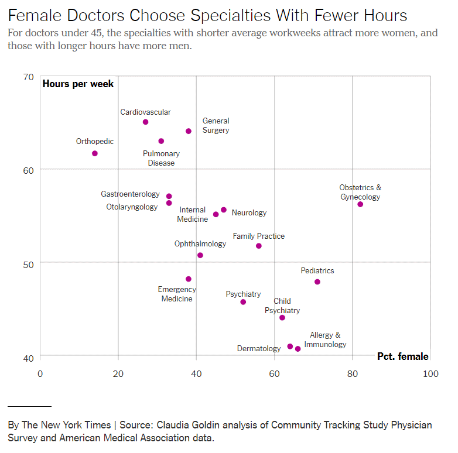

### Group exercise
+ Review one of these graphs/newspaper articles
  + [We Charted Arctic Sea Ice for Nearly Every Day Since 1979. You’ll See a Trend.](https://www.nytimes.com/interactive/2017/09/22/climate/arctic-sea-ice-shrinking-trend-watch.html)
  + [We Read 150 Privacy Policies. They Were an Incomprehensible Disaster.](https://www.nytimes.com/interactive/2019/06/12/opinion/facebook-google-privacy-policies.html)
  + [How Medicine Became the Stealth Family Friendly Profession.](https://nytimes.com/2019/08/21/upshot/medicine-family-friendly-profession-women.html)
+ What is the message? Summarize in 25 words or less.

The following images are taken from various newspaper articles or press releases. Look at the graph and read/skim the article.

What message do you think the journalist is trying to convey with this graph. Summarize this message in 25 words or less.

### Graphs in the news, Arctic ice levels

This image was found in a newpaper article, 

Popvich, N., Fountain, H., & Pearce, A. (2017, September 22). We Charted Arctic Sea Ice for Nearly Every Day Since 1979. You’ll See a Trend. - The New York Times. The New York Times. Retrieved from https://www.nytimes.com/interactive/2017/09/22/climate/arctic-sea-ice-shrinking-trend-watch.html

### Graphs in the news, Privacy policies

This image was found in a newpaper article, 

Kevin Litman-Navarro. We Read 150 Privacy Policies. They Were an Incomprehensible Disaster. The New York Times. Retrieved from https://www.nytimes.com/interactive/2019/06/12/opinion/facebook-google-privacy-policies.html

### Graphs in the news, Family friendly profession

This image was found in a newpaper article, 

Claire Cain Miller (2019, August 21). How Medicine Became the Stealth Family Friendly Profession. The New York Times. Retrieved from https://nytimes.com/2019/08/21/upshot/medicine-family-friendly-profession-women.html

### In small groups

+ Read the article associated with your graph
+ Review your graph
+ In 25 words or lesss
  + What is the message of this graph?
  

There is a newspaper article associated with the graph you have been given. Read the newspaper article and then look at the graph again. Try to summarize briefly what message the authors were trying to convey with this graph.

