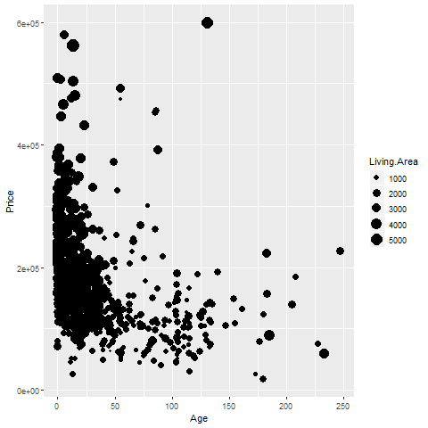
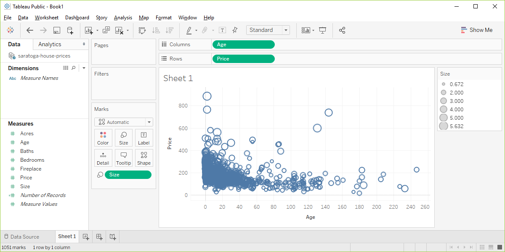

```{r echo=FALSE}
knitr::opts_chunk$set(echo = FALSE)
source("../../common-files/src/setup.R")
```

### Basic exercise - size

+ Use the Saratoga housing data set.
+ Draw a plot where the location is x=Age and y=Price and the size represents the living area.

### Here's the Python code.

```{}
ch6 = alt.Chart(df).mark_point().encode(
      x='Age',y='Price', size='Size')
```


### Here's the result in Python.


### Here's the R code.

```{}
ggplot(saratoga_houses, aes(x=Age, y=Price)) + 
  geom_point(aes(size=Living.Area))
```

### Here's the result in R.

```{r}
f <- "https://dasl.datadescription.com/download/data/3275"
saratoga_houses <- read.table(f, header=TRUE, sep="\x09")
saratoga_houses$i <- 1:1057
```

```{r size-living-area}
initiate_image()
ggplot(saratoga_houses, aes(x=Age, y=Price)) + 
  geom_point(aes(size=Living.Area))
finalize_image("R graph using size to represent Living Area")
```



### Here's the result in Tableau.



