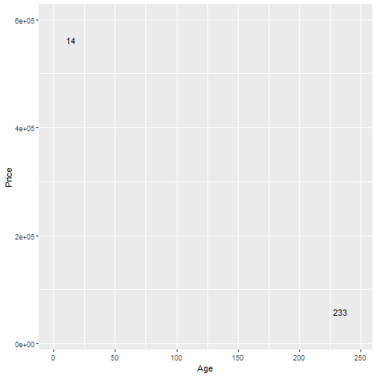
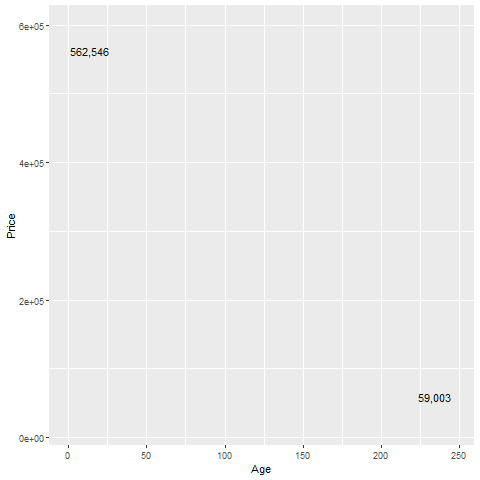
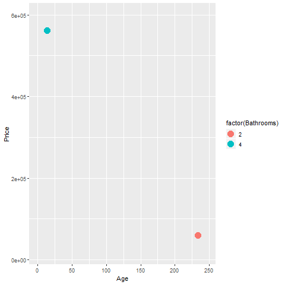

```{r setup-v01-main-lecture, echo=FALSE}
knitr::opts_chunk$set(echo = FALSE)
suppressMessages(suppressWarnings(library(ggplot2)))
suppressMessages(suppressWarnings(library(knitr)))
suppressMessages(suppressWarnings(library(magrittr)))
pd_text <- "This image was produced by Steve Simon and is placed in the public domain. You are welcome to use this image any way you see fit. An acknowledgement would be appreciated, but is not required."
initiate_image <- function() {
  fn <- opts_current$get("label")
  png(filename=paste0("../images/", fn, ".png"))
  return(fn)
}
finalize_image <- function() {
  quiet <- dev.off()
  write(pd_text, file=paste0("../images/", fn, ".txt"))
}
```


### Review basic scatterplot

+ Python code

```{}
ch = alt.Chart(df).mark_point().encode(
    x='Age', y='Price'
)
```

+ R code

```{}
ggplot(saratoga_houses, aes(x=Age, y=Price)) +
  geom_point()
```

+ Tableau
  + (Drag and drop)
  
<div class="notes">

You've already drawn a basic scatterplot in Python, R, or Tableau. All three systems choose a slightly different visualization, but, for the most part, the graphs look fairly nice. You can change some of those default options.

</div>

### Changing default options

+ Python code

```{}
.mark_point(shape="square", color="green").
```

+ R code

```{}
geom_point(shape="square", color="green")
```

+ Tableau
  + (Drag and drop)
  
<div class="notes">

In Python, you can change the default from blue circles to green squares in the mark_point function. In R, you do this inside the geom_point function. In Tableau, you have to click on the color and shape buttons to change the defaults.

</div>

### Basic exercise - global modifications
+ Use the Saratoga housing data set.
+ Try the suggested changes to the defaults and see what the visualization looks like.
+ Try changing the size of the points.

### Aesthetics for points - location (1 of 2)

```{r point-aesthetics-x}
fn <- "point-aesthetics-x"
f <- "https://dasl.datadescription.com/download/data/3275"
saratoga_houses <- read.table(f, header=TRUE, sep="\x09")
png(filename=paste0("../images/", fn, ".png"))
x <- c(212, 103)
x_range <- range(saratoga_houses$Age)
y_range <- range(saratoga_houses$Price)
g <- ggplot(saratoga_houses[x, ], aes(x=Age, y=Price)) + 
  expand_limits(x=x_range) +
  expand_limits(y=y_range)
g + geom_text(aes(label=Age))
quiet <- dev.off()
write(pd_text, file=paste0("../images/", fn, ".txt"))
```



<div class="notes">

This plot show only two data points, and is labeled with the variable age, corresponding to the X location.

The point in the upper left corner is a young house, only 14 years old. The point in the lower right corner is an old house, 233 years old.

</div>

### Aesthetics for points - location (2 of 2)

```{r point-aesthetics-y}
fn <- "point-aesthetics-y"
png(filename=paste0("../images/", fn, ".png"))
g + geom_text(aes(label=format(Price, big.mark=",")))
quiet <- dev.off()
write(pd_text, file=paste0("../images/", fn, ".txt"))
```



<div class="notes">

This plot is labeled with the variable Price, corresponding to the Y location.

The point in the upper left corner is an expensive house, over a half million dollars. The point in the lower right corner is a cheap house, about one-tenth of the price.

</div>

### Basic exercise - location
+ Use the Saratoga housing data set.
+ Revise the plot so that the location of the points represents x=Bedrooms and Y=Price.

```{r include-exercise-location, child="component/exercise-location.Rmd"}
```


### Aesthetics for points - shape

```{r point-aesthetics-shape}
fn <- "point-aesthetics-shape"
png(filename=paste0("../images/", fn, ".png"))
g + 
  geom_point(aes(shape=factor(Bedrooms)), size=5)
quiet <- dev.off()
write(pd_text, file=paste0("../images/", fn, ".txt"))
```


<div class="notes">

The house in the upper left corner has four bedrooms, and the house in the lower right corner has five bedrooms. You use circles and triangles to designate this and the legend on the right hand side tells you how to decipher the symbols.

I want to note here that this plot is effectively showing three dimensions, Age, Price, and Bedrooms, even though it is restricted to a two dimensional screen.

I also want to point out that this may not be the best way to visualize the relationship among these three variables.

</div>

### Basic exercise - shape
+ Use the Saratoga housing data set.
+ Draw a plot of all of the data where the location is x=Age and y=Price and the symbol represents the number of bedrooms.

### Aesthetics for points - size

```{r point-aesthetics-size}
fn <- "point-aesthetics-size"
png(filename=paste0("../images/", fn, ".png"))
g + 
  geom_point(aes(size=Living.Area))
quiet <- dev.off()
write(pd_text, file=paste0("../images/", fn, ".txt"))
```


<div class="notes">

You can also use the size of a point to represent a third dimension. Here is a plot where the larger house, the house with more living area has a big circle and the house with less living area has a small circle. 

</div>

### Basic exercise - size
+ Use the Saratoga housing data set.
+ Draw a plot where the location is x=Age and y=Price and the size represents the living area.

### Aesthetics for points - color (1 of 2)

```{r point-aesthetics-color-1}
fn <- "aesthetics-color-1"
png(filename=paste0("../images/", fn, ".png"))
g +
  geom_point(aes(color=factor(Bathrooms)), size=5)
quiet <- dev.off()
write(pd_text, file=paste0("../images/", fn, ".txt"))
```



<div class="notes">

This plot shows a blue point representing a four bathroom house in the upper left corner and an orange point representing a two bathroom house in the lower right corner.

</div>

### Aesthetics for points - color (2 of 2)

```{r point-aesthetics-color-2}
fn <- "aesthetics-color-2"
png(filename=paste0("../images/", fn, ".png"))
g +
  geom_point(aes(color=Living.Area), size=5)
quiet <- dev.off()
write(pd_text, file=paste0("../images/", fn, ".txt"))
```


<div class="notes">

Notice how the legend has changed.

</div>

### Basic exercise - color
+ Use the Saratoga housing data set.
+ Draw a plot where the location is x=Age and y=Price and the color represents the number of bathrooms.
