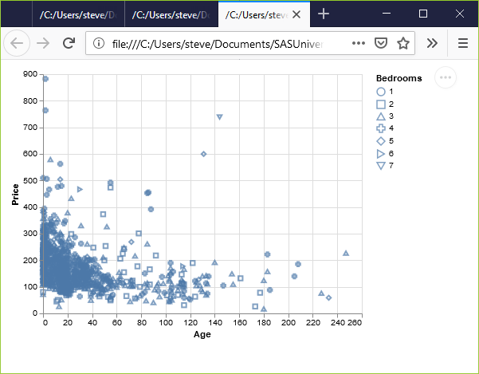
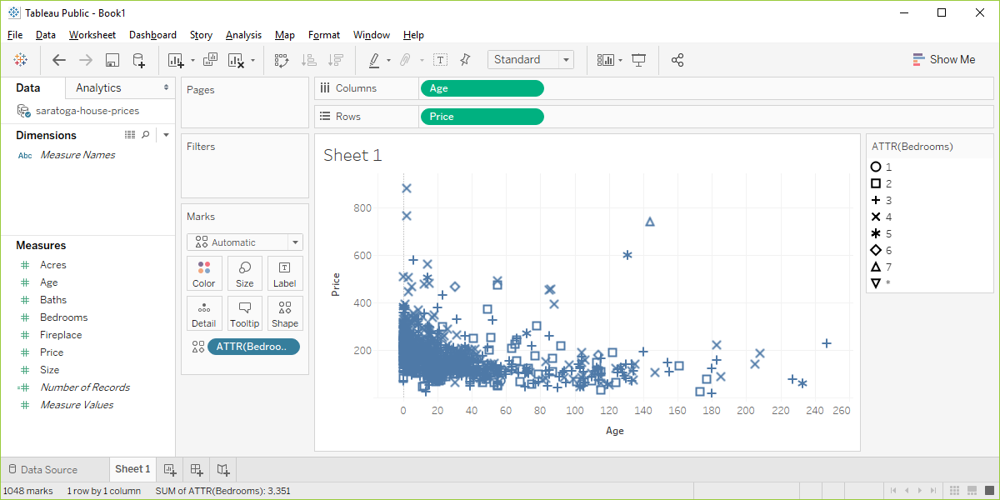

```{r setup, echo=FALSE}
knitr::opts_chunk$set(echo = FALSE)
suppressMessages(suppressWarnings(library(ggplot2)))
suppressMessages(suppressWarnings(library(magrittr)))
```


### Basic exercise - shape

+ Use the Saratoga housing data set.
+ Draw a plot of all of the data where the location is x=Age and y=Price and the symbol represents the number of bedrooms.

### Here's the Python code.

```{}
ch5 = alt.Chart(df).mark_point().encode(
      x='Age',y='Price', shape='Bedrooms:N')
```

### Here's the results in Python.



Here's the R code.

```{}
ggplot(saratoga_houses, aes(x=Age, y=Price)) + 
  geom_point(aes(shape=factor(Bedrooms)))
```

### Here's the results in R

```{r shape-bedrooms}
f <- "https://dasl.datadescription.com/download/data/3275"
saratoga_houses <- read.table(f, header=TRUE, sep="\x09")
saratoga_houses$i <- 1:1057
fn <- "r-shape-bedrooms"
png(filename=paste0("../images/", fn, ".png"))
ggplot(saratoga_houses, aes(x=Age, y=Price)) + 
  geom_point(aes(shape=factor(Bedrooms)))
quiet <- dev.off()
pd_text <- "This image was produced by Steve Simon and is placed in the public domain. You are welcome to use this image any way you see fit. An acknowledgement would be appreciated, but is not required."
write(pd_text, file=paste0("../images/", fn, ".txt"))
```


<div class="notes">

Here is what the R graph looks like. I don't particularly like this graph. It is confusing, especially with all the overprinting.

</div>

### Here 's the result in Tableau.



<div class="notes">

Here are the steps in Tableau. First revert to the earlier scatterplot where Age is in the Column fields and Price is in the Rows field. Then drag and drop Bedrooms on top of the Shape icon. Change from SUM(Bedrooms) to ATTR(Bedrooms). 

</div>
