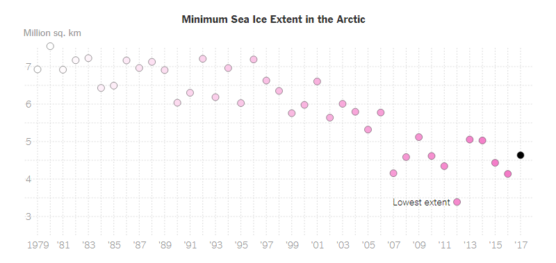
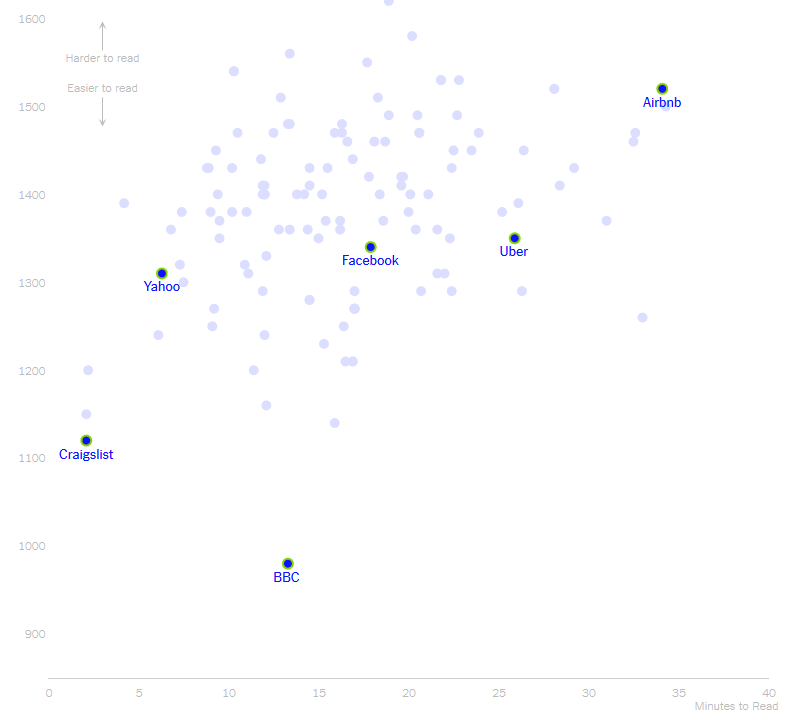
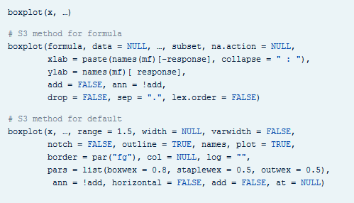
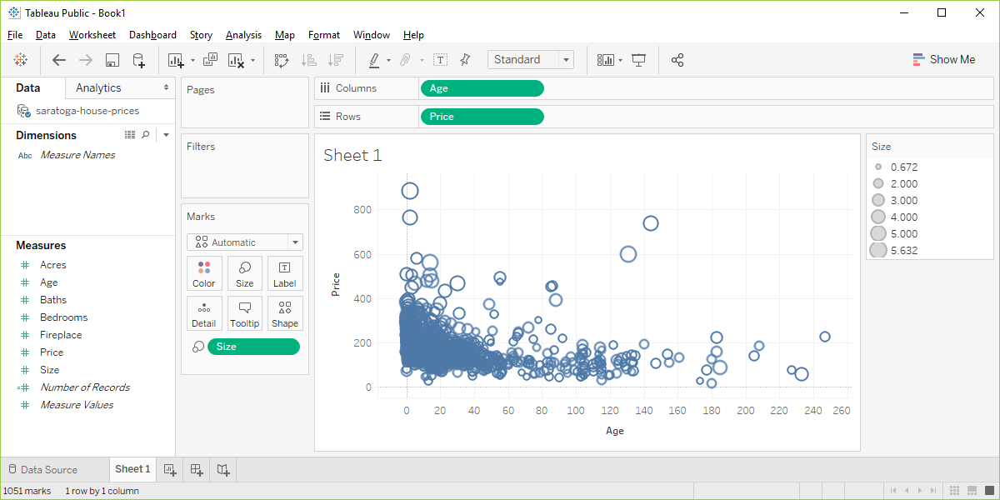

```{r setup, echo=FALSE}
knitr::opts_chunk$set(echo = FALSE)
suppressMessages(suppressWarnings(library(ggplot2)))
suppressMessages(suppressWarnings(library(magrittr)))
```

### About this class
+ Preparing for this lecture
+ Lecture
+ Basic exercises
+ Advanced exercises
+ Discussion questions
+ Short quizzes

<div class="notes">

This class is divided into several sections. 

Each section will start with information that you need to get ready before the class starts. Then there will be a lecture interspersed between basic exercises, advanced exercises, and discussion questions. 

The basic exercises involve running a short program, typically a one or two line modification of a program that I have just shown. These basic exercises are intended to slowly increase your comfort level with the visualization software (altair in Python, ggplot2 in R, or Tableau). Do the basic exercises on your own during the class. Warning: some of the visualizations you will be asked to produce will look terribly ugly. That's okay. You're just learning the basic programming steps for now. Later, you will see how to apply these steps to make better looking and more effective visualizations. 

Advanced exercises will require you to adapt the code to an entirely different data set. Do this in a group setting with others who are using the same visualization software as you. The advanced exercises will require the production of four or five different visualizations, so your group should adopt a "divide and conquer" strategy.

Discussion questions will involve small groups, or sometimes just pairs of individuals. You will see a typical media presention of a visualization along with the newspaper or magazine article that accompanies it. You and your group will discuss the visualization guided by a few questions provided here. Some groups may be asked to make a short presentation to the entire class.

You will get a short quiz at the end of the lecture. This will be multiple choice.

</div>

### Software agnosticism

+ This course will show examples using
  + Python,
  + R, and 
  + Tableau
+ I do not play favorites

<div class="notes">

I am a big believer in software agnosticism. That means that when I teach something, I teach it with the expectation that the software used to do the assignments is software of YOUR choosing. I have my own preferences, but those should not be your preferences.

It's a lot more work to teach a course that is not dependent on a particular software system, but I do not know what the best software choice would be for you. In this class, I will try to show examples using Python, R, and Tableau. I realize that there are other good choice, but I'm hoping that most of you will be happy with one of these three choices. Within Python, I will use the altair package. In R, I will use ggplot2. I realize that there are other graphics packages in these two languages, but altair and ggplot2 rely on modern graphics principles, so I will restrict my attention to these packages.

Tableau is a commercial product. If you don't currently have access to Tableau, the company offers a free version, Tableau Public. It has all the features of Tableau, but you have to store any data visualizations on a public server. That's just fine for someone like me who uses teaching examples with publicly available data sets. If you are using private or proprietary data, you need to pay the money for the commercial version.

</div>

### What software should you use?

+ Use the software you like best
+ What does your boss use?
+ What do your co-workers use?
+ What software are you most comfortable with?
  
<div class="notes">

If you are not sure what software package to use in this class, let me offer a few suggestions. First, your boss may have a strong opinion about what software that you should use. You can go to your boss and say "Steve Simon is a really smart guy and he says that the ggplot2 package in R is the best choice for data visualization." Try it and see what happens. Nothing, I suspect. One of the great tragedies in life is that the SSSS principle (Steve Simon Said So) carries very little weight in the real world.

If your boss doesn't care, see what most of your co-workers are using. They may not be as smart as I am (put on a false air of pride here) but they are a lot closer to your cubicle when this workshop ends and you have to find a quick answer.

There's also a comfort level here. Tableau develops its visualizations using a graphical user interface. Python and R are programming languages. A graphical interface is great for getting work done quickly. A programming language is great for reproducibility and reusability. What fits your working style better.

One more consideration. Some of you in this class are "ringers." You already know visualization better than I do because you've been doing it for longer, with bigger and more complex data sets. You're just here to see if I know one or two things that you don't already know. If you're a ringer, take the challenge of learning a new software system. It will keep you from getting too bored when I talk about all these things that you already know better than I do.

</div>

### To prepare for this section
+ Download and install Python, R, or Tableau
  + For R, also install the ggplot2 library
  + For Python, load the altair package
+ Go to the DASL website and review the "Housing Prices" data set
+ Import this data into Python, R, or Tableau
+ Draw a scatterplot with Age on the x-axis and Price on the y-axis.
  + Don't bother with changing any of the default options

<div class="notes">

Please do some work now, to get ready for the work in this section. If you do not already have Python, R, or Tableau installed on your computer, please do so now.

I want you to import a particular data file and draw a simple scatterplot.

</div>

### DASL https://dasl.datadescription.com/


<div class="notes">

DASL is an acronym for Data And Story Library. It used to sit on a website, Statlib, at Carnegie Mellon, but the company, Data Description, which makes a data analysis program, DataDesk, took over when the Statlib site went dark. It's a very nice site for small data sets useful for teaching.

I want to use a file on housing prices in Saratoga, New York, and you can find it through the search function on the main page. Look for housing or Saratoga, and you'll find it pretty quickly.

Note to myself: Try to keep this and every other image to no greater than 800 by 480.

</div>

### Choose "Saratoga House Prices" (not "Saratoga Houses")


  
<div class="notes">
  
There are two files actually, that look very similar. You want the "Saratoga House Prices" file and not the one called "Saratoga Houses". The Saratoga House Prices file has 1063 records and the variables are Price, Living.Area, Bathrooms, Bedrooms, Fireplaces, Lot.Size, Age, Fireplace.

This is the file that you want to download and run a scatterplot.

</div>

### Some general advice if things don't work
+ Download the file
+ Tweak the file
  + Remove variable names in first line
  + Change missing value codes
  + Change the delimiter
  + Look for inconsistencies
  + Convert the format
  
<div class="notes">

These things never work right the first time. If computers worked the first time and every time, we'd all be getting paid the minimum wage. I'm glad to help if you have any problems importing this or any other files, but here is some general advice that you might want to try first.

Some software systems allow you to download directly from the web. This is fast and easy and convenient, but if it doesn't work download the file and see if you can import it directly. 

If this doesn't work, open the file in a text editing program like notepad and see if you can make some minor changes that allow you to import the file.

If the first line of code has variable names, see if you can import the file without the variable names.

Look at the code for missing values. Some systems use a single dot for a missing value, and others use the letters "NA". Sometimes converting the missing value code to a different code will help.

Most files have a delimiter, a character that separates one variable from the next. This could be a space, a comma, or a tab character. You may have better luck if you do a careful search and replace, changing from one delimiter to another.

Look for inconsistencies, such as some invalid lines at the bottom of the file or a line with one too few variables or an unmatched quote mark. Fix these and try again.

See if you can read the file into a different program like a spreadsheet and export it in a different format.

</div>


### Python code

Here is the Python code that will download the data and create a simple scatterplot.

```{}
import matplotlib
import matplotlib.pyplot as plt
import numpy as np

# Data for plotting
t = np.arange(0.0, 2.0, 0.01)
s = 1 + np.sin(2 * np.pi * t)

fig, ax = plt.subplots()
ax.plot(t, s)

ax.set(xlabel='time (s)', ylabel='voltage (mV)',
       title='About as simple as it gets, folks')
ax.grid()

fig.savefig("test.png")
plt.show()
```

### Python code

```{}
import altair as alt
from vega_datasets import data

source = data.cars()

alt.Chart(source).mark_circle(size=60).encode(
    x='Horsepower',
    y='Miles_per_Gallon',
    color='Origin',
    tooltip=['Name', 'Origin', 'Horsepower', 'Miles_per_Gallon']
).interactive()
```

### R code

Here is the R code that will download the data and create a simple scatterplot.

```{}
library(ggplot2)
fn <- "https://dasl.datadescription.com/download/data/3275"
saratoga_houses <- read.table(fn, header=TRUE, sep="\x09")
ggplot(saratoga_houses, aes(x=Age, y=Price)) +
  geom_point()
```

<div class="notes">

Here's a brief bit of R code that should work.

</div>

### Importing into Tableau


<div class="notes">

Before you start with Tableau, download the Saratoga Housing Prices file to your local computer.

Tableau uses a graphical user interface, so there is no "program" to run. Here are the steps you need to take to get the data in and produce a simple scatterplot.

This is what Tableau looks like when you open it up. It may appear slightly differently on your computer system.

Select "Text file" from the left side menu bar or "File | Open" from the main menu.

</div>

### Importing into Tableau


<div class="notes">

Find the proper location on your computer where you stored the downloaded file and open it.

</div>

### Importing into Tableau


<div class="notes">

Your screen should look something like this if you imported the data correctly. Click on the sheet1 tab in the lower left corner to open up a blank visualization page.

</div>

### Importing into Tableau


<div class="notes">

Tableau will try to classify your data as measures or dimensions and will also try to decide whether they are categorical (designated by blue tags) or continuous (designated by green tags). Don't worry too much about this now, other than to note that changing the designations that Tableau makes will change how you visualize things.

Drag the variable Age into the Columns field and drag Price into the Rows field

</div>

### Importing into Tableau


<div class="notes">

Tableau makes some educated guesses about what you want. It thinks that you are interested in aggregating age and price and plots a single data point with the sum of all the ages of the houses on the X axis and the sum of all the prices on the Y axis.

This is not what you want, but that's okay. Better a wrong guess that you can correct than no guess at all.

</div>

### Importing into Tableau


<div class="notes">

Click on the green Sum(Age) and change it from Measure(Sum) to Dimension. Don't freak out when the graph goes all bonkers on you. Click on the green Sum(Price) and do the same thing. Then you'll get a nice basic scatterplot.

</div>

### Importing into Tableau


<div class="notes">

Did you get something that looks roughly like this? Pat yourself on the back for a job well done.

</div>


### What your scatterplot should look like (R version)

```{r simple-scatterplot}
fn <- "https://dasl.datadescription.com/download/data/3275"
saratoga_houses <- read.table(fn, header=TRUE, sep="\x09")
saratoga_houses$i <- 1:1057
ggplot(saratoga_houses, aes(x=Age, y=Price)) +
  geom_point()
```

### Group exercise (1 of 2)



<div class="notes">

This is one of two graphs. It was published in

Popvich, N., Fountain, H., & Pearce, A. (2017, September 22). We Charted Arctic Sea Ice for Nearly Every Day Since 1979. You’ll See a Trend. - The New York Times. The New York Times. Retrieved from https://www.nytimes.com/interactive/2017/09/22/climate/arctic-sea-ice-shrinking-trend-watch.html

Split into pairs. Review the article briefly (about 5 minutes) and look at the graph. Explain to your partner what the graph is trying to show. Your partner will get a different graph and do the same thing with you listening this time.

</div>

### Group exercise (2 of 2)



<div class="notes">

This is one of two graphs. It was published in 

Kevin Litman-Navarro. We Read 150 Privacy Policies. They Were an Incomprehensible Disaster. The New York Times. Retrieved from https://www.nytimes.com/interactive/2019/06/12/opinion/facebook-google-privacy-policies.html

Split into pairs. Review the article briefly (about 5 minutes) and look at the graph. Explain to your partner what the graph is trying to show. Your partner will get a different graph and do the same thing with you listening this time.

</div>


### Theoretical foundation of data visualization


<div class="notes">

Most of the current designers of data visualization software have based their work on the theoretical foundations of Leland Wilkinson. This includes ggplot2 in r, altair inPython, and Tableau, among others. Dr. Wilkinson wrote a book, The Grammar of Graphics, in 1999 (second edition in 2006) that laid out the principles for the development of pretty much any data visualizaton that you could imagine. The work is mathematically rigorous, and I do not recommend that you read this book unless you enjoy that sort of thing. I do want to highlight a few of the fundamental ideas in the book

</div>

### Visualization before Wilkinson (1 of 3)


<div class="notes">

Here's the help function from the program R for the barplot function. This function and the following were developed before Wilkinson's work and show the problem without using his framework.

</div>

### Visualization before Wilkinson (2 of 3)


<div class="notes">

Here's the help function from the program R for the hist function.

</div>

### Visualization before Wilkinson (3 of 3)



<div class="notes">

Here's the help function from the program R for the boxplot function. Notice how each function has a different set of arguments, listed in a different order and with different default options. This is only the beginning of the parade of confusion. There is a pie function for pie charts, a contour function for contour plots, a persp3d function for three dimensional surfaces, a stem function for stem and leaf diagrams, and many others.  

Adopting the framework developed in The Grammar of Graphics provides you with one stop shopping. It is a bit daunting at first, because it includes everything and the kitchen sink. But once you get comfortable with it, you will find that each new visualization that you try uses the same syntax, more or less. 

</div>

### Helpful resource


<div class="notes">

In this section, I am going to borrow heavily from a short course presented at the 2019 Symposium on Statistics and Data Science. The presenters are nice enough to share their materials on their github site. You can find it easily with a google search of bergen iversion sdss2019 data visualization.

</div>

### Definition of data visualization
+ "A mapping of data to the visual aesthetics of geometries/marks" 
  + Bergen and Iverson 2019
  
<div class="notes">

A definition of visualization, based on the Grammar of Graphics framework is provided in the Bergan and Iverson presentation that I mentioned on the previous slide.

There are four nouns in this definition.

Data. I hope I don't have to define data other than to say that it is an interesting set of numbers. I won't talk about non-numeric data like text in this workshop. Ideally these numbers have enough structure that you can put them into a rectangular grid like a spreadsheet or database table.

Aesthetics is a work that Dr. Wilkinson likes, but I'm not so sure that I care for it. An aesthetic is a visual feature.

The compound noun geometries/marks is a deliberate choice of Bergen and Iverson. If you use ggplot2 in R, you will be more comfortable with the noun geometries. If you use altair in Python, or if you use Tableau, you will be more comfortable with the noun marks.

Mapping means a transformation. You are taking data and converting it into various visual features.

It will help to see some examples.

</div>
  
### Examples  
+ Geometries/marks
  + Points
  + Lines
  + Bars
  + Text
+ Aesthetics
  + Position
  + Shape
  + Size
  + Color

<div class="notes">

Think of geometries/marks are ink placed on a sheet of paper. They could represent points, lines, bars, or text, among other things. 

There are four (more or less) major visual properties of points, lines, bars, and text.

The aesthetics fall into five major classes: position, shape, size, and color.

Not every geometry/mark will have every possible aesthetic. Some of these aesthetics can be combined to great effect, but sometimes they work antagonistically. Do consider every possible aesthetic in your graph, but intentionally ignoring an aesthetic can sometimes work to your advantage. Some aesthetics map very nicely to continuous data, but others only work well with categorical data.

</div>

### Aesthetics for points - location (1 of 2)

```{r point-aesthetics-x}
fn <- "point-aesthetics-x"
png(filename=paste0("../images/", fn, ".png"))
x <- c(212, 103) # earlier, I used 860, 928
# x <- 1:1057
x_range <- range(saratoga_houses$Age)
y_range <- range(saratoga_houses$Price)
g <- ggplot(saratoga_houses[x, ], aes(x=Age, y=Price)) + 
  expand_limits(x=x_range) +
  expand_limits(y=y_range)
g + geom_text(aes(label=Age))
quiet <- dev.off()
pd_text <- "This image was produced by Steve Simon and is placed in the public domain. You are welcome to use this image any way you see fit. An acknowledgement would be appreciated, but is not required."
write(pd_text, file=paste0("../images/", fn, ".txt"))
```


<div class="notes">

This plot show only two data points, and is labeled with the variable age, corresponding to the X location.

The point in the upper left corner is a young house, only 14 years old. The point in the lower right corner is an old house, 233 years old.

</div>

### Aesthetics for points - location (2 of 2)

```{r point-aesthetics-y}
fn <- "point-aesthetics-y"
png(filename=paste0("../images/", fn, ".png"))
g + geom_text(aes(label=format(Price, big.mark=",")))
quiet <- dev.off()
write(pd_text, file=paste0("../images/", fn, ".txt"))
```


<div class="notes">

This plot is labeled with the variable Price, corresponding to the Y location.

The point in the upper left corner is an expensive house, over a half million dollars. The point in the lower right corner is a cheap house, about one-tenth of the price.

</div>

### On your own

+ Revise the plot so that the location of the points represents x=Bedrooms and Y=Price.

### Wait before showing

Here's the Python code.

```{}
((To be added later))
```

### Here's the R code

```{}
ggplot(saratoga_houses, aes(x=Bedrooms, y=Price)) + 
  geom_point())
```

### Here's the R graph

```{r bedrooms-and-price}
fn <- "r-bedrooms-and-price"
png(filename=paste0("../images/", fn, ".png"))
ggplot(saratoga_houses, aes(x=Bedrooms, y=Price)) + 
  geom_point()
quiet <- dev.off()
write(pd_text, file=paste0("../images/", fn, ".txt"))
```


<div class="notes">

Here is what the plot looks like in R.

</div>

### Here are the steps in Tableau.


<div class="notes">

In Tableau, click on Age in the Columns field and choose the remove option. The graph looks a bit weird with no columns, but ignore it. Drag Bedrooms over to the Columns field. Tableau wants to use a sum, but you want individual data points. So click on SUM(Bedrooms) and change it to a Dimension.

</div>

### Aesthetics for points - shape

```{r point-aesthetics-shape}
fn <- "point-aesthetics-shape"
png(filename=paste0("../images/", fn, ".png"))
g + 
  geom_point(aes(shape=factor(Bedrooms)))
quiet <- dev.off()
write(pd_text, file=paste0("../images/", fn, ".txt"))
```


<div class="notes">

The house in the upper left corner has four bedrooms, and the house in the lower right corner has five bedrooms. You use circles and triangles to designate this and the legend on the right hand side tells you how to decipher the symbols.

I want to note here that this plot is effectively showing three dimensions, Age, Price, and Bedrooms, even though it is restricted to a two dimensional screen.

I also want to point out that this may not be the best way to visualize the relationship among these three variables.

</div>

### On your own

+ Draw a plot of all of the data where the location is x=Age and y=Price and the symbol represents the number of bedrooms.

### Wait before showing

Here's the Python code.

```{}
((To be added later))
```

Here's the R code.

```{}
ggplot(saratoga_houses, aes(x=Age, y=Price)) + 
  geom_point(aes(shape=factor(Bedrooms)))
```

### Here's the R graph

```{r shape-bedrooms}
fn <- "r-shape-bedrooms"
png(filename=paste0("../images/", fn, ".png"))
ggplot(saratoga_houses, aes(x=Age, y=Price)) + 
  geom_point(aes(shape=factor(Bedrooms)))
quiet <- dev.off()
write(pd_text, file=paste0("../images/", fn, ".txt"))
```


<div class="notes">

Here is what the R graph looks like. I don't particularly like this graph. It is confusing, especially with all the overprinting.

</div>

### Here are the steps in Tableau.


<div class="notes">

Here are the steps in Tableau. First revert to the earlier scatterplot where Age is in the Column fields and Price is in the Rows field. Then drag and drop Bedrooms on top of the Shape icon. Change from SUM(Bedrooms) to ATTR(Bedrooms). 

</div>

### Aesthetics for points - size

```{r point-aesthetics-size}
fn <- "point-aesthetics-size"
png(filename=paste0("../images/", fn, ".png"))
g + 
  geom_point(aes(size=Living.Area))
quiet <- dev.off()
write(pd_text, file=paste0("../images/", fn, ".txt"))
```


<div class="notes">

You can also use the size of a point to represent a third dimension. Here is a plot where the larger house, the house with more living area has a big circle and the house with less living area has a small circle. 

</div>

### On your own

+ Draw a plot where the location is x=Age and y=Price and the size represents the living area.

### Wait before showing

Here's the Python code.

```{}
((To be added later))
```

Here's the R code.

```{}
ggplot(saratoga_houses, aes(x=Age, y=Price)) + 
  geom_point(aes(size=Living.Area))
```

### Here are the steps in Tableau.



### What your visualization might look like.

```{r size-living-area}
fn <- "r-size-living-area"
png(filename=paste0("../images/", fn, ".png"))
ggplot(saratoga_houses, aes(x=Age, y=Price)) + 
  geom_point(aes(size=Living.Area))
quiet <- dev.off()
write(pd_text, file=paste0("../images/", fn, ".txt"))
```


<div class="notes">

Here's the R graph. Making some of the points bigger only exacerbates the overprinting problem, so this is definitely not a graph I would recommend.

</div>

### Aesthetics for points - color (1 of 2)

```{r point-aesthetics-color-1}
fn <- "aesthetics-color-1"
png(filename=paste0("../images/", fn, ".png"))
g +
  geom_point(aes(color=factor(Bathrooms)))
quiet <- dev.off()
write(pd_text, file=paste0("../images/", fn, ".txt"))
```


<div class="notes">


</div>

### Aesthetics for points - color (2 of 2)

```{r point-aesthetics-color-2}
fn <- "aesthetics-color-2"
png(filename=paste0("../images/", fn, ".png"))
g +
  geom_point(aes(color=Living.Area))
quiet <- dev.off()
write(pd_text, file=paste0("../images/", fn, ".txt"))
```


<div class="notes">

Notice how the legend has changed.

</div>

### On your own

+ Draw a plot where the location is x=Age and y=Price and the color represents the number of bathrooms.

### Wait before showing

Here's the Python code.

```{}
((To be added later))
```

Here's the R code.

```{}
ggplot(saratoga_houses, aes(x=Age, y=Price)) + 
  geom_point(aes(color=factor(Bathrooms)))
```

Here are the steps in Tableau.

((To be added later))

### What your visualization might look like.

```{r bathroom-colors}
ggplot(saratoga_houses, aes(x=Age, y=Price)) + 
  geom_point(aes(color=factor(Bathrooms)))
```

### Group exercise

+ Review the following visualization in your group.
  + Summarize what aesthetics (location, size, shape, color) appear in the graph
  + What variables map to each aesthetic?

((Provide visualization. Maybe use the visualization from the earlier exercise?))

<div class="notes">

I want you to review the visualizations that you discussed earlier. With you partner review the visualization again. Talk about the aesthetics and what variables map to each aesthetic.

</div>

### Panels

((Show an example of panels and explain how they work))

### Some tips
+ Don't try to squeeze in too much
+ Double up to emphasize
+ Shape is only good for categories
+ Shape and size don't mix

### Don't try to squeeze in too much.

((Show and example with four variables: shape and color))

### Double up to emphasize

((Show an example where shape and color are mapped from the same variable))

### Shape is only good for categories

((Explain why))

### Shape and size don't mix

((Explain why))

### On your own

((Find a totally different data set and get the students to draw four different visualizations. Have them divide into groups that like the same visualization software and have each person do a different visualization.))

### Summary
+ "A mapping of data to the visual aesthetics of geometries/marks" 
  + Points are a type of geometry/mark
  + Aesthetics for points include location, shape, size, color
+ Basic tips
  + Don't try to squeeze in too much
  + Double up to emphasize
  + Shape is only good for categories
  + Shape and size don't mix

