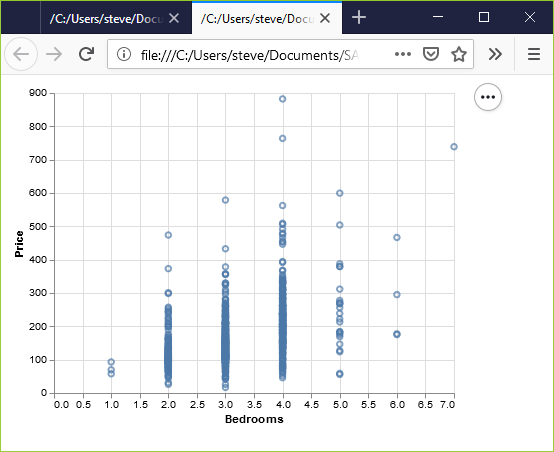
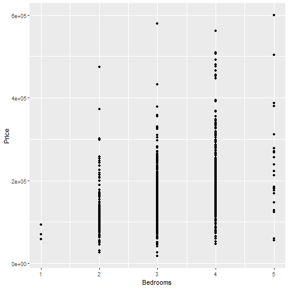

```{r setup, echo=FALSE}
knitr::opts_chunk$set(echo = FALSE)
suppressMessages(suppressWarnings(library(ggplot2)))
suppressMessages(suppressWarnings(library(magrittr)))
```

### Basic exercise - location

+ Use the Saratoga housing data set.
+ Revise the plot so that the location of the points represents x=Bedrooms and Y=Price.

### Here's the Python code

Here's the Python code.

```{}
ch4 = alt.Chart(df).mark_point().encode(
      x='Bedrooms',y='Price')
```

### Here's the result in Python



### Here's the R code

```{}
ggplot(saratoga_houses, aes(x=Bedrooms, y=Price)) + 
  geom_point())
```

### Here's the result in R

```{r bedrooms-and-price}
f <- "https://dasl.datadescription.com/download/data/3275"
saratoga_houses <- read.table(f, header=TRUE, sep="\x09")
saratoga_houses$i <- 1:1057
fn <- "r-bedrooms-and-price"
png(filename=paste0("../images/", fn, ".png"))
ggplot(saratoga_houses, aes(x=Bedrooms, y=Price)) + 
  geom_point()
quiet <- dev.off()
pd_text <- "This image was produced by Steve Simon and is placed in the public domain. You are welcome to use this image any way you see fit. An acknowledgement would be appreciated, but is not required."
write(pd_text, file=paste0("../images/", fn, ".txt"))
```



### Here are the steps in Tableau.


<div class="notes">

In Tableau, click on Age in the Columns field and choose the remove option. The graph looks a bit weird with no columns, but ignore it. Drag Bedrooms over to the Columns field. Tableau wants to use a sum, but you want individual data points. So click on SUM(Bedrooms) and change it to a Dimension.

</div>
