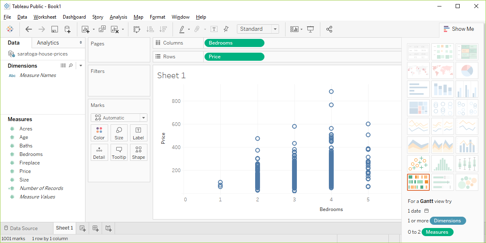

```{r setup, echo=FALSE}
knitr::opts_chunk$set(echo = FALSE)
suppressMessages(suppressWarnings(library(ggplot2)))
suppressMessages(suppressWarnings(library(magrittr)))
```

### Basic exercise - location

+ Revise the plot so that the location of the points represents x=Bedrooms and Y=Price.

### Wait before showing

Here's the Python code.

```{}
((To be added later))
```

### Here's the R code

```{}
ggplot(saratoga_houses, aes(x=Bedrooms, y=Price)) + 
  geom_point())
```

### Here's the R graph

```{r bedrooms-and-price}
fn <- "r-bedrooms-and-price"
png(filename=paste0("../images/", fn, ".png"))
ggplot(saratoga_houses, aes(x=Bedrooms, y=Price)) + 
  geom_point()
quiet <- dev.off()
write(pd_text, file=paste0("../images/", fn, ".txt"))
```


<div class="notes">

Here is what the plot looks like in R.

</div>

### Here are the steps in Tableau.



<div class="notes">

In Tableau, click on Age in the Columns field and choose the remove option. The graph looks a bit weird with no columns, but ignore it. Drag Bedrooms over to the Columns field. Tableau wants to use a sum, but you want individual data points. So click on SUM(Bedrooms) and change it to a Dimension.

</div>
