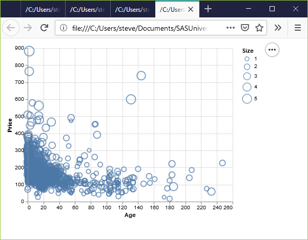

```{r setup, echo=FALSE}
knitr::opts_chunk$set(echo = FALSE)
suppressMessages(suppressWarnings(library(ggplot2)))
suppressMessages(suppressWarnings(library(magrittr)))
```

### Basic exercise - size

+ Use the Saratoga housing data set.
+ Draw a plot where the location is x=Age and y=Price and the size represents the living area.

### Here's the Python code.

```{}
ch6 = alt.Chart(df).mark_point().encode(
      x='Age',y='Price', size='Size')
```


### Here's the result in Python.



### Here's the R code.

```{}
ggplot(saratoga_houses, aes(x=Age, y=Price)) + 
  geom_point(aes(size=Living.Area))
```

### Here's the result in R.

```{r size-living-area}
f <- "https://dasl.datadescription.com/download/data/3275"
saratoga_houses <- read.table(f, header=TRUE, sep="\x09")
saratoga_houses$i <- 1:1057
fn <- "r-size-living-area"
png(filename=paste0("../images/", fn, ".png"))
ggplot(saratoga_houses, aes(x=Age, y=Price)) + 
  geom_point(aes(size=Living.Area))
quiet <- dev.off()
pd_text <- "This image was produced by Steve Simon and is placed in the public domain. You are welcome to use this image any way you see fit. An acknowledgement would be appreciated, but is not required."
write(pd_text, file=paste0("../images/", fn, ".txt"))
```


### Here's the result in Tableau.


