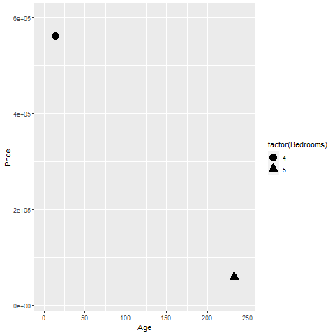

```{r setup-v01-main-lecture, echo=FALSE}
knitr::opts_chunk$set(echo = FALSE)
suppressMessages(suppressWarnings(library(ggplot2)))
suppressMessages(suppressWarnings(library(knitr)))
suppressMessages(suppressWarnings(library(magrittr)))
pd_text <- "This image was produced by Steve Simon and is placed in the public domain. You are welcome to use this image any way you see fit. An acknowledgement would be appreciated, but is not required."
initiate_image <- function() {
  fn <- opts_current$get("label")
  png(filename=paste0("../images/", fn, ".png"))
  return(fn)
}
finalize_image <- function() {
  quiet <- dev.off()
  write(pd_text, file=paste0("../images/", fn, ".txt"))
}
  
```

### About this class
+ Preparing for this lecture
+ Lecture
+ Basic exercises
+ Advanced exercises
+ Discussion questions
+ Short quizzes

<div class="notes">

This class is divided into several sections. 

Each section will start with information that you need to get ready before the class starts. Then there will be a lecture interspersed between basic exercises, advanced exercises, and discussion questions. 

The basic exercises involve running a short program, typically a one or two line modification of a program that I have just shown. These basic exercises are intended to slowly increase your comfort level with the visualization software (altair in Python, ggplot2 in R, or Tableau). Do the basic exercises on your own during the class. Warning: some of the visualizations you will be asked to produce will look terribly ugly. That's okay. You're just learning the basic programming steps for now. Later, you will see how to apply these steps to make better looking and more effective visualizations. 

Advanced exercises will require you to adapt the code to an entirely different data set. Do this in a group setting with others who are using the same visualization software as you. The advanced exercises will require the production of four or five different visualizations, so your group should adopt a "divide and conquer" strategy.

Discussion questions will involve small groups, or sometimes just pairs of individuals. You will see a typical media presention of a visualization along with the newspaper or magazine article that accompanies it. You and your group will discuss the visualization guided by a few questions provided here. Some groups may be asked to make a short presentation to the entire class.

You will get a short quiz at the end of the lecture. This will be multiple choice.

</div>

### Software agnosticism

+ This course will show examples using
  + Python,
  + R, and 
  + Tableau
+ I do not play favorites

<div class="notes">

I am a big believer in software agnosticism. That means that when I teach something, I teach it with the expectation that the software used to do the assignments is software of YOUR choosing. I have my own preferences, but those should not be your preferences.

It's a lot more work to teach a course that is not dependent on a particular software system, but I do not know what the best software choice would be for you. In this class, I will try to show examples using Python, R, and Tableau. I realize that there are other good choice, but I'm hoping that most of you will be happy with one of these three choices. Within Python, I will use the altair package. In R, I will use ggplot2. I realize that there are other graphics packages in these two languages, but altair and ggplot2 rely on modern graphics principles, so I will restrict my attention to these packages.

Tableau is a commercial product. If you don't currently have access to Tableau, the company offers a free version, Tableau Public. It has all the features of Tableau, but you have to store any data visualizations on a public server. That's just fine for someone like me who uses teaching examples with publicly available data sets. If you are using private or proprietary data, you need to pay the money for the commercial version.

</div>

### What software should you use?

+ Use the software you like best
+ What does your boss use?
+ What do your co-workers use?
+ What software are you most comfortable with?
  
<div class="notes">

If you are not sure what software package to use in this class, let me offer a few suggestions. First, your boss may have a strong opinion about what software that you should use. You can go to your boss and say "Steve Simon is a really smart guy and he says that the ggplot2 package in R is the best choice for data visualization." Try it and see what happens. Nothing, I suspect. One of the great tragedies in life is that the SSSS principle (Steve Simon Said So) carries very little weight in the real world.

If your boss doesn't care, see what most of your co-workers are using. They may not be as smart as I am (put on a false air of pride here) but they are a lot closer to your cubicle when this workshop ends and you have to find a quick answer.

There's also a comfort level here. Tableau develops its visualizations using a graphical user interface. Python and R are programming languages. A graphical interface is great for getting work done quickly. A programming language is great for reproducibility and reusability. What fits your working style better.

One more consideration. Some of you in this class are "ringers." You already know visualization better than I do because you've been doing it for longer, with bigger and more complex data sets. You're just here to see if I know one or two things that you don't already know. If you're a ringer, take the challenge of learning a new software system. It will keep you from getting too bored when I talk about all these things that you already know better than I do.

</div>

### Which is better? A bar chart...

```{r bar-chart-1}
labs <- c("Divorced/Separated", "Married", "Single/Never married", "Widowed")
marital_status <- data.frame(
  class=labs,
  n=c(49, 124, 55, 22),
  prop=c(19.6, 49.6, 22.0, 8.8)
)
fn <- initiate_image()
ggplot(marital_status, aes(x=class, y=n, fill=class)) +
  geom_col(fill=c("#F8766D", "#7CAE00", "#00BFC4", "#C77CFF")) -> bar_chart1
plot(bar_chart1)
finalize_image()
```


<div class="notes">

Here's a bar chart dispaying the counts for people in four categories for marital status, divorced, married, single, widowed.

</div>


### ... a stacked bar chart, ...

```{r bar-chart-2}
fn <- initiate_image()
ggplot(marital_status, aes(x="", y=n, fill=class)) +
  geom_col() -> bar_chart2
plot(bar_chart2)
finalize_image()
```


<div class="notes">

Here's the same data, but the bars are now stacked in a single column.

</div>


### ... or a pie chart

```{r pie-chart-1}
fn <- initiate_image()
ggplot(marital_status, aes(x = "", y = n, fill = class)) +
  geom_col() +
  coord_polar("y", start = 0) +
  theme_void() -> pie_chart
plot(pie_chart)
finalize_image()
```


<div class="notes">

There's one more obvious choice. You can display the counts in a pie chart.

</div>


### Better in what way?
+ Two most important criteria
  + Speed
  + Accuracy
  
<div class="notes">

The answer really depends on what question you are asking. There are a variety of questions that you might ask.

You can run an experiment (people have done this) where randomize and show half of them a bar chart and half of them a pie chart. Then you ask a question. Then you note the speed and accuracy of the response. Depending on the question, sometimes pie charts give faster and more accurate answers. Sometimes bar charts give faster and more accurate answers. It turns out that the results match up nicely with what we know about the psychology of perception.

</div>

### Which percentage is larger? Bar chart is best!

```{r bar-chart-3}
fn <- initiate_image()
bar_chart1 +
  geom_segment(
    x=1.5, y=49, xend=2.5, yend=49, 
    color="darkred", size=2, 
    arrow=arrow())
finalize_image()
```


<div class="notes">

If you ask the question, which percentage is larger, the percentage for single or the percentage for divorced/separated, the bar chart is the winner, hands-down. The comparison involves a 

</div>

### Second best, stacked bar chart

```{r bar-chart-4}
fn <- initiate_image()
bar_chart2 +
  geom_segment(
    x=1.3, xend=1.3, y=201, yend=250, 
    size=2, color="darkred",
    arrow=arrow(ends="both")) +
  geom_segment(
    x=1.3, xend=1.3, y=22, yend=77, 
    size=2, color="darkred",
    arrow=arrow(ends="both"))
finalize_image()
```


<div class="notes">

The second best choice for answering this question is the stacked bar chart. You have to compare the lengths of two bars which are not aligned. It takes a bit longer to make this judgement, and it is harder to provide an accurate answer when the bars are very similar in length. But it is still not too difficult.

</div>

### Worst, pie chart

```{r pie-chart-2}
fn <- initiate_image()
pie_chart +
  geom_segment(
    x=1, xend=1, y=22, yend=77, 
    size=2, color="darkred",
    arrow=arrow(ends="both")) +
  geom_segment(
    x=1, xend=1, y=201, yend=250,
    size=2, color="darkred",
    arrow=arrow(ends="both"))
finalize_image()
```


<div class="notes">

For the pie chart, you have to judge which wedge of the pie is bigger by looking at the area of the wedges, but actually most people make assessments in a pie chart by looking at the interior angle. You can see that the interior angle is bigger for the single group, but it is a harder judgement to make quickly and it is a harder judgement to make accurately.

Now I need to note that this is not my opinion. It is a fact established by empirical study. The first bar chart, which allows you to make comparisons using relative position, produces faster and more accurate answers.

</div>


### What fraction of people are single? Best is pie chart

```{r pie-chart-3}
fn <- initiate_image()
pie_chart +
  geom_segment(
    x=1, xend=1, y=22, yend=77,
    size=2, color="darkred",
    arrow=arrow(ends="both")) +
  geom_text(
    x=1.1, y=45, hjust=0,
    label="~90 degrees", 
    size=4, col="darkred"
  )
finalize_image()
```


<div class="notes">

But wait! If you ask a different question, what percentage of people in your sample are single, the pie chart does the best. The interior angle for the single wedge is just a bit under 90 degrees, and that tells you quickly, and fairly accurately, that the percentage is a bit under 25%.

</div>

### For a percentage question, the stacked bar chart is second best

```{r bar-chart-5}
fn <- initiate_image()
bar_chart2 +
  geom_segment(
    x=1.3, xend=1.3, y=22, yend=77, 
    size=2, color="darkred",
    arrow=arrow(ends="both"))
finalize_image()
```


<div class="notes">

You can ask the same question for the stacked bar chart, but it will take longer and be less accurate. It's easy to split a bar in half, but you will have much harder perceptual task to split it into quarters. So deciding whether that single bar is a bit less than 25% or a bit more than 25% can't be done as well.

</div>

### The side-by-side bar chart is hopeless for percentage questions.

```{r bar-chart-6}
fn <- initiate_image()
bar_chart1 + 
  geom_text(x=3, y=27, label="??", size=20, color="darkred")
finalize_image()
```


<div class="notes">

Trying to answer a percentage question for a side by side bar chart is pretty much hopeless. What you have to do is visually stack the bars and then divide the bars into quarters. 

When you ask percentage questions, all methods do pretty well for percentages near 0% and 100%. All methods also do  well for percentages around half, or 50%. Th pie chart also does well for percentages close to 25% and 75%. It is easy visually to split a pie into four equal pieces. Just look for the 90 degree angles. The empirical research supports this. Speed and accuracy of percentage judgements are about the same for bar charts and pie charts, except around 25% and 75% where the pie chart is markedly superior.

</div>

### Improvements to the "hopeless" bar chart

```{r bar-chart-7}
re_ordered_marital_status <- data.frame(
  re_ordered_class=factor(c(3, 2, 1, 4), labels=labs[c(3, 2, 1, 4)]),
  n=c(55, 124, 49, 22),
  prop=c(19.6, 49.6, 22.0, 8.8)
)
fn <- initiate_image()
ggplot(re_ordered_marital_status, aes(x=re_ordered_class, y=prop, fill=re_ordered_class)) +
  geom_col(fill=c("#00BFC4", "#7CAE00", "#F8766D", "#C77CFF")) -> bar_chart3
plot(bar_chart3)
finalize_image()
```


<div class="notes">

Things are never totally hopeless, however. If your goal is to simplify the estimation of the percentage of your sample in the single/never married category, change your y axis from counts to percentages. Also, place the most important bar closest to the Y axis. Horizontal projections are easiest when the distances you have to project are very short.

There's lots of other little things you can do. We'll talk a lot more about bars in the second part of this workshop.

</div>

### Group exercise (1 of 2)


<div class="notes">

This is one of two graphs. It was published in

Popvich, N., Fountain, H., & Pearce, A. (2017, September 22). We Charted Arctic Sea Ice for Nearly Every Day Since 1979. You’ll See a Trend. - The New York Times. The New York Times. Retrieved from https://www.nytimes.com/interactive/2017/09/22/climate/arctic-sea-ice-shrinking-trend-watch.html

Split into pairs. Review the article briefly (about 5 minutes) and look at the graph. Explain to your partner what the graph is trying to show. Your partner will get a different graph and do the same thing with you listening this time.

</div>

### Group exercise (2 of 2)


<div class="notes">

This is one of two graphs. It was published in 

Kevin Litman-Navarro. We Read 150 Privacy Policies. They Were an Incomprehensible Disaster. The New York Times. Retrieved from https://www.nytimes.com/interactive/2019/06/12/opinion/facebook-google-privacy-policies.html

Split into pairs. Review the article briefly (about 5 minutes) and look at the graph. Explain to your partner what the graph is trying to show. Your partner will get a different graph and do the same thing with you listening this time.

</div>


### Theoretical foundation of data visualization


<div class="notes">

Most of the current designers of data visualization software have based their work on the theoretical foundations of Leland Wilkinson. This includes ggplot2 in r, altair in Python, and Tableau, among others. Dr. Wilkinson wrote a book, The Grammar of Graphics, in 1999 (second edition in 2006) that laid out the principles for the development of pretty much any data visualizaton that you could imagine. The work is mathematically rigorous, and I do not recommend that you read this book unless you enjoy that sort of thing. I do want to highlight a few of the fundamental ideas in the book

</div>

### Visualization before Wilkinson (1 of 3)


<div class="notes">

I'm going to do one of those bad things that a presenter should never do. I'm going to show you a series of three slides that is intended to create a sense of confusion. I'm doing this because I want you to appreciate how bad things were before Leland Wilkinson came along.

There's a saying that a camel is a horse designed by a committee. Well, this slide and the next two slides represent some very ugly looking camels.

Here's the help function from the program R for the barplot function. This function and the following were developed before Wilkinson's work and show the problem without using his framework.

I don't want you to study this help file closely. I just want to emphasize two points.

First, there are a dizzying number of options, 30 for the barplot. Maybe this is unavoidable. But what follows when you look at the next help function is the real problem.

When you switch from one function to another, from one visualization method to another, the options change. This is bad because it makes it harder for you to learn new graphical display methods. Even after you learn them, you will have a difficult time remembering which options and which defaults go with which graphical displays.

</div>

### Visualization before Wilkinson (2 of 3)


<div class="notes">

Here's the help function from the program R for the hist function. The default option for the borders of the bars of a barplot differ from the option for the borders of the bars of a histogram. This makes no sense. A histogram is different than a bar chart, but not that much different.

The way that you determine the limits for the x-axis and the y-axis differ. Again, how is a histogram so much different from a barplot that you need different methods for deciding something like this.

</div>

### Visualization before Wilkinson (3 of 3)


<div class="notes">

If that isn't confusing enough, look at the help file for the boxplot.

It's pure chaos. Each function has a different set of arguments, listed in a different order and with different default options. This continues when you look at help for the pie function for pie charts, the contour function for contour plots, the persp3d function for three dimensional surfaces, the stem function for stem and leaf diagrams, and many others.  

Adopting the framework developed in The Grammar of Graphics provides you with one stop shopping. It is a bit daunting at first, because it includes everything and the kitchen sink. But once you get comfortable with it, you will find that each new visualization that you try uses the same syntax, more or less. 

</div>

### Helpful resource


<div class="notes">

In this section, I am going to borrow heavily from a short course presented at the 2019 Symposium on Statistics and Data Science. The presenters are nice enough to share their materials on their github site. You can find it easily with a google search of bergen iverson sdss2019 data visualization.

</div>

### Definition of data visualization
+ "A mapping of data to the visual aesthetics of geometries/marks" 
  + Bergen and Iverson 2019
  
<div class="notes">

A definition of visualization, based on the Grammar of Graphics framework is provided in the Bergan and Iverson presentation that I mentioned on the previous slide.

There are four nouns in this definition.

Data. I hope I don't have to define data other than to say that it is an interesting set of numbers. I won't talk about non-numeric data like text in this workshop. Ideally these numbers have enough structure that you can put them into a rectangular grid like a spreadsheet or database table.

Aesthetics is a work that Dr. Wilkinson likes, but I'm not so sure that I care for it. An aesthetic is a visual feature.

The compound noun geometries/marks is a deliberate choice of Bergen and Iverson. If you use ggplot2 in R, you will be more comfortable with the noun geometries. If you use altair in Python, or if you use Tableau, you will be more comfortable with the noun marks.

Mapping means a transformation. You are taking data and converting it into various visual features.

It will help to see some examples.

</div>
  
### Examples  
+ Geometries/marks
  + Points
  + Lines
  + Bars
  + Text
+ Aesthetics
  + Position
  + Shape
  + Size
  + Color

<div class="notes">

Think of geometries/marks are ink placed on a sheet of paper. They could represent points, lines, bars, or text, among other things. 

There are four (more or less) major visual properties of points, lines, bars, and text.

The aesthetics fall into five major classes: position, shape, size, and color.

Not every geometry/mark will have every possible aesthetic. Some of these aesthetics can be combined to great effect, but sometimes they work antagonistically. Do consider every possible aesthetic in your graph, but intentionally ignoring an aesthetic can sometimes work to your advantage. Some aesthetics map very nicely to continuous data, but others only work well with categorical data.

</div>

### Geometries/marks in Python
+ mark_point
+ mark_line
+ mark_bar
+ mark_text

<div class="notes">

You specify the type of geometry/mark in Python using a range of mark functions.

</div>

### Geometries/marks in R
+ geom_point
+ geom_line
+ geom_bar, geom_col
+ geom_text, geom_lab

<div class="notes">

You specify the type of geometry/marks in R using a range of geom functions.

</div>

### Geometries/marks in Tableau
+ Context specific
+ Variable classifications
  + Dimension, attribute, measure
  + Blue (categorical) versus green (continuous)
  
<div class="notes">

Tableau does not have a formal declartion of the type of geometry/mark. Instead, it chooses the geometry/mark using an educated guess from what the variables look like. It will use bars, for example, if one of the location variables is categorical and lines if one of the location variables is continuous. 

</div>

### Mapping to aesthetics in Python
+ encode function
  + x=
  + y=
  + shape=
  + size=
  + color=
+ Example
  + alt.Chart(cars).mark_point().encode(
    x='Age', y='Price', size=Acres,
    shape='Bedrooms', color='Bathrooms')
    
<div class="notes">

In Python, the mapping is done with the encode function. The location is represented by x= and y= arguments. Size, shape, and color are mapped using the size=, shape=, and color= arguments.

Here's an example. The age and price of the home are mapped to the x and y locations. The acreage of the land maps to the size. The number of bedrooms maps to the shape, and the number of bathrooms maps to the color.

</div>

### Mapping to aesthetics in R
+ aes function
  + x=
  + y=
  + size=
  + shape=
  + color=
+ Example
  + ggplot(*data*, aes(x=Age, y=Price)) +
  + geom_point(aes(size=Acres, shape=Bedrooms, color=Bathrooms))

<div class=notes>

In R, the mapping is done with the aes (short for aesthetics) function. The location is represented by x= and y= arguments. Size, shape, and color are mapped using the size=, shape=, and color= arguments.

Here's an example. The age and price of the home are mapped to the x and y locations. The acreage of the land maps to the size. The number of bedrooms maps to the shape, and the number of bathrooms maps to the color. 

</div>

### Mapping to aesthetics in Tableau


<div class="notes">

Tableau accomplishes mapping through a drag and drop interface. Drag a variable to the Columns field and a second variable to the Rows field to specify the x and y locations. Drag a variable on top of the size, shape, and color icons to map those variables appropriately.

This screenshot shows an example where Age is mapped to the x location, Price is mapped to the y location, Acres is mapped to size, Bedrooms is mapped to shape, and Baths is mapped to color.

</div>

### Review basic scatterplot

+ Python code

```{}
ch = alt.Chart(df).mark_point().encode(
    x='Age', y='Price'
)
```

+ R code

```{}
ggplot(saratoga_houses, aes(x=Age, y=Price)) +
  geom_point()
```

+ Tableau
  + (Drag and drop)
  
<div class="notes">

You've already drawn a basic scatterplot in Python, R, or Tableau. All three systems choose a slightly different visualization, but, for the most part, the graphs look fairly nice. You can change some of those default options.

</div>

### Changing default options

+ Python code

```{}
.mark_point(shape="square", color="green").
```

+ R code

```{}
geom_point(shape="square", color="green")
```

+ Tableau
  + (Drag and drop)
  
<div class="notes">

In Python, you can change the default from blue circles to green squares in the mark_point function. In R, you do this inside the geom_point function. In Tableau, you have to click on the color and shape buttons to change the defaults.

</div>

### Basic exercise - global modifications
+ Use the Saratoga housing data set.
+ Try the suggested changes to the defaults and see what the visualization looks like.
+ Try changing the size of the points.

### Aesthetics for points - location (1 of 2)

```{r point-aesthetics-x}
fn <- "point-aesthetics-x"
f <- "https://dasl.datadescription.com/download/data/3275"
saratoga_houses <- read.table(f, header=TRUE, sep="\x09")
png(filename=paste0("../images/", fn, ".png"))
x <- c(212, 103)
x_range <- range(saratoga_houses$Age)
y_range <- range(saratoga_houses$Price)
g <- ggplot(saratoga_houses[x, ], aes(x=Age, y=Price)) + 
  expand_limits(x=x_range) +
  expand_limits(y=y_range)
g + geom_text(aes(label=Age))
quiet <- dev.off()
write(pd_text, file=paste0("../images/", fn, ".txt"))
```


<div class="notes">

This plot show only two data points, and is labeled with the variable age, corresponding to the X location.

The point in the upper left corner is a young house, only 14 years old. The point in the lower right corner is an old house, 233 years old.

</div>

### Aesthetics for points - location (2 of 2)

```{r point-aesthetics-y}
fn <- "point-aesthetics-y"
png(filename=paste0("../images/", fn, ".png"))
g + geom_text(aes(label=format(Price, big.mark=",")))
quiet <- dev.off()
write(pd_text, file=paste0("../images/", fn, ".txt"))
```


<div class="notes">

This plot is labeled with the variable Price, corresponding to the Y location.

The point in the upper left corner is an expensive house, over a half million dollars. The point in the lower right corner is a cheap house, about one-tenth of the price.

</div>

### Basic exercise - location
+ Use the Saratoga housing data set.
+ Revise the plot so that the location of the points represents x=Bedrooms and Y=Price.

### Aesthetics for points - shape

```{r point-aesthetics-shape}
fn <- "point-aesthetics-shape"
png(filename=paste0("../images/", fn, ".png"))
g + 
  geom_point(aes(shape=factor(Bedrooms)), size=5)
quiet <- dev.off()
write(pd_text, file=paste0("../images/", fn, ".txt"))
```



<div class="notes">

The house in the upper left corner has four bedrooms, and the house in the lower right corner has five bedrooms. You use circles and triangles to designate this and the legend on the right hand side tells you how to decipher the symbols.

I want to note here that this plot is effectively showing three dimensions, Age, Price, and Bedrooms, even though it is restricted to a two dimensional screen.

I also want to point out that this may not be the best way to visualize the relationship among these three variables.

</div>

### Basic exercise - shape
+ Use the Saratoga housing data set.
+ Draw a plot of all of the data where the location is x=Age and y=Price and the symbol represents the number of bedrooms.

### Aesthetics for points - size

```{r point-aesthetics-size}
fn <- "point-aesthetics-size"
png(filename=paste0("../images/", fn, ".png"))
g + 
  geom_point(aes(size=Living.Area))
quiet <- dev.off()
write(pd_text, file=paste0("../images/", fn, ".txt"))
```


<div class="notes">

You can also use the size of a point to represent a third dimension. Here is a plot where the larger house, the house with more living area has a big circle and the house with less living area has a small circle. 

</div>

### Basic exercise - size
+ Use the Saratoga housing data set.
+ Draw a plot where the location is x=Age and y=Price and the size represents the living area.

### Aesthetics for points - color (1 of 2)

```{r point-aesthetics-color-1}
fn <- "aesthetics-color-1"
png(filename=paste0("../images/", fn, ".png"))
g +
  geom_point(aes(color=factor(Bathrooms)), size=5)
quiet <- dev.off()
write(pd_text, file=paste0("../images/", fn, ".txt"))
```


<div class="notes">

This plot shows a blue point representing a four bathroom house in the upper left corner and an orange point representing a two bathroom house in the lower right corner.

</div>

### Aesthetics for points - color (2 of 2)

```{r point-aesthetics-color-2}
fn <- "aesthetics-color-2"
png(filename=paste0("../images/", fn, ".png"))
g +
  geom_point(aes(color=Living.Area), size=5)
quiet <- dev.off()
write(pd_text, file=paste0("../images/", fn, ".txt"))
```


<div class="notes">

Notice how the legend has changed.

</div>

### Basic exercise - color
+ Use the Saratoga housing data set.
+ Draw a plot where the location is x=Age and y=Price and the color represents the number of bathrooms.

### Group exercise

+ Review the following visualization in your group.
  + Summarize what aesthetics (location, size, shape, color) appear in the graph
  + What variables map to each aesthetic?

+ ((Use the visualizations from the earlier group exercise.))

<div class="notes">

I want you to review the visualizations that you discussed earlier. With you partner review the visualization again. Talk about the aesthetics and what variables map to each aesthetic.

</div>

### Solutions to excessive overprinting
+ Opacity
+ Small points
+ Open symbols
+ Log scale

<div class="notes">

The plots that you have drawn tend to have difficulty with overprinting. Too many data points crammed into a small area produces a large solid blob that is hard to interpret. There are three possible solutions: opacity, small points, and a log scale.

</div>

### Overprinting - opacity

```{r point-opacity}
fn <- "point-opacity"
png(filename=paste0("../images/", fn, ".png"))
ggplot(saratoga_houses, aes(x=Age, y=Price)) +
  geom_point(alpha=0.1, size=5)
quiet <- dev.off()
write(pd_text, file=paste0("../images/", fn, ".txt"))
```


<div class="notes">

If you make the data points somewhat translucent, so that you can see what it behind it, this prevents a massive black blob from forming. You have to experiement a bit with the level of translucence.

</div>

### Overprinting - small points

```{r small-points}
fn <- "small-points"
png(filename=paste0("../images/", fn, ".png"))
ggplot(saratoga_houses, aes(x=Age, y=Price)) +
  geom_point(size=1)
quiet <- dev.off()
write(pd_text, file=paste0("../images/", fn, ".txt"))
```


<div class="notes">

Smaller data points have less trouble with overprinting.

</div>

### Overprinting - open symbols

```{r open-symbols}
fn <- "open-symbols"
png(filename=paste0("../images/", fn, ".png"))
ggplot(saratoga_houses, aes(x=Age, y=Price)) +
  geom_point(size=5, shape=1)
quiet <- dev.off()
write(pd_text, file=paste0("../images/", fn, ".txt"))
```


<div class="notes">

Smaller data points have less trouble with overprinting.

</div>

### Overprinting - log scale

```{r point-log-scale}
fn <- "log-scale"
png(filename=paste0("../images/", fn, ".png"))
saratoga_houses$age_plus <- saratoga_houses$Age + runif(1057)
ggplot(saratoga_houses, aes(x=age_plus, y=Price)) +
  geom_point(size=5) +
  scale_x_log10() +
  scale_y_log10()
quiet <- dev.off()
write(pd_text, file=paste0("../images/", fn, ".txt"))
```


### Some tips
+ Don't try to squeeze in too much
+ Double up to emphasize
+ Shape is only good for categories
+ Shape and size don't mix

### Don't try to squeeze in too much.

```{r point-aesthetics-color-3}
fn <- "aesthetics-color-3"
png(filename=paste0("../images/", fn, ".png"))
saratoga_houses$age_plus <- saratoga_houses$Age + runif(1057)
binary_colors <- c("red", "red", "blue", "blue", "blue", "blue", "blue", "blue")
ggplot(saratoga_houses, aes(x=age_plus, y=Price)) +
  geom_point(aes(color=factor(Bathrooms)), size=1, alpha=0.1) +
  scale_x_log10() +
  scale_y_log10() +
  scale_color_manual(values=binary_colors)
quiet <- dev.off()
write(pd_text, file=paste0("../images/", fn, ".txt"))
```


### Double up to emphasize

```{r double-up}
fn <- "double-up"
png(filename=paste0("../images/", fn, ".png"))
saratoga_houses$age_plus <- saratoga_houses$Age + runif(1057)
binary_colors <- c("red", "red", "blue", "blue", "blue", "blue", "blue", "blue")
ggplot(saratoga_houses, aes(x=age_plus, y=Price)) +
  geom_point(aes(color=factor(Bathrooms), shape=factor(Bathrooms)), size=5) +
  scale_x_log10() +
  scale_y_log10() +
  scale_color_manual(values=binary_colors) + 
  scale_shape_manual(values=rep(c(1, 4), c(2, 6)))
quiet <- dev.off()
write(pd_text, file=paste0("../images/", fn, ".txt"))
```


<div class="notes">

It's okay to map a single variable to more than one aesthetic. In fact, this often helps emphasize that variable.

</div>

### Some restrictions
+ Shape is only good for categories
+ Shape and size don't mix

<div class="notes">

There are some practical limits to aesthetics of points. First, shape makes sense only for categorical data. If you have a large number of values, as is typical for a continuous variable, you run out of symbols before you run out of categories.

Also size and shape don't mix. You can really compare two diffent shapes, such as an X and an O on size. Is the size related to the diameter, the area, or the perimeter? There's no really good answer, so it's asking to much of a graph that asks you to decide which is larger among points represent different shapes. Either vary the shape or vary the size, but not both.

</div>

### Quick quiz (1 of 4)
Data visualization is a mapping of data to the visual aesthetics of geometries/marks. Some examples of visual aesthetics include (choose all that apply)
1. Size
2. Points
3. Shapes

<div class="notes">

Answer: 1 and 3 (size and shapes)

</div>

### Quick quiz (2 of 4)
The log transformation works by (choose the best answer)
1. Stretching all data values equally.
2. Stretching the small values and squeezing the large values.
3. Stretching the large values and squeezing the small values.

<div class="notes">

Answer: 2 (strethcing the small values and squeezing the large values)

</div>

### Quick quiz (3 of 4)
Strategies that can sometimes help when you have a lot of problems with overprinting include (choose all that apply)
1. Using open circles
2. Using large size points
3. Using translucent points

<div class="notes">

Answer: 1 and 3 (using open circles and translucent points)

</div>

### Quick quiz (4 of 4)
The two visual aesthetics that doen't work well together are (choose the best answer)
1. color and size
2. color and shape
3. size and shape

<div class="notes">

Answer: 3 (size and shape)

</div>

### Advanced exercise

+ There is a second data set on sleep in 
mammals. You can find a brief description of
this data set at
  + http://www.statsci.org/data/general/sleep.html
+ You can download the actual data at
  + http://www.statsci.org/data/general/sleep.txt

### Advanced exercise
+ Draw a visualization that illustrates the interrelationships among
  + bodywt, lifespan, gestation
  + bodywt, brainwt, and totalsleep
  + predation, exposure, and totalsleep
  + bodywt, predation, and lifespan
+ Divide the work among different group members

### Summary
+ "A mapping of data to the visual aesthetics of geometries/marks" 
  + Points are a type of geometry/mark
  + Aesthetics for points include location, shape, size, color
+ Basic tips
  + Don't try to squeeze in too much
  + Double up to emphasize
  + Shape is only good for categories
  + Shape and size don't mix

