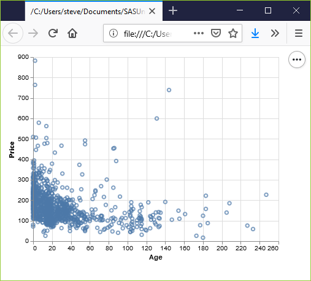
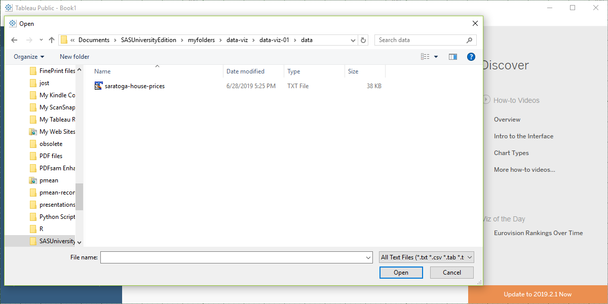
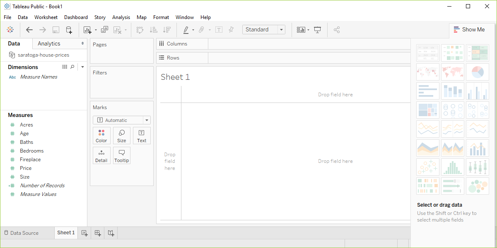
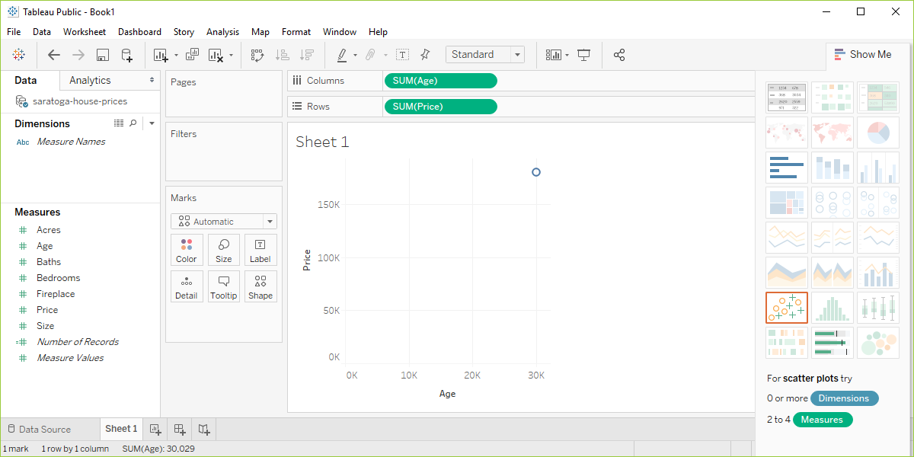

```{r setup-v01-prepare, echo=FALSE}
knitr::opts_chunk$set(echo = FALSE)
suppressMessages(suppressWarnings(library(ggplot2)))
suppressMessages(suppressWarnings(library(magrittr)))
```

### DASL https://dasl.datadescription.com/


<div class="notes">

DASL is an acronym for Data And Story Library. It used to sit on a website, Statlib, at Carnegie Mellon, but the company, Data Description, which makes a data analysis program, DataDesk, took over when the Statlib site went dark. It's a very nice site for small data sets useful for teaching.

I want to use a file on housing prices in Saratoga, New York, and you can find it through the search function on the main page. Look for housing or Saratoga, and you'll find it pretty quickly.

Note to myself: Try to keep this and every other image to no greater than 800 by 480.

</div>

### Choose "Saratoga House Prices" (not "Saratoga Houses")


  
<div class="notes">
  
There are two files actually, that look very similar. You want the "Saratoga House Prices" file and not the one called "Saratoga Houses". The Saratoga House Prices file has 1063 records and the variables are Price, Living.Area, Bathrooms, Bedrooms, Fireplaces, Lot.Size, Age, Fireplace.

This is the file that you want to download and run a scatterplot.

</div>

### Some general advice if things don't work
+ Download the file
+ Tweak the file
  + Remove variable names in first line
  + Change missing value codes
  + Change the delimiter
  + Look for inconsistencies
  + Convert the format
  
<div class="notes">

These things never work right the first time. If computers worked the first time and every time, we'd all be getting paid the minimum wage. I'm glad to help if you have any problems importing this or any other files, but here is some general advice that you might want to try first.

Some software systems allow you to download directly from the web. This is fast and easy and convenient, but if it doesn't work download the file and see if you can import it directly. 

If this doesn't work, open the file in a text editing program like notepad and see if you can make some minor changes that allow you to import the file.

If the first line of code has variable names, see if you can import the file without the variable names.

Look at the code for missing values. Some systems use a single dot for a missing value, and others use the letters "NA". Sometimes converting the missing value code to a different code will help.

Most files have a delimiter, a character that separates one variable from the next. This could be a space, a comma, or a tab character. You may have better luck if you do a careful search and replace, changing from one delimiter to another.

Look for inconsistencies, such as some invalid lines at the bottom of the file or a line with one too few variables or an unmatched quote mark. Fix these and try again.

See if you can read the file into a different program like a spreadsheet and export it in a different format.

</div>


### Python code

```{}
http://localhost:8888/?token=defbcdfe24454796470962f1cae834a7c7c8ec78d2c9075f
import pandas as pd
import altair as alt
df = pd.read_csv("data-viz-01/data/saratoga-house-prices.csv")
ch = alt.Chart(df).mark_point().encode(
    x='Age',
    y='Price'
)
ch.save("basic-scatterplot.html")
```

<div class="notes">

Here is the Python code that will download the data and create a simple scatterplot.

</div>

### Python plot



### R code

Here is the R code that will download the data and create a simple scatterplot.

```{}
library(ggplot2)
fn <- "https://dasl.datadescription.com/download/data/3275"
saratoga_houses <- read.table(fn, header=TRUE, sep="\x09")
ggplot(saratoga_houses, aes(x=Age, y=Price)) +
  geom_point()
```

<div class="notes">

Here's a brief bit of R code that should work.

</div>

### What your scatterplot should look like (R version)

```{r simple-scatterplot}
fn <- "r-simple-scatterplot"
f <- "https://dasl.datadescription.com/download/data/3275"
saratoga_houses <- read.table(f, header=TRUE, sep="\x09")
saratoga_houses$i <- 1:1057
png(filename=paste0("../images/", fn, ".png"))
ggplot(saratoga_houses, aes(x=Age, y=Price)) +
  geom_point()
quiet <- dev.off()
pd_text <- "This image was produced by Steve Simon and is placed in the public domain. You are welcome to use this image any way you see fit. An acknowledgement would be appreciated, but is not required."
write(pd_text, file=paste0("../images/", fn, ".txt"))
```


### Importing into Tableau


<div class="notes">

Before you start with Tableau, download the Saratoga Housing Prices file to your local computer.

Tableau uses a graphical user interface, so there is no "program" to run. Here are the steps you need to take to get the data in and produce a simple scatterplot.

This is what Tableau looks like when you open it up. It may appear slightly differently on your computer system.

Select "Text file" from the left side menu bar or "File | Open" from the main menu.

</div>

### Importing into Tableau



<div class="notes">

Find the proper location on your computer where you stored the downloaded file and open it.

</div>

### Importing into Tableau


<div class="notes">

Your screen should look something like this if you imported the data correctly. Click on the sheet1 tab in the lower left corner to open up a blank visualization page.

</div>

### Importing into Tableau



<div class="notes">

Tableau will try to classify your data as measures or dimensions and will also try to decide whether they are categorical (designated by blue tags) or continuous (designated by green tags). Don't worry too much about this now, other than to note that changing the designations that Tableau makes will change how you visualize things.

Drag the variable Age into the Columns field and drag Price into the Rows field

</div>

### Importing into Tableau



<div class="notes">

Tableau makes some educated guesses about what you want. It thinks that you are interested in aggregating age and price and plots a single data point with the sum of all the ages of the houses on the X axis and the sum of all the prices on the Y axis.

This is not what you want, but that's okay. Better a wrong guess that you can correct than no guess at all.

</div>

### Importing into Tableau


<div class="notes">

Click on the green Sum(Age) and change it from Measure(Sum) to Dimension. Don't freak out when the graph goes all bonkers on you. Click on the green Sum(Price) and do the same thing. Then you'll get a nice basic scatterplot.

</div>

### Importing into Tableau


<div class="notes">

Did you get something that looks roughly like this? Pat yourself on the back for a job well done.

</div>

