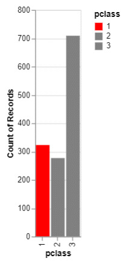
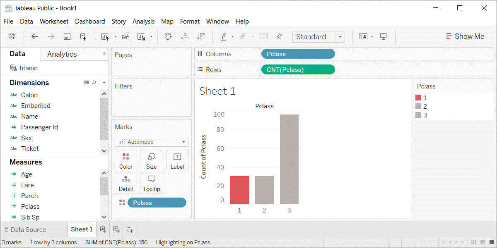

```{r child="../../common-files/src/component-header.Rmd"}
```

```{r}
load("../../common-files/data/titanic.RData")
```

### Exercise, First class red
+ Make the first class bar red (#FF0000)
+ Make the other two bars gray (#808080)

<div class="notes">

One way to emphasize a particular category is to make it a bright color and to set the other colors to a less prominent color like gray that lets them fade into the background. It's okay to use the same color for more than one category.

Make the first class category red and set the second and third class categories to gray.

</div>

### Exercise, Python code
+ Here's the Python code
```{}
ch = alt.Chart(df).mark_bar().encode(
    alt.Color(
        'pclass:N',
        scale=alt.Scale(
            range=['#FF0000', '#808080', '#808080']
        )
    ), 
    x='pclass:N',
    y='count()'
)
```

### Exercise, Python output
```{python}
import pandas as pd
import altair as alt
df = pd.read_csv("../../common-files/data/titanic3.csv")
ch = alt.Chart(df).mark_bar().encode(
    alt.Color(
        'pclass:N',
        scale=alt.Scale(
            range=['#FF0000', '#808080', '#808080']
        )
    ), 
    x='pclass:N',
    y='count()'
)
ch.save("../images/python/red-first-class.html")
```


  

### Exercise, R code
+ Here's the R code
```
ggplot(titanic, aes(x=pclass)) +
  geom_bar(aes(fill=pclass)) +
  scale_fill_manual(values=c("#FF0000", "#808080", "#808080"))
```

<div class="notes">

Here is the graph in Python.

</div>

### Exercise, R output

```{r bar-color-repeat}
load("../../common-files/data/titanic.RData")
initiate_image()
ggplot(titanic, aes(x=pclass)) +
  geom_bar(aes(fill=factor(pclass))) +
  scale_fill_manual(values=c("#FF0000", "#808080", "#808080"))
finalize_image("Barchart with red highlight")
```

`r display_image`

<div class="notes">

Here is the graph in R.

</div>

### Exercise, Tableau output


