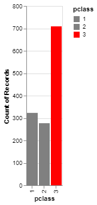

```{r child="../../common-files/src/component-header.Rmd"}
```

```{r}
load("../../common-files/data/titanic.RData")
```

### Exercise, First class red
+ Make the first class bar red to show Leonardo di Caprio's perspective on the Titanic.

### Exercise, Python code
+ Here's the Python code
```{}
ch = alt.Chart(df).mark_bar().encode(
    alt.Color(
        'pclass:N',
        scale=alt.Scale(
            range=['gray', 'gray', 'red']
        )
    ), 
    x='pclass:N',
    y='count()'
)
```

### Exercise, Python output
```{python}
import pandas as pd
import altair as alt
df = pd.read_csv("../../common-files/data/titanic3.csv")
ch = alt.Chart(df).mark_bar().encode(
    alt.Color(
        'pclass:N',
        scale=alt.Scale(
            range=['gray', 'gray', 'red']
        )
    ), 
    x='pclass:N',
    y='count()'
)
ch.save("../images/python/red-third-class.html")
```




### Exercise, R code
+ Here's the R code
```
ggplot(titanic, aes(x=pclass, fill=pclass)) +
  geom_bar() +
  scale_fill_manual(values=c("darkgrey", "darkgrey", "red"))
```

### Exercise, R output

```{r bar-color-repeat}
initiate_image()
ggplot(titanic, aes(x=pclass, fill=pclass)) +
  geom_bar() +
  scale_fill_manual(values=c("darkgrey", "darkgrey", "red"))
finalize_image("Barchart")
```

`r display_image`


### Exercise, Tableau output

((Tableau results))

