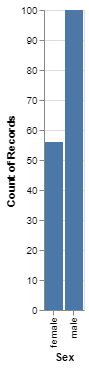

```{r child="../../common-files/src/component-header.Rmd"}
```

```{r}
load("../../common-files/data/titanic.RData")
```

### Exercise, Gender barchart
+ Draw a bar chart showing the number of people in each gender (use the Sex variable).

### Exercise, Python code
+ Here's the Python code
```{}
ch = alt.Chart(df).mark_bar().encode(
    x='sex',
    y='count()'
)
```

### Exercise, Python output

```{python}
import pandas as pd
import altair as alt
df = pd.read_csv("../../common-files/data/titanic3.csv")
ch = alt.Chart(df).mark_bar().encode(
    x='sex',
    y='count()'
)
ch.save("../images/python/gender-barchart.html")
```



### Exercise, R code
+ Here's the R code
```
ggplot(titanic, aes(sex)) +
  geom_bar()
```

### Exercise, R output

```{r gender-barchart}
initiate_image()
ggplot(titanic, aes(sex)) +
  geom_bar()
finalize_image()
```

`r display_image`

### Exercise, Tableau output


