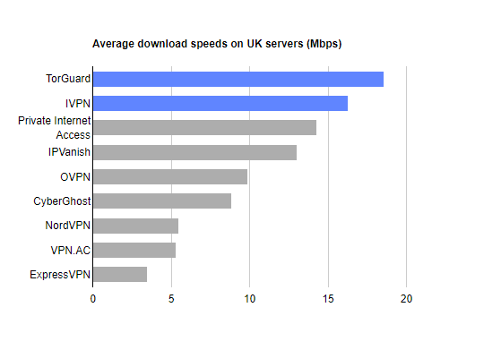

### Group exercise
+ Review one of these graphs/newspaper articles
+ What is the message? Summarize in 25 words or less.

The following images are taken from various newspaper articles or press releases. Look at the graph and read/skim the article.

What message do you think the journalist is trying to convey with this graph. Summarize this message in 25 words or less.

### Graphs in the news, Voters in Texas

This is one of two graphs. It was published in

Badger, E. (2019). People Who Can’t Vote Still Count Politically in America. What if That Changes?. Retrieved June 24, 2019, from The New York Times website: https://www.nytimes.com/2019/06/22/upshot/america-who-deserves-representation.html

### Group exercise (2 of 4)

Weiyi Cai, Simone Landon. Attacks by White Extremists Are Growing. So Are Their Connections. The New York Times, April 3, 2019. Retrieved August 8, 2019 from https://www.nytimes.com/interactive/2019/04/03/world/white-extremist-terrorism-christchurch.html

### Group exercise (3 of 4)

Mark Smirniotis. The Best VPN Service. Wirecutter, February 8, 2019. Retrieved August 14, 2019 from https://thewirecutter.com/reviews/best-vpn-service/.

### Group exercise (4 of 4)
+ These bar charts come from recent newspaper articles.
  + [People Who Can’t Vote Still Count Politically in America. What if That Changes?](https://www.nytimes.com/2019/06/22/upshot/america-who-deserves-representation.html)
  + [Attacks by White Extremists Are Growing. So Are Their Connections](https://www.nytimes.com/interactive/2019/04/03/world/white-extremist-terrorism-christchurch.html).
  + [The Best VPN Service](https://thewirecutter.com/reviews/best-vpn-service/).

+ Read the newspaper article for context and then look at the graph again. 
  + Explain to your partner what the graph is trying to show. Your partner will do the same to you with his/her graph.
