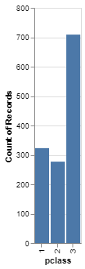
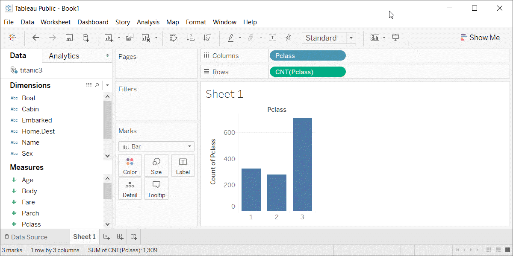
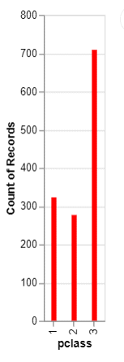
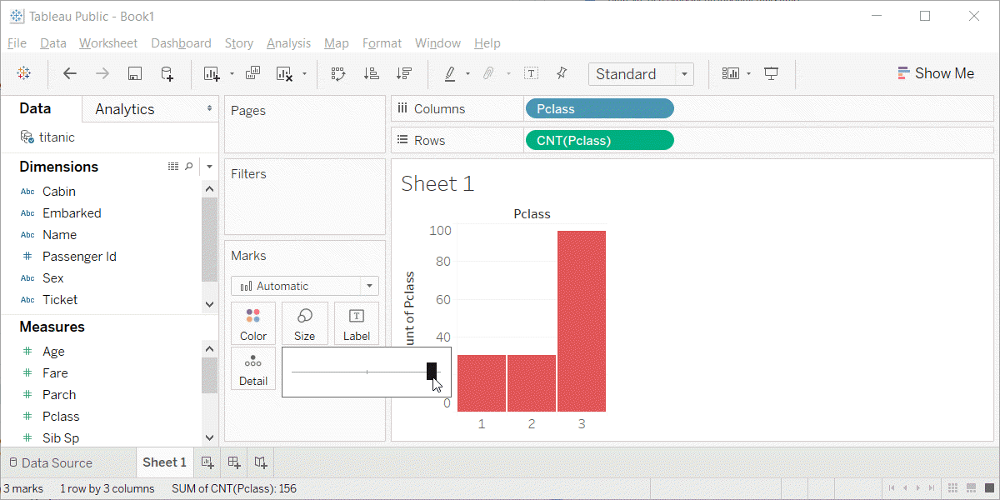
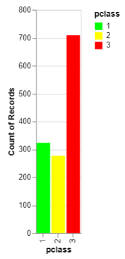
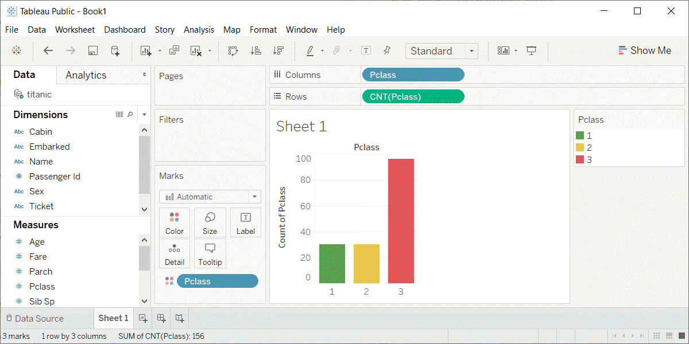
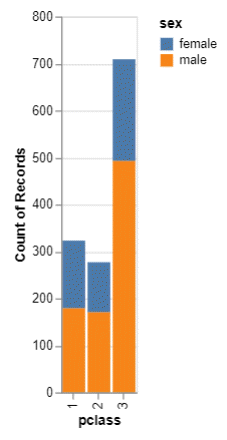
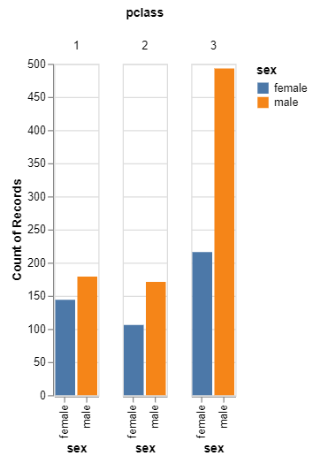

```{r child="../../common-files/src/component-header.Rmd"}
```

### Barchart fundamentals
+ Fewer in numbers than points
+ Usually a summary statistic
  + Count
  + Percent
  + Average
  + Total
+ A bar chart is NOT a histogram
  
<div class="notes">

Bar charts are different than point charts. There are usually only a few bars. These bars usually represent a summary statistic, like a count, percent, average, or total.

There is a technical distinction between a bar chart and a histogram. Histograms are a great diagnostic tool, but usually ends up on the cutting room floor. So I won't be talking about it much, if at all, in this workshop.

</div>

### Barchart fundamentals, Aesthetics for bars
+ Review
  + Location
  + Size
  + Color
  + NOT shape!!!
  
<div class="notes">

Recall that aesthetics are visual attributes associated with a geometry/mark. You can map variables to the location, size, and/or color of bars, but you cannot assign a variable to the shape of a bar.

There is a bit of potential ambiguity on bar charts. If you are looking at a vertical bar chart (the bar chart shown earlier is a vertical bar chart), then the location on the x-axis represents which category. For the vast majority of bar charts, the bars are anchored on the x-axis, though there are a few exceptions.

The location of the Y-axis, then, is the measure of the bar's height. You could, if you wanted to, call this the bar's size, but most people think of the bar's size as the width of the bar. For the vast majority of cases, the width of a bar is constant, but there are a few exceptions.

The color of a bar can refer to the interior of the bar or the border of the bar. Usually these two colors are the same, but there are some exceptions.

 We won't talk about the exceptions in this lecture, but you are welcome to ask about them, if you are curious.

You cannot vary the shape of a bar. A bar is a bar.

</div>

### Barchart fundamentals, Basic barchart
+ Python code
```
ch = alt.Chart(df).mark_bar().encode(
    x='pclass:N',
    y='count()'
```
+ R code
```
ggplot(ti, aes(x=pclass)) +
  geom_bar()
```
+ Tableau
  + Drag and drop

<div class="notes">

The Python/Altair code uses the mark_bar function instead of mark_point. You encode the passenger class on the x axis, but you have to remind Python/Altair that the values of 1, 2, and 3 represent categories of first class, second class, and third class. The y axis represents the count.

The code in R uses the geom_bar function. You can get away with specifying only a single location, the x-axis, because the default in geom_bar is to use the count as the location on the y-axis.

</div>

### Barchart fundamentals, Python output for basic barchart



<div class="notes">

This is the Python version of the barchart.

This is data from the Titanic, a ship that was as massive as its name. It was considered unsinkable, but on its maiden voyage in 1912, the ship hit an iceberg and sank. It sank during an era where people really believed in women and children first, and this shows quite clearly in the mortality statistics. There was a difference, though, between third class passengers like Leonardo diCaprio and first class passengers like Kate Winslet.

This shows a simple bar chart. The x-axis is passenger class and the y-axis is count. Note that there are about the same number of first and second class passengers, but the two combined does not come close to the number of third class passengers.

</div>

### Barchart fundamentals, R output for basic barchart

```{r basic-barchart-again}
initiate_image()
load("../../common-files/data/titanic.RData")
ggplot(titanic, aes(pclass)) +
  geom_bar()
finalize_image()
```

`r display_image`

<div class="notes">

This is the R version of the barchart.

</div>

### Barchart fundamentals, Tableau output for basic barchart



<div class="notes">

Here is the Tableau output. Notice the columns (the x-axis) is a blue pill. That tells Tableau that passenger class is a discrete dimenion (or categorical). The rows (y-axis) is the count summary function.

</div>

<!--- Exercise --->

```{r child="exercise-gender-barchart.Rmd"}
```

### Barchart fundamentals, changing the default
+ Python code
```
ch = alt.Chart(df).mark_bar(
    color='#FF0000', 
    size=5
).encode(
    x='pclass:N',
    y='count()'
)
```
+ R code
```
ggplot(titanic, aes(pclass)) +
  geom_bar(fill="#FF0000", width=0.5)
```
+ Tableau
  + Point and click

<div class="notes">

Here is the code to change the color and the size of all the bars. In Altair/Python, you place color and size arguments inside the mark_bar function. The size represents the number of pixels (not counting a one pixel border), so a value of 5 will produce a 7 pixel barrather narrow bar. The default in Python is to leave a 3 pixel gap between each bar.

In R, the arguments are different. You specify the color of a bar with the fill argument. If you tried to use the color argument, it would change the color of the border, and leave the interior of the bar as the default color.

R also uses the width argument rather than size. This might not be the best choice, but width is less ambiguous than size, which could just as easily refer to the height as the width of the bar.

In R, width is a relative measure, and a value of 1 would mean that the bars fill up the entire space without any gaps. The value of 0.5 shown here will make the bars fill 50% of the space, making the bar widths equal to the width of the gaps. The default in R is 0.8.

In Tableau, you click on the color button to change the color for every bar. You click on the size button to change the width of the bars. Slide all the way to the right to have the bars touching and all the way to the left to get a single pixel width bar.

</div>

### Barchart fundamentals, Python output for changing the default

```{python}
import pandas as pd
import altair as alt
df = pd.read_csv("../../common-files/data/titanic3.csv")
ch = alt.Chart(df).mark_bar(
    color='#FF0000',
    size=5
).encode(
    x='pclass:N',
    y='count()'
)
ch.save("../images/python/red-bars.html")
```



### Barchart fundamentals, R output for changing the default

```{r red-bars}
load("../../common-files/data/titanic.RData")
initiate_image()
ggplot(titanic, aes(pclass)) +
  geom_bar(fill="#FF0000", width=0.5)
finalize_image("Bar chart of passenger class count")
```

`r display_image`

<div class="notes">

Here is the output in R. Notice that the gaps between the bars are equal to the widths of the bars themselves.

</div>

### Barchart fundamentals, Tableau output for changing the default



<div class="notes">

This is what Tableau produces. I am showing the slider bar that appears when you click on the size button. It is almost all the way to the right, so the bars are very fat and there is only a very tiny gap between the bars.

</div>

### Barchart fundamentals, Color
+ Use for emphasis in simple bar charts
+ Very important for stacked or side-by-side bar charts

<div class="notes">

For simple bar charts like all the ones we've seen so far, color is not really needed. You already can distinguish between the passenger classes using the location. If you do use color in a simple bar chart, it is often to emphasize a point. In the previous bar chart, I used red for third class, because Kate Winslet, a rich first class passenger, found true love in third class, with the adorable Leonardo di Caprio.

Color becomes very important in just a minute when we add another layer of complexity.

</div>

### Barchart fundamentals, Coding colors
+ Python code
```
ch = alt.Chart(df).mark_bar().encode(
    alt.Color('pclass:N'),
    x='pclass:N',
    y='count()'
)
```
+ R code
```
ggplot(titanic, aes(x=pclass)) +
  geom_bar(aes(fill=pclass))
```
+ Tableau
  + Point and click

<div class="notes">

If you want each bar to be a different color, then in Python, you have to include the color inside the encode function.

In R, you have to place the variable inside the aes function.

In Tableau, you have to drag and drop the variable on top of the color button.

</div>

### Barchart fundamentals, Choosing your own colors
+ Python code
```
ch = alt.Chart(df).mark_bar().encode(
    alt.Color(
        'pclass:N',
        scale=alt.Scale(
            range=['#00FF00', '#FFFF00', '#FF0000']
        )
    ),
    x='pclass:N',
    y='count()'
)
```
<div class="notes">

While the default colors chosen by your software are almost always good, you should experiment with different color combinations. A common choice for a three level ordinal variable is the traffic light colors of red, yellow, and green.

In Python, you add a scale argument to encode.

</div>

### Barchart fundamentals, Choosing your own colors
+ R code
```
ggplot(titanic, aes(x=pclass)) +
  geom_bar(aes(fill=pclass)) +
  scale_fill_manual(values=c("#00FF00", "#FFFF00", "#FF0000"))
```
+ Tableau
  + Point and click

<div class="notes">

In R, you have to add another layer to the graph with the scale_fill_manual function. 

In Tableau, you click on each color in the legend, then click in the upper corner to lock in that bar only. Then click on the color button to change that bar to the desired color.

</div>


### Barchart fundamentals, Python output for coding colors
```{python}
import pandas as pd
import altair as alt
df = pd.read_csv("../../common-files/data/titanic3.csv")
ch = alt.Chart(df).mark_bar().encode(
    alt.Color(
        'pclass:N',
        scale=alt.Scale(
            range=['#00FF00', '#FFFF00', '#FF0000']
        )
    ), 
    x='pclass:N',
    y='count()'
)
ch.save("../images/python/traffic-light.html")
```



<div class="notes">

This is what the Python bar chart looks like.

</div>

### Barchart fundamentals, R output for coding colors

```{r bar-color}
load("../../common-files/data/titanic.RData")
initiate_image()
ggplot(titanic, aes(x=pclass)) +
  geom_bar(aes(fill=factor(pclass))) +
  scale_fill_manual(values=c("#00FF00", "#FFFF00", "#FF0000"))
finalize_image("Barchart with traffic light colors")
```

`r display_image`

<div class="notes">

This is what the R graph looks like.

</div>

### Barchart funadamentals, Tableau output for coding colors



<!--- Exercise --->

```{r child="exercise-first-class-red.Rmd"}
```

### Barchart fundamentals, Stack versus dodge
+ Summarize by two categories
+ Dodge
  + Side by side
+ Stack
  + One on top, one on bottom

<div class="notes">

Bar charts that represent a summary across a single categorical variable are fairly simple and easy to handle. But when you want to summarize by two categories simultaneously, things get interesting. Interesting in a good way.

</div>

### Barchart fundamentals, code for stack
+ Python code
```
ch = alt.Chart(df).mark_bar().encode(
    x='pclass:N',
    y='count()',
    color='sex'
)
```


### Barchart fundamentals, Python stack
```{python}
import pandas as pd
import altair as alt
df = pd.read_csv("../../common-files/data/titanic3.csv")
ch = alt.Chart(df).mark_bar().encode(
    x='pclass:N',
    y='count()',
    color='sex'
)
ch.save("../images/python/stack.html")
```



### Barchart fundamentals, Python dodge

```{python}
import pandas as pd
import altair as alt
df = pd.read_csv("../../common-files/data/titanic3.csv")
ch = alt.Chart(df).mark_bar().encode(
    x='sex',
    y='count()',
    color='sex',
    column='pclass:N'
)
ch.save("../images/python/dodge.html")
```




### Barchart fundamentals, Titanic dodge

```{r count-by-dodge}
load("../../common-files/data/titanic.RData")
initiate_image()
titanic %>%
  ggplot(aes(x=pclass, fill=sex)) +
    geom_bar(position="dodge")
finalize_image()
```

`r display_image`

<div class="notes">


</div>

### Barchart fundamentals, Titanic stack

```{r count-by-stack}
load("../../common-files/data/titanic.RData")
initiate_image()
titanic %>%
  ggplot(aes(x=pclass, fill=sex)) +
    geom_bar(position="stack")
finalize_image()
```

`r display_image`

<div class="notes">


</div>


```{r child="exercise-mortality-by-sex.Rmd"}
```

### Barchart fundamentals, Summarizations
+ One number summary (mean or percentage)
+ Two number summary (error bars)
+ Five number summary (boxplots)
+ All the data
  + Jittering
  + Opacity
  
<div class="notes">

All of the examples, so far, have used counts in the bar chart. There are many other statistics that you can choose from, and 

((note to myself: maybe this goes better in the talk about lines.))

</div>
  
### Barchart fundamentals, Switching from count to percent

((Show the code in Python, R, and Tableau. Explain why you might want counts versus percents.))

### Barchart fundamentals, Example with means

((Need to find the right data set to illustrate this. Maybe the Saratoga house prices?))

### Barchart fundamentals, Example with totals

((Same data. What means tell you versus totals.))

### Barchart fundamentals, Boxplots example

((Include an explanation of what a boxplot is))

### Barchart fundamentals, Jittering example

((Include an explanation on when it doesn't work.))

### Barchart fundamentals, Opacity example

((Note the computational expense.))

### Barchart fundamentals, Summary
+ "A mapping of data to the visual aesthetics of geometries/marks" 
  + Bars are a type of geometry/mark
  + Aesthetics for bars include location, size, color
  + Stack versus dodge
+ Basic tips
  + Place comparators close
  + Use axis ticks, light grid lines

```{r save-everything}
save.image("../data/barcharts-fundamentals.RData")
```