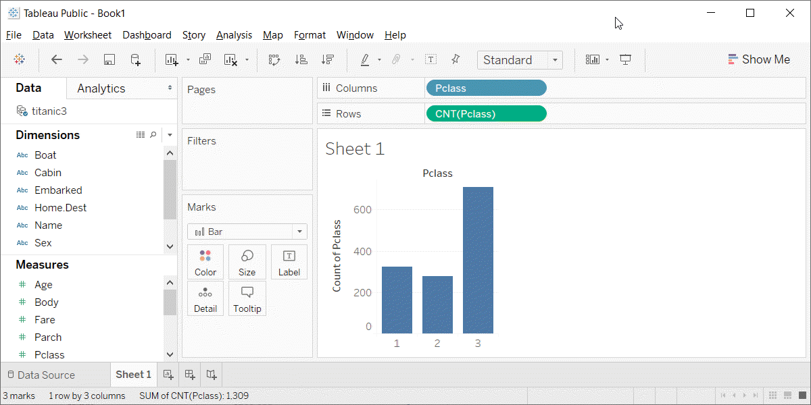

```{r child="../../common-files/src/component-header.Rmd"}
```

### Preparation, overview

+ Follow these steps to get ready for lecture #2 in data visualization.
  + Download and import Titanic data
  + Download and import scotus data

### Preparation, Titanic data set
+ R code
```
read.csv("../../common-files/data/titanic3.csv")
```
+ Python code
```
import pandas as pd
import altair as alt
df = pd.read_csv("../../common-files/data/titanic3.csv")
ch = alt.Chart(df).mark_bar().encode(
    x='pclass',
    y='count()'
)
ch.save("../images/python/basic-barchart.html")
```

<div class="notes">

Make sure you can import the file titanic3.csv to Python, R or Tableau.

</div>

### Preparation, Scotus data set
+ Python code
```
(To be added)
```
+ R code
```
(To be added)
```

<div class="notes">

Also import the scotus (Supreme Court of the United States) data.

</div>

### Preparation, kaggle website


<div class="notes">

The scotus file comes originally from the Kaggle datasets webpages. I fixed a few small typos, but you can get pretty much the same results by downloading the original file and keeping the typos in there.

</div>

### Preparation, Draw a simple bar chart

Import the data and create a bar chart showing the frequency of opinions written by year_filed. Note that there are a few typos and a few rows that do not belong. You can remove these, but they will not affect any of the analyses we are considering.

### Preparation, Code
+ Python code
```
import pandas as pd
import altair as alt
df = pd.read_csv("../../common-files/data/titanic3.csv")
ch = alt.Chart(df).mark_bar().encode(
    x='pclass:N',
    y='count()'
)
ch.save("../images/python/basic-barchart.html")
```
+ R code
```
(Add later)
```

### Preparation, Python output

```{python}
import pandas as pd
import altair as alt
df = pd.read_csv("../../common-files/data/titanic3.csv")
ch = alt.Chart(df).mark_bar().encode(
    x='pclass:N',
    y='count()'
)
ch.save("../images/python/basic-barchart.html")
```


### Preparation, R output

```{r scotus-bar, message=FALSE}
initiate_image()
sc_cases <- read.csv(file="../data/scotus_cases.csv")
ggplot(sc_cases, aes(year_filed)) +
  geom_bar()
finalize_image()
```

`r display_image`

### Preparation, Tableau steps
+ Import titanic3.csv
+ Drag pclass to columns
  + Change to Discete Dimension
+ Drag pclass to rows
  + Change to Measure(Count)
+ If needed, change Marks to Bar

### Preparation, Tableau output


