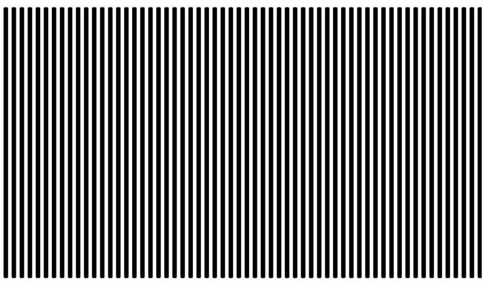
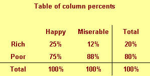
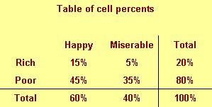

```{r child="../../common-files/src/component-header.Rmd"}
```

```{r}
load("../../common-files/data/titanic.RData")
```

### Barchart recommendations, Don't make gaps equal to widths (1/2)



<div class="notes">

If the space between the bars is equal to the width of the bars themselves, you get an unsettling vibratory effect. This is because your eye is constantly shifting perspective. Sometimes it perceives the black as the foreground and the white as the background. Sometimes it perceives the white as the foreground and the black as the background.

"I'm ten years old, my life's half over. And I don't even know if I'm black with white stripes or white with black stripes." Marty the Zebra in the movie Madagascar.

</div>

### Barchart recommendations, Don't make gaps equal to widths (2/2)


<div class="notes">

If the widths are the same and the bars are empty, then you can get a differnt problem. You might get confused as to what is the bar and what is the gap, as in this optical illusion.

As a general rule, the gap between bars should be about 10 to 20 percent of the width of the bars. Most visualization software has sensible defaults, but beware when you have a very large number of bars. There's always a bit of rounding when you place pixels on a screen or on a page. Your software is trying to fill the available plotting area, so it may have to squeeze or stretch one gap or another. This unevenness can become noticeable when the gaps are only a few pixels wide.

</div>

### Barchart fundamentals, Thoughts on location
+ Axis labels often fit better next to horizontal bars
+ Bar charts with many bars
  + Vertical bars allow more room
  + Beware of rounding artefacts
+ Do not cut off bar charts at the knees

<div class="notes">

The default for most visualization software is vertical bars, but you should give thoughtful consideration to horizontal bars. The labels often fit better when the bars are horizontal. You also often have more room left to right than you do up and down in a graph, so the bars can stretch out more, allowing you to more easily discern small and subtle differences.

If you have a very large number of bars, then a vertical format will allow those bars to fit better.

Remember the fault of default principle. Always try different ways of displaying your data. It costs nothing other than a few electrons to display a horizontal alternative to the typical vertical bar chart format, so why not indulge yourself?

</div>

### Barchart recommendations, Labels on a barchart (1/3)

```{r location-vertical-1}
load("../../common-files/data/titanic.RData")

age_class <- case_when(
  titanic$age <= 10 ~ " 0-10",
  titanic$age <= 20 ~ "11-20",
  titanic$age <= 30 ~ "21-30",
  titanic$age <= 40 ~ "31-40",
  titanic$age <= 50 ~ "41-50",
  titanic$age <= 60 ~ "51-60",
  titanic$age <= 70 ~ "61-70",
  titanic$age <= 80 ~ "71-80",
  TRUE              ~ "???"
)
age_class <- paste(age_class, "years")
initiate_image()
ggplot(titanic, aes(age_class, fill=survived)) +
  geom_bar(position="fill") + 
  theme(axis.text.x = element_text(angle = 90))
finalize_image()
```

`r display_image`

<div class="notes">

Labels often fit better on a vertical bar chart.

</div>

### Barchart recommendations, Labels on a barchart (2/3)

```{r location-vertical-2}
initiate_image()
ggplot(titanic, aes(age_class, fill=survived)) +
  geom_bar(position="fill") + 
  theme(axis.text.x = element_text(angle = 90))
finalize_image()
```

`r display_image`

<div class="notes">

You can turn the x-axis text by 90 degrees to make it fit better. But it is harder to read text that is turned 90 degrees.

</div>

### Barchart recommendations, Labels on a barchart (3/3)

```{r location-horizontal}
initiate_image()
ggplot(titanic, aes(age_class, fill=survived)) +
  geom_bar(position="fill") + 
  coord_flip()
finalize_image()
```

`r display_image`

<div class="notes">

Labels often fit better on a vertical bar chart.

</div>

### Barchart recommendations, Watch for rounding artefacts

```{r rounding-artefacts}
complete_cases <- titanic[!is.na(titanic$age), ]
age_class <- trunc(pmin(complete_cases$age, 65)/1.5)
initiate_image()
ggplot(complete_cases, aes(age_class, fill=survived)) +
  geom_bar(position="fill") + 
  coord_flip()
finalize_image()
```

`r display_image`

<div class="notes">

Here's a barchart with 44 bars. I drew the image as 480 pixels by 480 pixels. After allowing for margins, it looks like there are about 340 pixels for the 66 bars. 44 does not divide evenly into 340. You get something like 7.73. If you allocate 7 pixels per bar, that uses up 308 pixels, leaving you with 32 pixels to divide among the 43 gaps between the 44 bars. So some of the gaps will be one pixel wide and some will be zero pixels wide. 

</div>

### Barchart recommendations, sort your bars by size

```{r sorted-barchart}
n <- c(124, 55, 49, 26)
mar <- c("Married", "Single/Never married", "Divorced/Separated", "Widowed")
p <- n/sum(n)
st <- factor(1:4, labels=mar)
marital_status <- data.frame(st, n, p)
initiate_image()
ggplot(marital_status, aes(x=st, y=p)) +
  geom_col()
finalize_image("Sorted Bar chart")
```

`r display_image`

<div class="notes">

If you sort the bars by size, then comparisons between bars of approximately the same size are comparisons that are side by side. This shortens the distance that you have to project.

</div>

### Which percentage


### Data

```{r happiness-counts}
income <- rep(c("Rich", "Poor"), each=2)
outlook <- rep(c("Happy", "Miserable"), 2)
n <- c(30, 10, 90, 70)
```

### Which percentage


```{r}
row_percents <- c(75, 25, 56, 44)
```

### Which percentage



```{r}
column_percents <- c(25, 12, 75, 88)
```

### Which percentage



