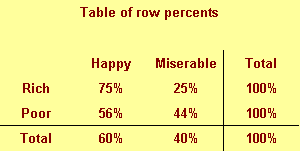

```{r child="../../common-files/src/component-header.Rmd"}
```

```{r}
load("../../common-files/data/titanic.RData")
```

### Barchart recommendations, Don't make gaps equal to widths (1/2)


<div class="notes">

If the space between the bars is equal to the width of the bars themselves, you get an unsettling vibratory effect. This is because your eye is constantly shifting perspective. Sometimes it perceives the black as the foreground and the white as the background. Sometimes it perceives the white as the foreground and the black as the background.

"I'm ten years old, my life's half over. And I don't even know if I'm black with white stripes or white with black stripes." Marty the Zebra in the movie Madagascar.

</div>

### Barchart recommendations, Don't make gaps equal to widths (2/2)


<div class="notes">

If the widths are the same and the bars are empty, then you can get a differnt problem. You might get confused as to what is the bar and what is the gap, as in this optical illusion.

As a general rule, the gap between bars should be about 10 to 20 percent of the width of the bars. Most visualization software has sensible defaults, but beware when you have a very large number of bars. There's always a bit of rounding when you place pixels on a screen or on a page. Your software is trying to fill the available plotting area, so it may have to squeeze or stretch one gap or another. This unevenness can become noticeable when the gaps are only a few pixels wide.

</div>

### Barchart fundamentals, Thoughts on location
+ Axis labels often fit better next to horizontal bars
+ Bar charts with many bars
  + Vertical bars allow more room
  + Beware of rounding artefacts
+ Do not cut off bar charts at the knees

<div class="notes">

The default for most visualization software is vertical bars, but you should give thoughtful consideration to horizontal bars. The labels often fit better when the bars are horizontal. You also often have more room left to right than you do up and down in a graph, so the bars can stretch out more, allowing you to more easily discern small and subtle differences.

If you have a very large number of bars, then a vertical format will allow those bars to fit better.

Remember the fault of default principle. Always try different ways of displaying your data. It costs nothing other than a few electrons to display a horizontal alternative to the typical vertical bar chart format, so why not indulge yourself?

</div>

### Barchart recommendations, Labels on a barchart (1/3)

```{r location-vertical-1}
load("../../common-files/data/titanic.RData")
bw <- c("#000000", "#FFFFFF")
gyr <- c("#00E800", "#E8E800", "#E80000")
pb <- c("#FFC0C0", "#0000FF")
age_class <- case_when(
  titanic$age <= 10 ~ " 0 to 10",
  titanic$age <= 20 ~ "11 to 20",
  titanic$age <= 30 ~ "21 to 30",
  titanic$age <= 40 ~ "31 to 40",
  titanic$age <= 50 ~ "41 to 50",
  titanic$age <= 60 ~ "51 to 60",
  titanic$age <= 70 ~ "61 to 70",
  titanic$age <= 80 ~ "71 to 80",
  TRUE              ~ "???"
)
# age_class <- paste(age_class, "years")
initiate_image()
ggplot(titanic, aes(age_class, fill=survived)) +
  geom_bar(position="fill", color="#000000") +
  scale_fill_manual(values=rev(bw))
finalize_image()
```

`r display_image`

<div class="notes">

Labels will sometimes clash on a vertical bar chart.

</div>

### Barchart recommendations, Labels on a barchart (2/3)

```{r location-vertical-2}
initiate_image()
ggplot(titanic, aes(age_class, fill=survived)) +
  geom_bar(position="fill", color="#000000") + 
  theme(axis.text.x = element_text(angle = 90)) +
  scale_fill_manual(values=rev(bw))
finalize_image()
```

`r display_image`

<div class="notes">

You can turn the x-axis text by 90 degrees to make it fit better. But it is harder to read text that is turned 90 degrees.

</div>

### Barchart recommendations, Labels on a barchart (3/3)

```{r location-horizontal}
initiate_image()
ggplot(titanic, aes(age_class, fill=survived)) +
  geom_bar(position="fill", color="#000000") + 
  coord_flip() +
  scale_fill_manual(values=rev(bw))
finalize_image()
```

`r display_image`

<div class="notes">

A better solution is to turn the bars sideways. The labels fit better on a horizontal bar chart.

</div>

### Barchart recommendations, Watch for rounding artefacts

```{r rounding-artefacts}
complete_cases <- titanic[!is.na(titanic$age), ]
age_class <- trunc(pmin(complete_cases$age, 65)/1.5)
initiate_image()
ggplot(complete_cases, aes(age_class, fill=survived)) +
  geom_bar(position="fill") + 
  coord_flip() + 
  scale_fill_manual(values=rev(bw))
finalize_image()
```

`r display_image`

<div class="notes">

With a large number of bars and a limited number of pixels in your image, you might end up seeing some artefacts caused by rounding. There is always some rounding error in the placement of bars, but this is mostly imperceptible when you only have a few bars. What is a pixel here or there when your bars are a hundred pixels wide and the gaps between the bars are 10 pixels wide?

But a large number of bars will shrink the width of the bars and the size of the gaps to the point where having to add or remove a pixel becomes noticeable.

Here's an example of a barchart with 44 bars. Now for this particular example, there is no compelling reason to have 44 bars, but bear with me, as there are situations, now and then, where you really want that many bars.

I drew the image as 480 pixels by 480 pixels. After allowing for margins, it looks like there are about 340 pixels for the 66 bars. 44 does not divide evenly into 340. You get something like 7.73. If you allocate 7 pixels per bar, that uses up 308 pixels, leaving you with 32 pixels to divide among the 43 gaps between the 44 bars. So some of the gaps will be one pixel wide and some will be zero pixels wide. 

</div>

### Barchart recommendations, Solutions to rounding artefacts
+ Combine categories to reduce the number of bars.
+ Increase the resolution of your plot
+ Switch to a line graph

<div class="notes">

If you notice some rounding artefacts, you have several possible remedies.

First, if you can combine categories to reduce their numbers, this will help. This particular plot had very narrow age intervals, and if you could afford to widen the intervals to five years (0 to 4, 5 to 9, etc.) or even wider, that would help. Sometimes you can combine a large number of infrequently occuring categories into an "other" category.

Combining categories has the risk of losing important details, so you do need to be careful.

In this particular example, narrow intervals are needed for children, because the survival probabilities change a lot between a 2 year old, a 5 year old, and a 13 year old passenger. But they don't change as much for adults. So a chart with eighten bars for the first eighteen years of life plus a nineteenth bar showing survival for adults might be a good compromise.

I chose 480 by 480 pixels for most of the graphs in this talk because it is, for the most part, a good compromise between size of the file and quality of the image. But for a difficult graph with 44 bars, a resolution of 960 by 960 or even higher might be needed. Be careful, though. When I import these files into another program like PowerPoint, that software may reduce the resolution in order to fit within their own page size limits. Trial and error is often the only good solution here.

</div>

### Barchart recommendations, sort your bars by size

```{r sorted-barchart}
n <- c(124, 55, 49, 26)
mar <- c("Married", "Single/Never married", "Divorced/Separated", "Widowed")
p <- n/sum(n)
st <- factor(1:4, labels=mar)
marital_status <- data.frame(st, n, p)
initiate_image()
ggplot(marital_status, aes(x=st, y=p)) +
  geom_col()
finalize_image("Sorted Bar chart")
```

`r display_image`

<div class="notes">

If you sort the bars by size, then comparisons between bars of approximately the same size are comparisons that are side by side. This shortens the distance that you have to project.

If your categories have a natural ordering, like the age groups we saw in an earlier example, you can't sort by size. A bar chart that starts with 30 to 40 year old passengers, jumps to 60 to 70 year old passengers, and then jumps again to 20 to 30 year old passengers will cause too much confusion. A Likert scale pretty much has to start with "strongly disagree" and follow the proper sequence through "disagree," "neutral," "agree," and end up at "strongly agree."

Some people like a nice orderly alphabetical order to their bars. It helps a little bit with "look up" or the process of quickly finding a particular bar of interest. But the value of look up is often overrated, as the more important visual tasks are comparisons of one bar to another rather than the rapid identification of a single bar.

</div>

### Multiple categories
+ Which bars get to snuggle?
  + Minimize distance between important comparisons
+ When should you stack?
+ Counts versus percentages
  + HOw to de-ephasize small categories
+ What percentage to use?
  + Row, column, or cell percentages

<div class="notes">

When you have two different categories, like gender and passenger class in the Titanic example, you have the opportunity to display the bar chart several different ways. It is more work, but it is often well worth your time to try your bar chart several different ways.

</div>

### Which bars get to snuggle? (1/2)

```{r passenger-class-adjacent}
initiate_image()
load("../../common-files/data/titanic.RData")
ggplot(titanic, aes(sex, fill=factor(pclass))) +
  geom_bar(position="dodge") +
  scale_fill_manual(values=gyr)
finalize_image("Dodged barchart with passenger classes adjacent")
```

`r display_image`

<div class="notes">

When you place the passenger classes next to one another, it both emphasizes and facilitates comparisons among the passenger classes. The rule is to place things close that you want to be compared. So this graph tells you that males tend to be found by far more often in third class than any other class. This is where Leonardo DiCaprio travelled. The distribution among passenger classes is uneven for women as well, but not to as great an extent.

</div>

### Which bars get to snuggle? (2/2)

```{r sex-adjacent}
initiate_image()
load("../../common-files/data/titanic.RData")
ggplot(titanic, aes(factor(pclass), fill=sex)) +
  geom_bar(position="dodge") +
  scale_fill_manual(values=pb)
finalize_image("Dodged barchart with sex adjacent")
```

`r display_image`

<div class="notes">

The emphasis changes when you place the men and women next to each other. Now the comparison that leaps out to you is that men outnumbered women in every passenger class, but down in thrid class, the gender disrepancy is the largest.

</div>

### When should you stack? (1/3)

```{r passenger-class-stacked}
initiate_image()
load("../../common-files/data/titanic.RData")
ggplot(titanic, aes(sex, fill=factor(pclass))) +
  geom_bar(position="stack") +
  scale_fill_manual(values=gyr)
finalize_image("Barchart with passenger class stacked")
```

`r display_image`

<div class="notes">

Stacking tends to emphasize how each individual piece contribute to a whole. Here you see the relative distribution of females across the three passenger classes in the bar on the left and the relative distribution of males across the three passenger classes in the bar on the right.

With the stacked chart, you also bring the third class females close to the third class males, the second class females close to the second class males, and the first class females close to the first class males. But notice that the comparison of the bottom components, the third class females to the third class males is the easiest comparison, because it is a projection. To compare third class females to third class males, you just slide the female blue bar horizontally to the male blue bar. For the others, the comparison is a superimposition, you have to shift one bar diagonally to compare it to another. The two salmon bars representing first class females and first class males are almost the same size, but it's hard to tell with this graph because the diagonal shift is slower and less accurate.

</div>

### When should you stack? (2/3)

```{r passenger-class-reverse-stacked}
initiate_image()
load("../../common-files/data/titanic.RData")
titanic$reverse_pclass <- factor(4-titanic$pclass, labels=3:1)
ggplot(titanic, aes(sex, fill=factor(reverse_pclass))) +
  geom_bar(position="stack") +
  scale_fill_manual(values=rev(gyr))
finalize_image("Barchart with passenger class stacked in reverse order")
```

`r display_image`

<div class="notes">

Notice how the comparison of first class females and first class males is so much easier when you place them at the bottom of the graph?

</div>

### When should you stack? (3/3)

```{r sex-stacked}
initiate_image()
load("../../common-files/data/titanic.RData")
ggplot(titanic, aes(factor(pclass), fill=sex)) +
  geom_bar(position="stack") +
  scale_fill_manual(values=pb)
finalize_image("Barchart with sex stacked")
```

`r display_image`

<div class="notes">

You can switch things so that gender is stacked for each passenger class. This barchart shows that setting up a co-ed volleyball team would be a lot easier in first or second class, which have a roughly equal distribution of mean and women compared to third class.

</div>

### Which percentage


<div class="notes">

When you are computing percentages, you need to decide what particular percentage you want. The data set shown above is totally fictional, but it helps you understand what your options are.

This represents a sample of 200 people who are classified by income (rich or poor) and by outlook (happy or miserable). 

</div>

### Data

```{r happiness-counts}
income <- rep(c("Rich", "Poor"), each=2)
outlook <- rep(c("Happy", "Miserable"), 2)
n <- c(30, 10, 90, 70)
```

### Which percentage



<div class="notes">

You can compute row percentages which divide the entry in each row by the row total. Row percents add up to 100% within each row.


```{r outlook-stack}
n <- c(30, 10, 90, 70)
happy <- data.frame(
  income=rep(rep(c("Rich", "Poor"), each=2), each=n),
  outlook=rep(rep(c("Happy", "Miserable"), 2), each=n)
)
initiate_image()
ggplot(happy, aes(x=income, fill=outlook)) +
  geom_bar(position="fill")
finalize_image()
```

`r display_image`

<div class="notes">


</div>

### Which percentage


```{r}
column_percents <- c(25, 12, 75, 88)
```

### Which percentage


