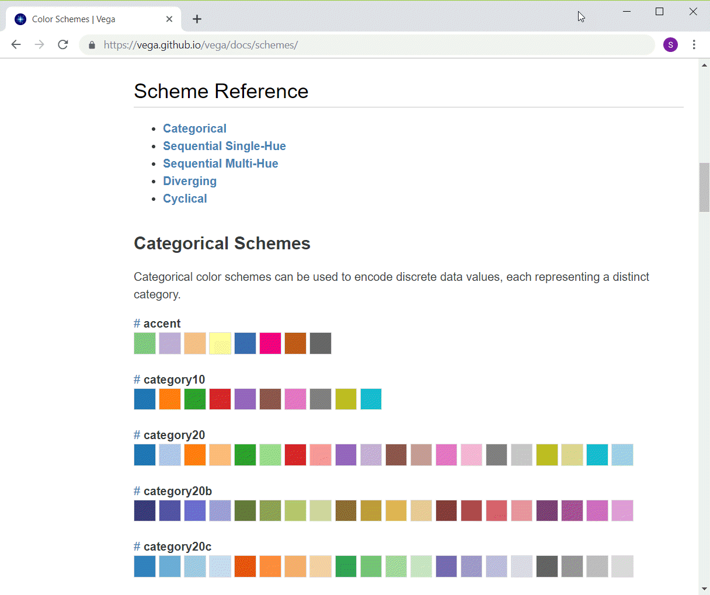

```{r child="../../common-files/src/component-header.Rmd"}
```

```{r}
load("../../common-files/data/titanic.RData")
```

### Python color schemes



### Python change colors

```{python}
import pandas as pd
import altair as alt
df = pd.read_csv("../../common-files/data/houses.csv")
ch = alt.Chart(df).mark_point().encode(
    alt.Color('Bathrooms', scale=alt.Scale(scheme='Inferno')),
    x='Age',
    y='Price'
)
ch.save("../images/python/change-colors.html")
```

### Barchart recommendations, similar to fashion


<div class="notes">

It's a well known fasion mistake to wear too many colors at the same time. Maybe this guy could get away with it, but most of us would look like idiots if we tried to dress that way.

There's a similar lesson for data visualization.

</div>

### Barchart recommendations, Don't overuse colors.


<div class="notes">

Naomi Robbins, an expert on data visualization, made an interesting observation. You would never make each word in a sentence a different color. So why would you make every bar, every point, and every line a different color?

Too many colors dilutes the impact that color can have.

You can use a second color to add emphasis. Or maybe a gradient between two different colors could work. Doing more than this is usually a big mistake.

</div>

### Colors, Contrasting pure colors often appear too intense

```{r intense}
initiate_image()
c3 <- c("#FF0000", "#00FF00", "#0000FF")
l3 <- c("#FF9090", "#90FF90", "#9090FF")
d3 <- c("#700000", "#007000", "#000070")
df <- data.frame(
  x=rep(1:3, each=3), 
  y=rep(3:1, 3),
  b=rep(c3, 3),
  f=rep(c3, each=3)
)
df <- df[c(2:4, 6:8), ]
ggplot(df, aes(x, y)) +
  expand_limits(x=c(0, 4), y=c(0, 4)) +
  geom_point(size=30, color=df$b, shape="square") +
  geom_text(
    color=df$f,
    label=paste0("F=", df$f, "\nB=", df$b)) +
  theme_void() +
  theme(
    panel.background=element_rect(fill="#888888")
  )
finalize_image()
```

`r display_image`

<div class="notes">


</div>

### Colors, Lighter background, darker foreground

```{r both}
initiate_image()
df <- data.frame(
  x=rep(1:3, each=3), 
  y=rep(3:1, 3),
  b=rep(l3, 3),
  f=rep(d3, each=3)
)
df <- df[c(2:4, 6:8), ]
ggplot(df, aes(x, y)) +
  expand_limits(x=c(0, 4), y=c(0, 4)) +
  geom_point(size=30, color=df$b, shape="square") +
  geom_text(
    color=df$f,
    label=paste0("F=", df$f, "\nB=", df$b)) +
  theme_void() +
  theme(
    panel.background=element_rect(fill="#888888")
  )
finalize_image()
```

`r display_image`

<div class="notes">


</div>

### Colors, or the reverse

```{r reverse}
initiate_image()
df <- data.frame(
  x=rep(1:3, each=3), 
  y=rep(3:1, 3),
  b=rep(d3, 3),
  f=rep(l3, each=3)
)
df <- df[c(2:4, 6:8), ]
ggplot(df, aes(x, y)) +
  expand_limits(x=c(0, 4), y=c(0, 4)) +
  geom_point(size=30, color=df$b, shape="square") +
  geom_text(
    color=df$f,
    label=paste0("F=", df$f, "\nB=", df$b)) +
  theme_void() +
  theme(
    panel.background=element_rect(fill="#888888")
  )
finalize_image()
```

`r display_image`

<div class="notes">


</div>

### Avoid the rainbow gradient

(To be added)