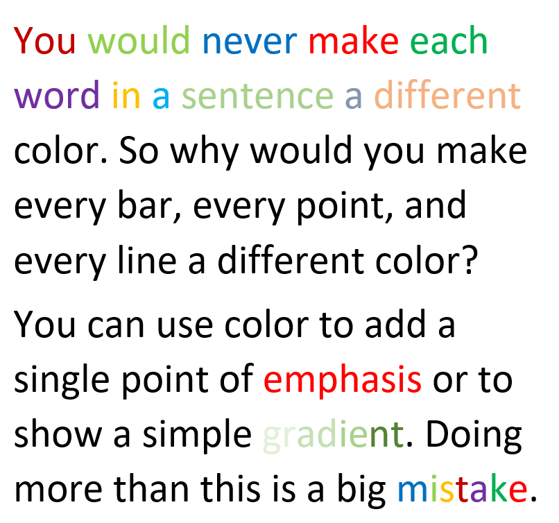

```{r child="../../common-files/src/component-header.Rmd"}
```

```{r}
load("../../common-files/data/titanic.RData")
```

### Color recommendations, lessons from the world of fashion


<div class="notes">

It's a well known fasion mistake to wear too many colors at the same time. Maybe this guy could get away with it, but most of us would look like idiots if we tried to dress that way.

There's a similar lesson for data visualization.

</div>

### Barchart recommendations, Don't overuse colors.



<div class="notes">

Naomi Robbins, an expert on data visualization, made an interesting observation. You would never make each word in a sentence a different color. So why would you make every bar, every point, and every line a different color?

Too many colors dilutes the impact that color can have.

You can use a second color to add emphasis. Or maybe a gradient between two different colors could work. Doing more than this is usually a big mistake.

</div>

### The power of a single color


<div class="notes">

Graphic designers have known for quite a while that a restrained use of colors can be very effective. Here is an image from a YouTube video clip, 

The Travelers - Look under the Umberella commercial (1986). Retrieved 2019-09-07 from https://www.youtube.com/watch?v=3zQX66jd_c0.

The single red umbrella in a sea of black umbrellas stands out. Your eye can't help but follow this umbrella as it travels across the screen from left to right. It's a very powerful image.

A small dollop of color in your visualizations can be far more effective than using a whole bunch of different colors.

### Count the fives

```{r count-nine-colors}
initiate_image()
set.seed(123547)
n <- 30
x <- runif(n)
y <- runif(n)
z <- factor(1+floor(9*runif(n)))
df <- data.frame(x, y, z)
ggplot(df, aes(x, y, color=z)) +
  geom_text(label=z, size=10) +
  theme(legend.position="none")
finalize_image()
```

`r display_image`

<div class="notes">

Here's an exercise that adapted from Olson and Bergen.

How many fives are there in this picture. I've used a different color for each number to make it easier for you to pick out any particular number. It takes a while, but you can see that there are three 5's, clustered in the lower right corner of the graph.

Did the colors help? Well, not all that much. It is hard to pick out nine colors and not have a few of them look very similar. In particular, the 5's and the 6's are pretty close, as are the 8's and the 9's.

</div>

### Count the fives

```{r count-two-colors}
initiate_image()
set.seed(123547)
n <- 30
x <- runif(n)
y <- runif(n)
z <- factor(1+floor(9*runif(n)))
df <- data.frame(x, y, z)
co <- ifelse(z==5, "red", "black")
ggplot(df, aes(x, y)) +
  geom_text(label=z, size=10, color=co) +
  theme(legend.position="none")
finalize_image()
```

`r display_image`

<div class="notes">

When you use a bit of restraint and only show two colors, you make the process of identifying all the fives much easier. The red fives are like the red umbrella in the Traveller's commercial.

</div>

### Count the fives

```{r count-black-gray}
initiate_image()
set.seed(123547)
n <- 30
x <- runif(n)
y <- runif(n)
z <- factor(1+floor(9*runif(n)))
df <- data.frame(x, y, z)
co <- ifelse(z==5, "black", "gray")
ggplot(df, aes(x, y)) +
  geom_text(label=z, size=10, color=co) +
  theme(legend.position="none")
finalize_image()
```

`r display_image`

<div class="notes">

The same trick works with black versus gray. By making some features of your graph gray, you help them to fade into the background, making what remains in black more prominent.

Now why would you want to make something fade into the background? Why not just eliminate it? Sometimes that makes sense, but often you want to see the overall range that the emphasized points lie in.

</div>

### Problems with emphasis
+ Don't always know what to emphasize
  + Solution: interactivity
+ Let the data speak for itself
  + But sometimes data speaks too subtly
+ Potential for deception
+ Bias potential in EVERY visualization choice

<div class="notes">

Now, if you feel a bit of unease about this example, it is a feeling I share. I used bold colors for the 5's. Red versus black or black versus gray. Doesn't this hurt the feelings of the other numbers? I hear the 6 has a fragile ego.

Seriously, the effort to emphasize one group always results in the de-empahsis of other groups. You may feel uncomfortable with this because you don't really know what group is worth emphasizing. Fair enough. If you don't know, then there are interactive features like mouseover that allow the end user to change the emphasis on the fly to what they find intersting. Mouseover is a feature where the graph changes as you let the mouse hover over certain features of the graph. It is a very effective tool, but beyond the scope of this workshop.

There's also a common refrain, "LEt the data speak for itself." It sounds nice in theory, but in practice, data doesn't speak very well. It has a soft voice. It mumbles. It's message gets lost in the noise. You job as a data visualizer is to amplify the message. If you are afraid to do this, you are in the wrong job.

The other thing to keep in mind is that if you have the power to emphasize (or de-emphasize) certain features of the data, you have the power to deceive your reader. And this happens a lot. I won't share any deceptive plots with you, but you can find them easily with a Google search.

</div>

### Colors, Contrasting pure colors often appear too intense

```{r intense}
initiate_image()
c3 <- c("#FF0000", "#00FF00", "#0000FF")
l3 <- c("#FF9090", "#90FF90", "#9090FF")
d3 <- c("#700000", "#007000", "#000070")
df <- data.frame(
  x=rep(1:3, each=3), 
  y=rep(3:1, 3),
  b=rep(c3, 3),
  f=rep(c3, each=3)
)
df <- df[c(2:4, 6:8), ]
ggplot(df, aes(x, y)) +
  expand_limits(x=c(0, 4), y=c(0, 4)) +
  geom_point(size=30, color=df$b, shape="square") +
  geom_text(
    color=df$f,
    label=paste0("F=", df$f, "\nB=", df$b)) +
  theme_void() +
  theme(
    panel.background=element_rect(fill="#888888")
  )
finalize_image()
```

`r display_image`

<div class="notes">


</div>

### Colors, Lighter background, darker foreground

```{r both}
initiate_image()
df <- data.frame(
  x=rep(1:3, each=3), 
  y=rep(3:1, 3),
  b=rep(l3, 3),
  f=rep(d3, each=3)
)
df <- df[c(2:4, 6:8), ]
ggplot(df, aes(x, y)) +
  expand_limits(x=c(0, 4), y=c(0, 4)) +
  geom_point(size=30, color=df$b, shape="square") +
  geom_text(
    color=df$f,
    label=paste0("F=", df$f, "\nB=", df$b)) +
  theme_void() +
  theme(
    panel.background=element_rect(fill="#888888")
  )
finalize_image()
```

`r display_image`

<div class="notes">


</div>

### Colors, or the reverse

```{r reverse}
initiate_image()
df <- data.frame(
  x=rep(1:3, each=3), 
  y=rep(3:1, 3),
  b=rep(d3, 3),
  f=rep(l3, each=3)
)
df <- df[c(2:4, 6:8), ]
ggplot(df, aes(x, y)) +
  expand_limits(x=c(0, 4), y=c(0, 4)) +
  geom_point(size=30, color=df$b, shape="square") +
  geom_text(
    color=df$f,
    label=paste0("F=", df$f, "\nB=", df$b)) +
  theme_void() +
  theme(
    panel.background=element_rect(fill="#888888")
  )
finalize_image()
```

`r display_image`

<div class="notes">


</div>

### Colors, Contrasting pure colors often appear too intense

```{r test-intense}
initiate_image()
d3 <- c("#FFCCCC", "#FF9999", "#FF6666", "#FF3333", "#FF0000", "#CC0000", "#990000", "#660000", "#330000")
c3 <- c("#003300", "#006600", "#009900", "#00CC00", "#00FF00", "#33FF33", "#66FF66", "#99FF99", "#CCFFCC")
t <- c(" ",  paste0("F=", c3, ", B=", d3))
b <- rep(1,4)
o <- c(b, 2, b, b, 3, b, b, 4, b, b, 5, b, b, 6, b, b, 7, b, b, 8, b, b, 9, b, b, 10, b)
df <- data.frame(
  y=rep((0:8)/2, each=9), 
  x=rep(0:8, length(c3)),
  b=rep(d3, each=9),
  f=rep(c3, each=9),
  t=t[o]
)
ggplot(df, aes(x, y)) +
  expand_limits(x=c(0, 8), y=c(0, 4)) +
  geom_point(size=30, color=df$b, shape="square") +
  geom_text(color=df$f, label=df$t, size=12) +
  theme_void() +
  theme(
    panel.background=element_rect(fill="#888888")
  )
finalize_image()
```

`r display_image`

<div class="notes">


</div>

### Colors, Contrasting pure colors often appear too intense

```{r test-intense2}
initiate_image()
g <- c("#FF0000", "#00FF00", "#0000FF")
c3 <- rep(g, each=3)[-c(1, 5, 9)]
d3 <- rep(g, 3)[-c(1, 5, 9)]
t <- c(" ",  paste0("F=", c3, ", B=", d3))
b <- rep(1,4)
o <- c(b, 2, b, b, 3, b, b, 4, b, b, 5, b, b, 6, b, b, 7, b)
df <- data.frame(
  y=rep((6:1)/2, each=9), 
  x=rep((0:8)/2, 6),
  b=rep(d3, each=9),
  f=rep(c3, each=9),
  t=t[o]
)
ggplot(df, aes(x, y)) +
  geom_point(size=37, color=df$b, shape="square") +
  expand_limits(y=c(0.37, 3.11)) +
  geom_text(color=df$f, label=df$t, size=12) +
  theme_void() +
  theme(
    panel.background=element_rect(fill="#888888")
  )
finalize_image()
```

`r display_image`

<div class="notes">


</div>

### Colors, Pure color circle

```{r hsv-pure-circle}
initiate_image()
twist=0.03
n4 <- 600
t4 <- (0:(n4-1))/n4
x4 <- cos( 2*3.14159*t4+twist)
y4 <- sin(-2*3.14159*t4+twist)
c4 <- hsv(t4, 1, 1) 
dg4 <- data.frame(x=x4, y=y4, co=c4)
ggplot(dg4, aes(x, y)) + 
  geom_point(col=dg4$co) +
  expand_limits(y=c(-5, 1)) + 
  expand_limits(x=c(-1.2, 1.2)) + 
  theme_void() +
  theme(
    panel.background=element_rect(fill="#808080")
  )
finalize_image()
```

`r display_image`

### Colors, Lighter color circle

```{r hsv-lighter-circle}
initiate_image()
d <- 0.5
twist=0.03
n5 <- 600
t5 <- (0:(n5-1))/n5
x5 <- d*cos( 2*3.14159*t5+twist)
y5 <- d*sin(-2*3.14159*t5+twist)
c5 <- hsv(t5, d, 1) 
dg5 <- data.frame(x=x5, y=y5, co=c5)
dg5 <- rbind(dg4, dg5)
ggplot(dg5, aes(x, y)) + 
  geom_point(col=dg5$co) +
  expand_limits(y=c(-5, 1)) + 
  expand_limits(x=c(-1.2, 1.2)) + 
  theme_void() +
  theme(
    panel.background=element_rect(fill="#808080")
  )
finalize_image()
```

`r display_image`

### Colors, Darker color circle

```{r hsv-darker-circle}
initiate_image()
d <- 0.75
twist=0.03
n6 <- 600
t6 <- (0:(n6-1))/n6
x6 <- cos( 2*3.14159*t6+twist)
y6 <- sin(-2*3.14159*t6+twist)-1
c6 <- hsv(t6, 1, d) 
dg6 <- data.frame(x=x6, y=y6, co=c6)
dg6 <- rbind(dg4, dg6)
ggplot(dg6, aes(x, y)) + 
  geom_point(col=dg6$co) +
  expand_limits(y=c(-5, 1)) + 
  expand_limits(x=c(-1.2, 1.2)) + 
  theme_void() +
  theme(
    panel.background=element_rect(fill="#808080")
  )
finalize_image()
```

`r display_image`

### Colors, Contrasting pure colors often appear too intense

```{r test-intense3}
initiate_image()
g <- c("#800000", "#008000", "#000080")
h <- c("#FF8080", "#80FF80", "#8080FF")
c3 <- rep(g, each=3)[-c(1, 5, 9)]
d3 <- rep(h, 3)[-c(1, 5, 9)]
t <- c(" ",  paste0("F=", c3, ", B=", d3))
b <- rep(1,4)
o <- c(b, 2, b, b, 3, b, b, 4, b, b, 5, b, b, 6, b, b, 7, b)
df <- data.frame(
  y=rep((6:1)/2, each=9), 
  x=rep((0:8)/2, 6),
  b=rep(d3, each=9),
  f=rep(c3, each=9),
  t=t[o]
)
ggplot(df, aes(x, y)) +
  geom_point(size=37, color=df$b, shape="square") +
  expand_limits(y=c(0.37, 3.11)) +
  geom_text(color=df$f, label=df$t, size=12) +
  theme_void() +
  theme(
    panel.background=element_rect(fill="#888888")
  )
finalize_image()
```

`r display_image`

<div class="notes">


</div>


### Avoid the rainbow gradient

(To be added)

### When to use simple gradient

(To be added)

### When to use divergent gradient

(To be added)

### When to use circular gradient

(To be added)

### Equal luminence

(To be added)

### Avoid crosshatching

(To be added)

### Varying hue and saturation

(To be added)