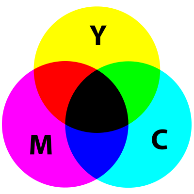

```{r child="../../common-files/src/component-header.Rmd"}
```

### Colors, introductory tutorial
+ Kindergarten view of colors
+ Review hexadecimal codes
+ Color systems
  + RGB
  + HSV
  + CMYK
  
<div class="notes">

There are three major color systems used on computers, RGB, HSV, and CYMK. I'll discuss RGB in detail, and touch briefly on the other systems. But you need to realize that how colors work on a computer was not the way you learned in Kindergarten. A solid understanding of the RGB color system also requires you to work comfortably with hexadecimal codes, so I have a brief review of that as well.

</div>

### Colors, Everything I know about colors, I learned in Kindergarten.


<div class="notes">

It was probably in Kindergarten where you learned the basic way to combine primary colors. Yellow plus red equals orange, Yellow plus blue equals green. Red plus blue equals purple/violoet.

It doesn't work that way on a computer screen because screens use light to create colors and lights blend in different ways than paints or crayons.

Before you tackle ths computer system for colors, you need to review binary and hexadecimal number systems.

</div>

### Colors, Binary codes
+ "There are 10 types of programmers in the world, those who undestand binary and those who don't."
  + 1001 1100 (base 2)
  + = $1*2^7+0*2^6+0*2^5+1*2^4+1*2^3+1*2^2+0*2^1+0*2^0$
  + = 128+16+8+4 = 156
+ Eight binary digits represent the numbers 0-255
  
<div class="notes">

Let me share a bad joke about binary numbers. Actually, you need to read it because the digits "1"-"0" represent something entirely different in the world of binary numbers.

Here's an example of how to decode the binary number 1001 1100.

Binary numbers use powers of two: 1, 2, 4, 8, 16, etc. Eight binary digits can represent any number from 0 to 255.

</div>

### Colors, Hexadecimal codes
+ Hexadecimal digits (base 16)
  + 0-9, A=10, B=11, C=12, D=13, E=14, F=15
  + 1001 1100 (base 2)
  + = 9C (base 16)
  + = $9*16^1+12*16^0$
+ Two hexadecimal digits represent the numbers 0-255.
  + 00 (base 16) = 0, FF (base 16) = 255
+ A # prefix implies hexadecimal in most computer languages.

<div class="notes">

Binary representations get unwieldy very quickly, and the hexadecimal format provides a much tighter representation that still has the spirit of binary. It is fairly easy to switch back and forth between binary and hexadecimal.

Hexadecimal means powers of 16 and you can represent numbers up to (but not including) 16 using four binary digits. The ehxadecimal digits start out like normal digits, 0, 1, 2, etc. but once you get up to nine you run out of single digits. So the value of 10 is represented by the letter A, the value of 11 by B, etc. through the letter F which represents 15. At sixten, you roll over to the next place.

So you count in hexadecimal like 0, 1, 2, 3, 4, 5, 6, 7, 8, 9, A, B, C, D, E, F, 10, 11, ...

Split the eight digit binary number 1001 1100 into groups of four binary digits. The binary 1001 is equal to 9 and the binary 1100 is equal to 12 or C. So the hexadecimal equivalent is 9C. You can represent this using powers of 16, 9 times 16 to the first power plus twelve times 16 to the zeroth power. That works out to 156.

Tow hexadecimal digits just like eight binary digits can represent the numbers 0 to 255, with 00 hexadecimal equaling 0 and FF hexadecimal equaling 255 (15*16+15).

Use the prefix of a pound sign (hash tag) to tell the computer that you are speaking to it in hexadecimal.

</div>

### Colors, Codes for colors
+ #rrggbb format
  + #000000 is pure black
  + #FFFFFF is pure white
  + #FF0000 is pure red
  + #00FF00 is pure green
  + #0000FF is pure blue
+ You can mix and match to get 16,777,216 colors
  + #800080 is purple, #FF69B4 is pink, #40e0d0 is turquoise
  
<div class="notes">

The RGB format uses six hexadecimal digits to represent colors. A hexidecimal of all zeros is pure black and at the other extreme, a hexidecimal of all F's is pure white. 

The first two hexidecimal digits represent the red channel. The highest value FF for the red channel combined with zeros for the other two channels (#FF0000) equals pure red. 

The next two digits represent the green channel. #00FF00, giving the maximum to the green channel and the minimum to the other two channels produces a pure green. 

The last two digits represent the blue channel, and #0000FF represents pure blue.

You can combine these in a variety of ways. You end up with an almost unlimited number of colors. Six hexadecimal digits allow you to produce 16^6 or 16,777,216 different colors.

</div>

### Colors, Red plus green equals yellow

```{r red-plus-green}
add_colors <- function(c1, c2, c3) {
  df <- data.frame(
    x=rep(2, 3),
    y=3:1,
    b=c(c1, c2, c3)
  )
  ggplot(df, aes(x, y)) +
    geom_text(color=df$b, size=24, label=df$b) +
    expand_limits(x=c(0, 4), y=c(0, 4)) +
    geom_text(x=0.25, y=2, label="+", size=24) +
    geom_segment(x=0.75, y=1.5, xend=3.25, yend=1.5, size=3) +
    theme_void() +
    theme(
      panel.background=element_rect(fill="#888888"))
}
initiate_image()
add_colors("#FF0000", "#00FF00", "#FFFF00")
finalize_image()
```

`r display_image`

<div class="notes">

Whne you combine colors in the RGB system, they become lighter in color. So if you add red light (FF in the red channel) to green light (FF in the green chanel), you get yellow, which is FF in both the red and green channels.

</div>

### Colors, Red plus blue equals magenta

```{r red-plus-blue}
a3 <- c("#FF0000", "#FF0000", "#00FF00")
b3 <- c("#00FF00", "#0000FF", "#0000FF")
c3 <- c("#FFFF00", "#FF00FF", "#00FFFF")
initiate_image()
add_colors("#FF0000", "#0000FF", "#FF00FF")
finalize_image()
```

`r display_image`

<div class="notes">

Red plus blue gives you #FF00FF, which is magenta, a light purplish red.

</div>

### Colors, Green plus blue equals cyan

```{r green-plus-blue}
initiate_image()
add_colors("#00FF00", "#0000FF", "#00FFFF")
finalize_image()
```

`r display_image`

<div class="notes">

Green plus blue gives you #00FFFF, which is cyan, a greenish blue color.

</div>

### Colors, Yellow plus blue equals white

```{r yellow-plus-blue}
initiate_image()
add_colors("#FFFF00", "#0000FF", "#FFFFFF")
finalize_image()
```

`r display_image`

<div class="notes">

Yellow has FF in the red and green channels and 00 in the blue chanel. If you combine yellow with blue, you fill up all three channels and produce white.

Notice that this is not at all what happens with crayons or paints. In those settings, yellow plus blue gives you green.

</div>

### Colors, Magenta plus green equals white

```{r magenta-plus-green}
initiate_image()
add_colors("#FF00FF", "#00FF00", "#FFFFFF")
finalize_image()
```

`r display_image`

<div class="notes">

Similarly, magenta has FF in the red and blue channles. Add green to fill in the last channel and you get white.

</div>

### Colors, Cyan plus red equals white

```{r cyan-plus-red}
initiate_image()
add_colors("#00FFFF", "#FF0000", "#FFFFFF")
finalize_image()
```

`r display_image`

<div class="notes">

Finally, cyan has FF in the green and blue channels. Adding red to fill the last channel produces white.

</div>

### Colors, The color cube (1/2)

```{r color-cube-1}
initiate_image()
k <- data.frame(x= 0, y= 0, co="#000000")
r <- data.frame(x=-5, y=-5, co="#FF0000") 
g <- data.frame(x= 7, y= 0, co="#00FF00")
b <- data.frame(x= 0, y= 7, co="#0000FF")
y <- data.frame(x= 2, y=-5, co="#FFFF00")
z <- data.frame(x=-5, y= 2, co="#FF00FF")
m <- data.frame(x= 7, y= 7, co="#00FFFF")
w <- data.frame(x= 2, y= 2, co="#FFFFFF")

df <- rbind(k, r, g, b, y, z, w)
dg <- rbind(k, r, k, g, k, b)

ggplot(dg, aes(x, y)) + 
  geom_path(col="white") +
  geom_text(col=dg$co, label=dg$co, angle=-45, hjust=0.5) +
  expand_limits(x=c(-7, 9)) +
  expand_limits(y=c(-7, 9)) +
  theme_void() +
  theme(
    panel.background=element_rect(fill="#808080")
  )
finalize_image("The three axes of the color cube")
```

`r display_image`

<div class="notes">

The color cube shows the three dimensions (red, green, and blue) of the RGB color system as axes in a three dimensional space.

</div>

### Colors, The color cube (2/2)

```{r color-cube-2}
initiate_image()
dg <- rbind(k, r, y, g, k, b, m, g, m, w, y, r, z, w, z, b)

ggplot(dg, aes(x, y)) + 
  geom_path(col="white") +
  geom_text(col=dg$co, label=dg$co, angle=-45, hjust=0.5) +
  expand_limits(x=c(-7, 9)) +
  expand_limits(y=c(-7, 9)) +
  theme_void() +
  theme(
    panel.background=element_rect(fill="#808080")
  )
finalize_image("The full color cube with a front white vertex")
```

`r display_image`

<div class="notes">

The combination colors of yellow, magenta, cyan, and white represent different vertices of the color cube.

</div>

### Colors, Gradients of black to red

```{r gradient-black-to-red}
initiate_image()
h <- c("0", "3", "6", "9", "C", "F")

rg <- paste0("#", h, h, "0000")

n <- length(rg)
p <- (0:(n-1))/(n-1)
rx <- r$x*p
ry <- r$y*p

gg <- paste0("#00", h, h, "00")
gx <- g$x*p
gy <- g$y*p

bg <- paste0("#0000", h, h)
bx <- b$x*p
by <- b$y*p

da <- data.frame(
  x=c(rx, gx, bx), 
  y=c(ry, gy, by), 
  g=c(rg, gg, bg), 
  a=rep(c(-45, -45, -45), each=n),
  j=rep(c(0.5, 0.5, 0.5), each=n))
df <- da[1:n, ]

ggplot(dg, aes(x, y)) + 
  geom_path(col="white") +
  geom_text(data=df, col=df$g, label=df$g, angle=df$a, hjust=df$j) +
  expand_limits(x=c(-7, 9)) +
  expand_limits(y=c(-7, 9)) +
  theme_void() +
  theme(
    panel.background=element_rect(fill="#888888")
  )
finalize_image()
```

`r display_image`

<div class="notes">

You can develop gradients, gradual and continuous changes in color, by varying the channels from lowest to highest. If you let the red channel range from 00 to FF and keep the other channels at zero, you get a gradient from black through dark shades of red to pure red.

The figure only shows six values for the gradient (red channels ranging from 00 to 33, to 66 to 99 to CC), but you can produce 255 different shades between black and red.

</div>

### Colors, Gradients of black to green

```{r gradient-black-to-green}
initiate_image()

df <- da[(n+1):(2*n), ]

ggplot(dg, aes(x, y)) + 
  geom_path(col="white") +
  geom_text(data=df, col=df$g, label=df$g, angle=df$a, hjust=df$j) +
  expand_limits(x=c(-7, 9)) +
  expand_limits(y=c(-7, 9)) +
  theme_void() +
  theme(
    panel.background=element_rect(fill="#888888")
  )
finalize_image()
```

`r display_image`

<div class="notes">

Similarly, if you let the green channel vary from 00 to FF and hold the red and blue channels at zero, you get a gradient that goes from black through dark shades of green to pure green.

</div>

### Colors, Gradients of black to blue

```{r gradient-black-to-blue}
initiate_image()

df <- da[(2*n+1):(3*n), ]

ggplot(dg, aes(x, y)) + 
  geom_path(col="white") +
  geom_text(data=df, col=df$g, label=df$g, angle=df$a, hjust=df$j) +
  expand_limits(x=c(-7, 9)) +
  expand_limits(y=c(-7, 9)) +
  theme_void() +
  theme(
    panel.background=element_rect(fill="#888888")
  )
finalize_image()
```

`r display_image`

<div class="notes">

Varying the blue channel from 00 to FF while keeping the red and green channels at zero will produce a gradient of black through dark shades of blue to pure blue.

</div>

### Colors, Gradients of red to white

```{r gradient-red-to-white}
initiate_image()
h <- c("0", "3", "6", "9", "C", "F")

rg <- paste0("#FF", h, h, h, h)

n <- length(rg)
p <- (0:(n-1))/(n-1)
rx <- r$x + (w$x-r$x)*p
ry <- r$y + (w$x-r$x)*p

gg <- paste0("#", h, h, "FF", h, h)
gx <- g$x + (w$x-g$x)*p
gy <- g$y + (w$y-g$y)*p

bg <- paste0("#", h, h, h, h, "FF")
bx <- b$x + (w$x-b$x)*p
by <- b$y + (w$y-b$y)*p

da <- data.frame(
  x=c(rx, gx, bx), 
  y=c(ry, gy, by), 
  g=c(rg, gg, bg), 
  a=rep(c(0, 0, 0), each=n),
  j=rep(c(0.5, 0.5, 0.5), each=n))

df <- da[1:n, ]
ggplot(dg, aes(x, y)) + 
  geom_path(col="white") +
#  geom_text(col=dg$co, label=dg$co, angle=-45, hjust=0.5) +
  geom_text(data=df, col=df$g, label=df$g, angle=df$a, hjust=df$j) +
  expand_limits(x=c(-7, 9)) +
  expand_limits(y=c(-7, 9)) +
  theme_void() +
  theme(
    panel.background=element_rect(fill="#888888")
  )
finalize_image()
```

`r display_image`

<div class="notes">

To create a gradient from red through the lighter shades of red (pinkish, actually) to white, keep the red channel at full strength (FF) and vary the green and blue channels from 00 to FF.

</div>


### Colors, Gradient of green to white

```{r gradient-green-to-white}
initiate_image()
df <- da[(n+1):(2*n), ]
ggplot(dg, aes(x, y)) + 
  geom_path(col="white") +
  geom_text(data=df, col=df$g, label=df$g, angle=df$a, hjust=df$j) +
  expand_limits(x=c(-7, 9)) +
  expand_limits(y=c(-7, 9)) +
  theme_void() +
  theme(
    panel.background=element_rect(fill="#888888")
  )
finalize_image()
```

`r display_image`

<div class="notes">

Similary, you can create a gradient from pure green through the lighter shades of green to white.

</div>

### Colors, Gradient of blue to white

```{r gradient-blue-to-white}
initiate_image()
df <- da[(2*n+1):(3*n), ]
ggplot(dg, aes(x, y)) + 
  geom_path(col="white") +
  geom_text(data=df, col=df$g, label=df$g, angle=df$a, hjust=df$j) +
  expand_limits(x=c(-7, 9)) +
  expand_limits(y=c(-7, 9)) +
  theme_void() +
  theme(
    panel.background=element_rect(fill="#888888")
  )
finalize_image()
```

`r display_image`

<div class="notes">

And just as easily you can develop a gradient that goes from pure blue through the lighter shades of blue to white.

</div>

### Colors, Gradients of red to green via white

```{r gradient-red-white-green}
initiate_image()
h <- c("0", "3", "6", "9", "C", "F")

rg <- paste0("#FF", h, h, h, h)

n <- length(rg)
p <- (0:(n-1))/(n-1)
rx <- r$x + (w$x-r$x)*p
ry <- r$y + (w$x-r$x)*p

gg <- paste0("#", h, h, "FF", h, h)
gx <- g$x + (w$x-g$x)*p
gy <- g$y + (w$y-g$y)*p

df <- data.frame(
  x=c(rx, gx), 
  y=c(ry, gy), 
  g=c(rg, gg), 
  a=rep(c(-45, -45), each=n),
  j=rep(c(0.5, 0.5), each=n))

ggplot(dg, aes(x, y)) + 
  geom_path(col="white") +
#  geom_text(col=dg$co, label=dg$co, angle=-45, hjust=0.5) +
  geom_text(data=df, col=df$g, label=df$g, angle=df$a, hjust=df$j) +
  expand_limits(x=c(-7, 9)) +
  expand_limits(y=c(-7, 9)) +
  theme_void() +
  theme(
    panel.background=element_rect(fill="#888888")
  )
finalize_image()
```

`r display_image`

<div class="notes">

If you want to go from one pure color to another, there is more than one route that works. You can run red to white and then white to green.

</div>

### Colors, Gradients of red to green via yellow

```{r gradient-red-yellow-green}
initiate_image()
h <- c("0", "3", "6", "9", "C", "F")

rg <- paste0("#FF", h, h, "00")

n <- length(rg)
p <- (0:(n-1))/(n-1)
rx <- r$x + (y$x-r$x)*p
ry <- r$y + (y$y-r$y)*p

gg <- paste0("#", h, h, "FF00")
gx <- g$x + (y$x-g$x)*p
gy <- g$y + (y$y-g$y)*p

df <- data.frame(
  x=c(rx, gx), 
  y=c(ry, gy), 
  g=c(rg, gg), 
  a=rep(c(-45, -45), each=n),
  j=rep(c(0.5, 0.5), each=n))

ggplot(dg, aes(x, y)) + 
  geom_path(col="white") +
  geom_text(data=df, col=df$g, label=df$g, angle=df$a, hjust=df$j) +
  expand_limits(x=c(-7, 9)) +
  expand_limits(y=c(-7, 9)) +
  theme_void() +
  theme(
    panel.background=element_rect(fill="#888888")
  )
finalize_image()
```

`r display_image`

<div class="notes">

A common gradient for red to green relies on the fact that yellow is a combination of red and green. So start with red at full blast (FF), green at zero (and blue at zero). Move towards yellow by mixing in a bit more green. Once you get to pure yellow (FF in the green and red channels), reverse this process by keeping the green channel at full blast (FF) and gradually reduce the red channel to zero.

</div>

### Colors, gradients of red to green through gray

(To be added)

<div class="notes">

You can just as easily go from red to green through gray.

</div>

### Gradients in Python

(To be added)

<div class="notes">

You can choose from even more color schemes. For details, go to

https://vega.github.io/vega/docs/schemes/

</div>

### Gradients in R

(To be added)

<div class="notes">

http://www.cookbook-r.com/Graphs/Colors_(ggplot2)/

</div>

### Gradients in Tableau

(To be added)

<div class="notes">

https://help.tableau.com/current/pro/desktop/en-us/viewparts_marks_markproperties_color.htm

</div>

### Colors, HSV system

+ (To be added)

### Colors, HSV system

```{r hsv-1}
twist <- 0.03
initiate_image()
n1 <- 200
t <- 0.5*(0:(n1-1))/n1
m1 <- n1
v <- (m1:0)/m1
x1 <- rep(cos( 2*3.14159*t+twist), m1+1)
y1 <- rep(sin(-2*3.14159*t+twist), m1+1)-4*rep(rev(v), each=n1)
c1 <- c(hsv(h=rep(t, m1+1), rep(v, each=n1), rep(v, each=n1))) 
dg1 <- data.frame(x=x1, y=y1, co=c1)
n2 <- 300
x2 <- 2*rep((0:(n2-1))/n2, each=n2)-1
y2 <- 2*rep((0:(n2-1))/n2, n2)-1
r2 <- sqrt(x2^2+y2^2)
theta <- (pi + atan2(y2, x2))/(2*pi)
c2 <- rep(hsv(h=0, s=0, v=0.5), n2^2)
c2[r2<=1] <- hsv(theta[r2<=1], r2[r2<=1], 1)
dg2 <- data.frame(x=-x2, y=y2, co=c2)
dg3 <- rbind(dg1, dg2[r2<=1, ])
ggplot(dg3, aes(x, y)) + 
  geom_point(col=dg3$co) +
  expand_limits(y=c(-5, 1)) + 
  expand_limits(x=c(-1.2, 1.2)) + 
  theme_void() +
  theme(
    panel.background=element_rect(fill="#888888")
  )
finalize_image()
```

`r display_image`

### Colors, HSV system, hue only

```{r hsv-2}
initiate_image()
n4 <- 600
t4 <- (0:(n4-1))/n4
x4 <- cos( 2*3.14159*t4+twist)
y4 <- sin(-2*3.14159*t4+twist)
c4 <- hsv(t4, 1, 1) 
dg4 <- data.frame(x=x4, y=y4, co=c4)
ggplot(dg4, aes(x, y)) + 
  geom_point(col=dg4$co) +
  expand_limits(y=c(-5, 1)) + 
  expand_limits(x=c(-1.2, 1.2)) + 
  geom_text(x=x4[100], y=y4[100], label="hsv(1/6, 1, 1)", color="white") + 
  geom_text(x=x4[200], y=y4[200], label="hsv(1/3, 1, 1)", color="white") + 
  geom_text(x=x4[300], y=y4[300], label="hsv(1/2, 1, 1)", color="white") + 
  geom_text(x=x4[400], y=y4[400], label="hsv(2/3, 1, 1)", color="white") + 
  geom_text(x=x4[500], y=y4[500], label="hsv(5/6, 1, 1)", color="white") + 
  geom_text(x=x4[600], y=y4[600], label="hsv(0 or 1, 1, 1)", color="white") + 
  theme_void() +
  theme(
    panel.background=element_rect(fill="#888888")
  )
finalize_image()
```

`r display_image`

### Colors, HSV system, saturation only

```{r hsv-3}
initiate_image()
n5 <- 6
m5 <- 200
t5 <- rep((0:(n5-1))/n5, m5)
u5 <- rep((1:m5)/ m5, each=n5)
x5 <- cos( 2*3.14159*t5+twist)*u5
y5 <- sin(-2*3.14159*t5+twist)*u5
c5 <- hsv(t5, u5, 1) 
dg5 <- data.frame(x=x5, y=y5, co=c5)
ggplot(dg5, aes(x, y)) + 
  geom_point(col=dg5$co) +
  expand_limits(y=c(-5, 1)) + 
  expand_limits(x=c(-1.2, 1.2)) + 
  geom_text(x=x4[100], y=y4[100], label="hsv(1/6, 1, 1)", color="black") + 
  geom_text(x=x4[200], y=y4[200], label="hsv(1/3, 1, 1)", color="black") + 
  geom_text(x=x4[300], y=y4[300], label="hsv(1/2, 1, 1)", color="black") + 
  geom_text(x=x4[400], y=y4[400], label="hsv(2/3, 1, 1)", color="black") + 
  geom_text(x=x4[500], y=y4[500], label="hsv(5/6, 1, 1)", color="black") + 
  geom_text(x=x4[600], y=y4[600], label="hsv(0 or 1, 1, 1)", color="black") + 
  geom_text(x=0,       y=0,       label="hsv(anything, 0, 1)", color="black") + 
  theme_void() +
  theme(
    panel.background=element_rect(fill="#888888")
  )
finalize_image()
```

`r display_image`

### Colors, HSV system, value only

```{r hsv-4}
initiate_image()
n6 <- 6
m6 <- 200
t6 <- rep((0:(n6-1))/n6, m6)

u6 <- rep((1:m6)/ m6, each=n6)
x6 <- cos( 2*3.14159*t6+twist)
y6 <- sin(-2*3.14159*t6+twist)-4*u6
c6 <- hsv(t6, 1, 1-u6) 
dg6 <- data.frame(x=x6, y=y6, co=c6)
ggplot(dg6, aes(x, y)) + 
  geom_point(col=dg6$co) +
  expand_limits(y=c(-5, 1)) + 
  expand_limits(x=c(-1.2, 1.2)) + 
  geom_text(x=x4[100], y=y4[100], label="hsv(1/6, 1, 1)", color="white") + 
  geom_text(x=x4[200], y=y4[200], label="hsv(1/3, 1, 1)", color="white") + 
  geom_text(x=x4[300], y=y4[300], label="hsv(1/2, 1, 1)", color="white") + 
  geom_text(x=x4[400], y=y4[400], label="hsv(2/3, 1, 1)", color="white") + 
  geom_text(x=x4[500], y=y4[500], label="hsv(5/6, 1, 1)", color="white") + 
  geom_text(x=x4[600], y=y4[600], label="hsv(0 or 1, 1, 1)", color="white") + 
  geom_text(x=x4[100], y=y4[100]-4, label="hsv(1/6, 1, 0)", color="white") + 
  geom_text(x=x4[200], y=y4[200]-4, label="hsv(1/3, 1, 0)", color="white") + 
  geom_text(x=x4[300], y=y4[300]-4, label="hsv(1/2, 1, 0)", color="white") + 
  geom_text(x=x4[400], y=y4[400]-4, label="hsv(2/3, 1, 0)", color="white") + 
  geom_text(x=x4[500], y=y4[500]-4, label="hsv(5/6, 1, 0)", color="white") + 
  geom_text(x=x4[600], y=y4[600]-4, label="hsv(0 or 1, 1, 0)", color="white") + 
  theme_void() +
  theme(
    panel.background=element_rect(fill="#888888")
  )
finalize_image()
```

`r display_image`

### Colors, CMYK system



<div class="notes">

When you are printing, more of something makes things darker. This is the exact opposite of a computer monitor, where more of something makes things lighter. Also, printing is typically done on a sheet of white paper, so you don't need to put any ink down in areas that are pure white and you put very little ink down in areas that are nearly white.

</div>

### Colors, CMYK system, combinations
+ Building blocks Cyan (C), Magenta (M), Yellow (Y), Black (K).
+ Cyan plus Magenta equals Blue
+ Cyan plus Yellow equals Green
+ Magenta plus Yellow equals Red
+ All three combined equals Black

### Colors, CMYK system, Why you need black
+ Only in theory does, C+M+Y = Black
  + Too much ink
  + Dull muddy color

### Colors, review
+ Kindergarten view of colors
+ RGB color system
  + Gradients
+ HSV color system
  +  Discrete color palettes
+ CYMK system

<div class="notes">

The kindergarten view of colors (red plus yellow equals orange) doesn't work on a computer screen because the screen uses mixtures of light to combine colors. We covered the RGB system including how to create gradients. The HSV system provides a more intuitive description of colors, while CMYK is used when printing, where a substractive rather than additive color system is needed.

</div>

```{r save-colors-tutorial-files}
save.image("../data/colors-tutorial.RData")
```