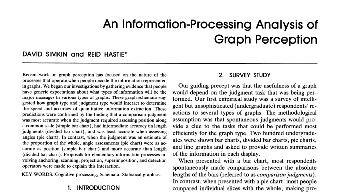
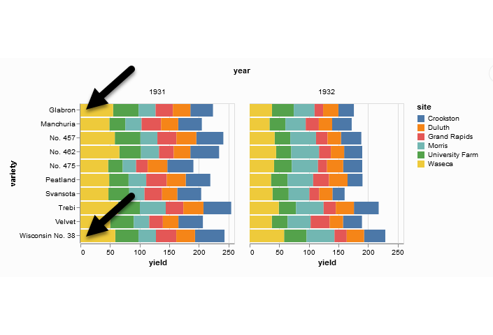
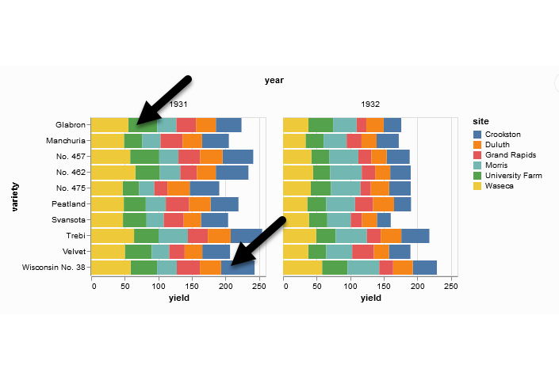
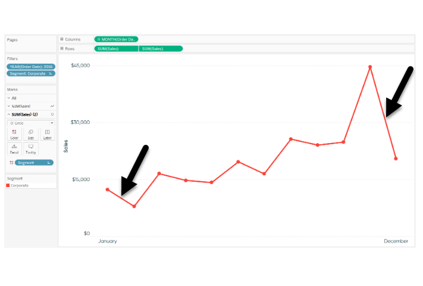
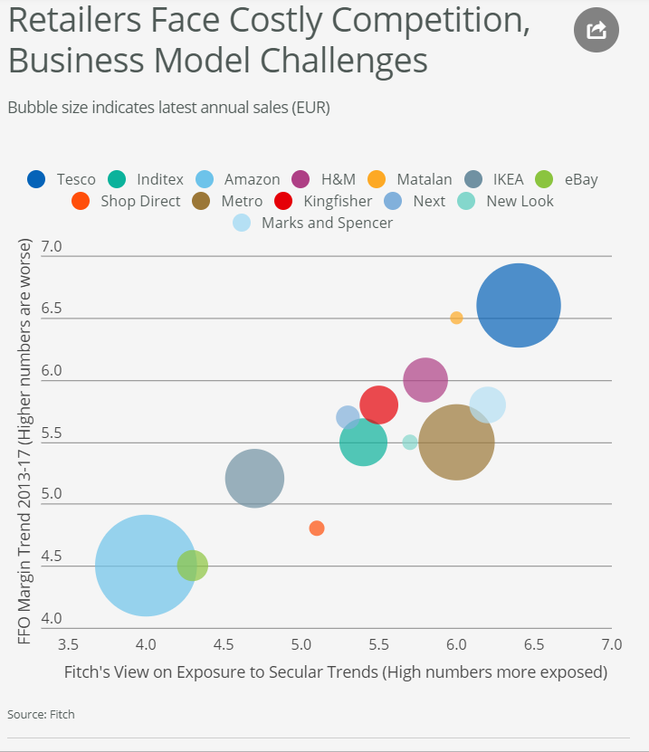
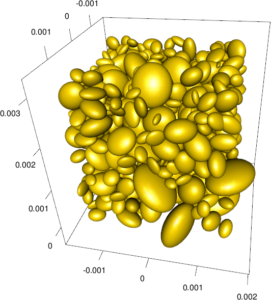

```{r child="../../common-files/src/component-header.Rmd"}
```

### Perception, introductory tutorial
+ Visual tasks
  + Projection, 
  + Superimposition,
  + Scanning, 
  + Anchoring

<div class="notes">

Understanding perception is the key to making effective visualizations. There are several key visual tasks: projection, superimposition, scanning, and anchoring. You want to design visualizations that facilitate these perceptual tasks.

</div>

### Perception, introductory tutorial
+ Hierarchy of comparisons
  + Position
  + Length
  + Angle
  + Area
  + Volume
  + Color
  
<div class="notes">

Comparisons are the heart of most visualizations. Comparisons follow a hierarchy from easy to difficult. Position is the easiest comparison. Does one bar in a bar chart reach higher than another? Other comparisons: length, angle, and area comparisons become increasingly more difficult. Comparisons involving volume (requiring estimation in a three dimentional space) and color (comparing the relative brightness of two colors) are the most difficult comparisons to make.

</div>

### Perception, A framework for graph perception



<div class="notes">

Much of the work on the psychology of perception that I will be discussing next is drawn from this 1987 article by Simkin and Hastie.

</div>


### Perception, Which is better? A bar chart...

```{r bar-chart}
n <- c(49, 124, 55, 26)
marital_status <- data.frame(
  class=c("Divorced/Separated", "Married", "Single/Never married", "Widowed"),
  n=n,
  prop=round(100*n/sum(n), 1)
)
initiate_image()
ggplot(marital_status, aes(x=class, y=prop)) +
  geom_col()
finalize_image("Bar chart")
```

`r display_image`

### Perception, ... or a pie chart

```{r pie-chart}
initiate_image()
ggplot(marital_status, aes(x = "", y = prop, fill = class)) +
  geom_col() +
  coord_polar("y", start = 0) +
  theme_void()
finalize_image("Pie chart")
```

`r display_image`

### Perception, Answer. It depends.
+ What question are you trying to answer?
  + What proportion of the patients are single?
  + Are there more single or divorced patients?
  
<div class="notes">

The answer really depends on what question you are asking. There are a variety of questions that you might ask. Two are illustrated above.

You can run an experiment (people have done this) where randomize and show half of them a bar chart and half of them a pie chart. Then you ask a question, like one of the questions above. Then you note the speed and accuracy of the response. Depending on the question, sometimes pie charts give faster and more accurate answers. Sometimes bar charts give faster and more accurate answers. It turns out that the results match up nicely with what we know about the psychology of perception.

</div>

### Perception, Visual processing (1 of 3)
+ Projection
  + Shifting an object in a horizontal or vertical direction
+ Superimposition
  + Shifting in other directions (e.g., diagonal shifts, rotation) in order to make a comparison
  + Much harder than projection
+ Distance affects speed and accuracy of both projection and superimposition

<div class="notes">

Your eye will try to move objects like bars in a bar chart to try to make comparisons. If these movements are solely in a horizontal or vertical direction, you are making a projection. If these movements are in a diagonal direction or if it involves rotation, you are making a superimposition.

Projections are easier than superimpositions. Both are affected by distance. The further the distance that you have to project, for exapmle, the more time it takes and the less accurate you get, on average.

</div>

### Perception, Projection (first yellow bar versus last yellow bar)



<div class="notes">

The position means the vertical or horizontal location. Does the first yellow bar in 1931 (Glabron seeds planted in Wasica) extend further to the right than the last yellow bar (Wisconsin No. 38 seeds planted in Wasica)?

</div>

### Perception, Superimposition (first green bar versus last blue bar)



<div class="notes">

The length means either the width or the height. Does the first green bar in 1931 (Glabron seeds planted in University Farm) extend further to the right than the last yellow bar (Wisconsin No. 38 seeds planted in Crookston)?

</div>

### Perception, Scanning and Anchoring
+ Scanning
  + Quantifying distance throug the use of a mental tape measure
  + Shorter distances are easier
+ Anchoring
  + Implicit or explicit development of reference points
  + Assists with scanning
  
### Perception, Scanning

```{r fuel-guage-1}
df <- data.frame(
  pct=c(35, 65), 
  x=factor(rep(1, 2)),
  z=factor(1:2))
narrow_image()
ggplot(df, aes(y=pct, x=x, fill=z)) +
  geom_col(position="stack") +
  theme(legend.position="none") +
  scale_x_discrete(name=NULL, breaks=NULL) +
  scale_y_continuous(name=NULL, breaks=c(0, 100), minor_breaks=NULL, labels=c("Empty", "Full")) +
  scale_fill_manual(values=c("white", "black")) +
  theme(axis.text.y  = element_text(size=24))
finalize_image("Image of a fuel gauge, 65% full")
```

`r display_image`
  
<div class="notes">

To understand scanning, think of a gas gauge. Usually it is a semicircular dial, but let's set up the gas gauge as a rectangle. If the level is at the top, you have a full tank. If the level is at the bottom, you have an empty tank. This gauge shows a tank that is 65% full. Trust me, I drew the gauge. It is at 65%. Now how would you estimate the gas level?

You would take a mental tape measure, starting at the bottom and measure up to where the black box ends.

Now if you were smart, you'd start at the top and scan downwards. Less distance means that you can do this faster and more accurately.

Now if you were Albert Einstein, you'd split the gauge at the halfway point and measure from the halfway point to the top of the black box. Actually, there's a little of Albert Einstein in all of us. That halfway point is something that all of us do subconciously. You did, because you recognized almost immediately that the tank was more than half full.

</div>

### Perception, Assisting scanning with anchors
  
```{r fuel-gauge-2}
narrow_image()
ggplot(df, aes(y=pct, x=x, fill=z)) +
  geom_col(position="stack") +
  theme(legend.position="none") +
  scale_x_discrete(name=NULL, breaks=NULL) +
  scale_y_continuous(name=NULL, 
    breaks=c(0, 25, 50, 75, 100), minor_breaks=NULL, 
    labels=c("Empty", "1/4", "Half", "3/4", "Full")) +
  scale_fill_manual(values=c("white", "black")) +
  theme(axis.text.y  = element_text(size=24))
finalize_image("Image of a fuel gauge, anchors at 1/4, half, 3/4")
```

`r display_image`

<div class="notes">

Here's the same gas gauge, still at 65% full, but now we have added anchors at 1/4, half, and 3/4. You can read this gauge faster and more accurately, because you can scane from half up to 65% or from 3/4 down to 65%.

</div>

### Perception, Visual processing (3 of 3)
+ Visually simple tasks
  + Position
  + Length
  + Angle/slope
+ Visually demanding tasks
  + Area
  + Volume
  + Density/Saturation/Hue
  
<div class="notes">

There are a variety of perceptual tasks that you use when making comparisons within an image. These are arranged on this slide roughly in order of difficulty, with the easiest tasks at the top.

</div>

### Perception, Position (first yellow bar versus last yellow bar)


<div class="notes">

The comparison of the two yellow bars is a comparison of position. Which yellow bar extends further to the right?

</div>

### Perception, Length (first green bar versus last blue bar)


<div class="notes">

The comparison of the green and blue bars is a length comparison. The two bars start at different spots, so the position can't help you.

Length is harder to judge than position, because it involves a superimposition rather than a projection.

</div>

### Perception, Angle/slope (first month decline versus last month decline)



<div class="notes">

This graph shows sales trends over a twelve month span. If you want to assess whether the first month decline (the dip in sales between January and February) was worse than the last month decline (the dip in sales between November and December), you would probably do this by judging the angle of the first line segment to the angle of the second line segment. This is not quite as easy as a position or length judgement, but it isn't too bad either.

</div>

### Perception, Area


### Perception, Area



<div class="notes">

This graph shows exposure and margin trends on the x and y axes. Larger values are worse on both axes. The size of the bubble is the size of the company (annual sales). There is some ambiguity here--is size measured in terms of diameter or in terms of area. Which is bigger, the brown circle (Metro) or the dark blue circle (Tesco)?

</div>

### Perception, Volume



<div class="notes">

Volume comparisons are especially difficult. This graphic image, busy beyond belief, shows three dimensional ellipsoids of various orientations. Picking out the biggest among these ellipsoids is not easy, even if you restricted it to ellipsoids that are fully visible.

</div>

### Perception, Color


<div class="notes">

What city gets more snowfall, Remington, in the southwester corner of the state, or Newport, in the northeast corner of the state?

</div>

