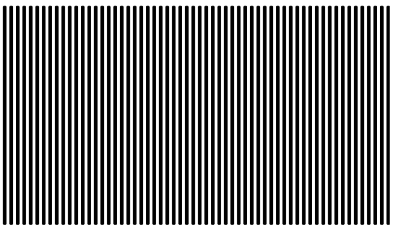

```{r echo=FALSE}
knitr::opts_chunk$set(echo = FALSE)
source("../../common-files/setup.R")
```

### Barchart recommendations, Don't make gaps equal to widths (1/2)



<div class="notes">

If the space between the bars is equal to the width of the bars themselves, you get an unsettling vibratory effect. This is because your eye is constantly shifting perspective. Sometimes it perceives the black as the foreground and the white as the background. Sometimes it perceives the white as the foreground and the black as the background.

"I'm ten years old, my life's half over. And I don't even know if I'm black with white stripes or white with black stripes." Marty the Zebra in the movie Madagascar.

</div>

### Barchart recommendations, Don't make gaps equal to widths (2/2)


<div class="notes">

If the widths are the same and the bars are empty, then you can get a differnt problem. You might get confused as to what is the bar and what is the gap, as in this optical illusion.

As a general rule, the gap between bars should be about 10 to 20 percent of the width of the bars. Most visualization software has sensible defaults, but beware when you have a very large number of bars. There's always a bit of rounding when you place pixels on a screen or on a page. Your software is trying to fill the available plotting area, so it may have to squeeze or stretch one gap or another. This unevenness can become noticeable when the gaps are only a few pixels wide.

((Show an example of this using the scotus data))

<div>

