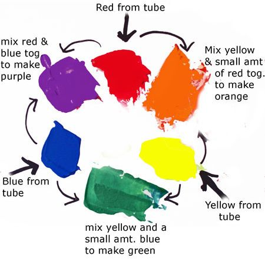

```{r setup-v02-colors, echo=FALSE}
knitr::opts_chunk$set(echo = FALSE)
suppressMessages(suppressWarnings(library(dplyr)))
suppressMessages(suppressWarnings(library(ggplot2)))
suppressMessages(suppressWarnings(library(magrittr)))
suppressMessages(suppressWarnings(library(readr)))
```

### Colors, introductory tutorial
+ Kindergarten view of colors
+ Review hexadecimal codes
+ RGB color system

### COlors, Everything I know about colors, I learned in Kindergarten.



### Colors, Hexadecimal codes
+ "There are 10 types of programmers in the world, those who undestand binary and those who don't."
  + 1001 1100 (base 2)
  + = $1*2^7+0*2^6+0*2^5+1*2^4+1*2^3+1*2^2+0*2^1+0*2^0$
  + = 128+16+8+4 = 156
+ Hexadecimal digits (base 16)
  + 0-9, A=10, B=11, C=12, D=13, E=14, F=15
  + 1001 1100 (base 2)
  + = 9C (base 16)
  + = $9*16^1+12*16^0$
+ Two hexadecimal digits represent the numbers 0-255.
  + 00 (base 16) = 0, FF (base 16) = 255

### Colors, Codes for colors
+ #rrggbb format
  + #000000 is pure black
  + #FFFFFF is pure white
  + #FF0000 is pure red
  + #00FF00 is pure green
  + #0000FF is pure blue
+ You can mix and match to get 16,777,216 colors
  + #800080 is purple, #FF69B4 is pink, #40e0d0 is turquoise
  

### Colors, The color cube (1/2)

```{r color-cube-1}
k <- data.frame(x= 0, y= 0, co="#000000")
r <- data.frame(x=-5, y=-5, co="#FF0000") 
g <- data.frame(x= 7, y= 0, co="#00FF00")
b <- data.frame(x= 0, y= 7, co="#0000FF")
y <- data.frame(x= 2, y=-5, co="#FFFF00")
z <- data.frame(x=-5, y= 2, co="#FF00FF")
m <- data.frame(x= 7, y= 7, co="#00FFFF")
w <- data.frame(x= 2, y= 2, co="#FFFFFF")

df <- rbind(k, r, g, b, y, z, w)
dg <- rbind(k, r, k, g, k, b)

ggplot(dg, aes(x, y)) + 
  geom_path(col="white") +
  geom_text(col=dg$co, label=dg$co, angle=-45, hjust=0.5) +
  expand_limits(x=c(-7, 9)) +
  expand_limits(y=c(-7, 9)) +
  theme_void() +
  theme(
    panel.background=element_rect(fill="#808080")
  )
```

### Colors, The color cube (2/2)

```{r color-cube-2}
dg <- rbind(k, r, y, g, k, b, m, g, m, w, y, r, z, w, z, b)

ggplot(dg, aes(x, y)) + 
  geom_path(col="white") +
  geom_text(col=dg$co, label=dg$co, angle=-45, hjust=0.5) +
  expand_limits(x=c(-7, 9)) +
  expand_limits(y=c(-7, 9)) +
  theme_void() +
  theme(
    panel.background=element_rect(fill="#808080")
  )
```


### Colors, Gradients (1/4)

```{r rgb-gradient-1}
h <- c("0", "3", "6", "9", "C", "F")

rg <- paste0("#", h, h, "0000")

n <- length(rg)
p <- (0:(n-1))/(n-1)
rx <- r$x*p
ry <- r$y*p

gg <- paste0("#00", h, h, "00")
gx <- g$x*p
gy <- g$y*p

bg <- paste0("#0000", h, h)
bx <- b$x*p
by <- b$y*p

df <- data.frame(
  x=c(rx, gx, bx), 
  y=c(ry, gy, by), 
  g=c(rg, gg, bg), 
  a=rep(c(-45, -45, -45), each=n),
  j=rep(c(0.5, 0.5, 0.5), each=n))

ggplot(dg, aes(x, y)) + 
  geom_path(col="white") +
  geom_text(data=df, col=df$g, label=df$g, angle=df$a, hjust=df$j) +
  expand_limits(x=c(-7, 9)) +
  expand_limits(y=c(-7, 9)) +
  theme_void() +
  theme(
    panel.background=element_rect(fill="#888888")
  )
```

### Colors, Gradients (2/4)

```{r rgb-gradient-2}
h <- c("0", "3", "6", "9", "C", "F")

rg <- paste0("#FF", h, h, h, h)

n <- length(rg)
p <- (0:(n-1))/(n-1)
rx <- r$x + (w$x-r$x)*p
ry <- r$y + (w$x-r$x)*p

gg <- paste0("#", h, h, "FF", h, h)
gx <- g$x + (w$x-g$x)*p
gy <- g$y + (w$y-g$y)*p

bg <- paste0("#", h, h, h, h, "FF")
bx <- b$x + (w$x-b$x)*p
by <- b$y + (w$y-b$y)*p

df <- data.frame(
  x=c(rx, gx, bx), 
  y=c(ry, gy, by), 
  g=c(rg, gg, bg), 
  a=rep(c(0, 0, 0), each=n),
  j=rep(c(0.5, 0.5, 0.5), each=n))

ggplot(dg, aes(x, y)) + 
  geom_path(col="white") +
#  geom_text(col=dg$co, label=dg$co, angle=-45, hjust=0.5) +
  geom_text(data=df, col=df$g, label=df$g, angle=df$a, hjust=df$j) +
  expand_limits(x=c(-7, 9)) +
  expand_limits(y=c(-7, 9)) +
  theme_void() +
  theme(
    panel.background=element_rect(fill="#888888")
  )
```

### Colors, Gradients (3/4)

```{r rgb-gradient-3}
h <- c("0", "3", "6", "9", "C", "F")

rg <- paste0("#FF", h, h, "00")

n <- length(rg)
p <- (0:(n-1))/(n-1)
rx <- r$x + (y$x-r$x)*p
ry <- r$y + (y$y-r$y)*p

gg <- paste0("#", h, h, "FF00")
gx <- g$x + (y$x-g$x)*p
gy <- g$y + (y$y-g$y)*p

df <- data.frame(
  x=c(rx, gx), 
  y=c(ry, gy), 
  g=c(rg, gg), 
  a=rep(c(-45, -45), each=n),
  j=rep(c(0.5, 0.5), each=n))

ggplot(dg, aes(x, y)) + 
  geom_path(col="white") +
  geom_text(data=df, col=df$g, label=df$g, angle=df$a, hjust=df$j) +
  expand_limits(x=c(-7, 9)) +
  expand_limits(y=c(-7, 9)) +
  theme_void() +
  theme(
    panel.background=element_rect(fill="#888888")
  )
```

### Colors, Gradients (4/4)

```{r rgb-gradient-4}
h <- c("0", "3", "6", "9", "C", "F")

rg <- paste0("#FF", h, h, h, h)

n <- length(rg)
p <- (0:(n-1))/(n-1)
rx <- r$x + (w$x-r$x)*p
ry <- r$y + (w$x-r$x)*p

gg <- paste0("#", h, h, "FF", h, h)
gx <- g$x + (w$x-g$x)*p
gy <- g$y + (w$y-g$y)*p

df <- data.frame(
  x=c(rx, gx), 
  y=c(ry, gy), 
  g=c(rg, gg), 
  a=rep(c(-45, -45), each=n),
  j=rep(c(0.5, 0.5), each=n))

ggplot(dg, aes(x, y)) + 
  geom_path(col="white") +
#  geom_text(col=dg$co, label=dg$co, angle=-45, hjust=0.5) +
  geom_text(data=df, col=df$g, label=df$g, angle=df$a, hjust=df$j) +
  expand_limits(x=c(-7, 9)) +
  expand_limits(y=c(-7, 9)) +
  theme_void() +
  theme(
    panel.background=element_rect(fill="#888888")
  )
```

### Colors, Gradients (5/5)

```{r rgb-gradient-5}
h <- rev(c("0", "3", "6", "9", "C", "F"))

rg <- paste0("#", h, h, "0000")

n <- length(rg)
p <- (0:(n-1))/(n-1)
rx <- r$x + (k$x-r$x)*p
ry <- r$y + (k$y-r$y)*p

gg <- paste0("#00", h, h, "00")
gx <- g$x + (k$x-g$x)*p
gy <- g$y + (k$y-g$y)*p

df <- data.frame(
  x=c(rx, gx), 
  y=c(ry, gy), 
  g=c(rg, gg), 
  a=rep(c(-45, -45), each=n),
  j=rep(c(0.5, 0.5), each=n))

ggplot(dg, aes(x, y)) + 
  geom_path(col="white") +
  geom_text(data=df, col=df$g, label=df$g, angle=df$a, hjust=df$j) +
  expand_limits(x=c(-7, 9)) +
  expand_limits(y=c(-7, 9)) +
  theme_void() +
  theme(
    panel.background=element_rect(fill="#888888")
  )
```

### Colors, RGB combinations

Additive color mixing: adding red to green yields yellow; adding green to blue yields cyan; adding blue to red yields magenta; adding all three primary colors together yields white.


### Colors, Contrasting pure colors often appear too intense

```{r intense}
c3 <- c("#FF0000", "#00FF00", "#0000FF")
l3 <- c("#FF9090", "#90FF90", "#9090FF")
d3 <- c("#700000", "#007000", "#000070")
df <- data.frame(
  x=rep(1:3, each=3), 
  y=rep(3:1, 3),
  b=rep(c3, 3),
  f=rep(c3, each=3)
)
df <- df[c(2:4, 6:8), ]
ggplot(df, aes(x, y)) +
  expand_limits(x=c(0, 4), y=c(0, 4)) +
  geom_point(size=30, color=df$b, shape="square") +
  geom_text(
    color=df$f,
    label=paste0("F=", df$f, "\nB=", df$b)) +
  theme_void() +
  theme(
    panel.background=element_rect(fill="#888888")
  )
```

### Colors, Lighten the background

```{r ligthen-background}
df <- data.frame(
  x=rep(1:3, each=3), 
  y=rep(3:1, 3),
  b=rep(l3, 3),
  f=rep(c3, each=3)
)
df <- df[c(2:4, 6:8), ]
ggplot(df, aes(x, y)) +
  expand_limits(x=c(0, 4), y=c(0, 4)) +
  geom_point(size=30, color=df$b, shape="square") +
  geom_text(
    color=df$f,
    label=paste0("F=", df$f, "\nB=", df$b)) +
  theme_void() +
  theme(
    panel.background=element_rect(fill="#888888")
  )
```

### Colors, Darken the foreground

```{r darken-foreground}
df <- data.frame(
  x=rep(1:3, each=3), 
  y=rep(3:1, 3),
  b=rep(c3, 3),
  f=rep(d3, each=3)
)
df <- df[c(2:4, 6:8), ]
ggplot(df, aes(x, y)) +
  expand_limits(x=c(0, 4), y=c(0, 4)) +
  geom_point(size=30, color=df$b, shape="square") +
  geom_text(
    color=df$f,
    label=paste0("F=", df$f, "\nB=", df$b)) +
  theme_void() +
  theme(
    panel.background=element_rect(fill="#888888")
  )
```

### Colors, or both

```{r both}
df <- data.frame(
  x=rep(1:3, each=3), 
  y=rep(3:1, 3),
  b=rep(l3, 3),
  f=rep(d3, each=3)
)
df <- df[c(2:4, 6:8), ]
ggplot(df, aes(x, y)) +
  expand_limits(x=c(0, 4), y=c(0, 4)) +
  geom_point(size=30, color=df$b, shape="square") +
  geom_text(
    color=df$f,
    label=paste0("F=", df$f, "\nB=", df$b)) +
  theme_void() +
  theme(
    panel.background=element_rect(fill="#888888")
  )
```

### Colors, or the reverse

```{r reverse}
df <- data.frame(
  x=rep(1:3, each=3), 
  y=rep(3:1, 3),
  b=rep(d3, 3),
  f=rep(l3, each=3)
)
df <- df[c(2:4, 6:8), ]
ggplot(df, aes(x, y)) +
  expand_limits(x=c(0, 4), y=c(0, 4)) +
  geom_point(size=30, color=df$b, shape="square") +
  geom_text(
    color=df$f,
    label=paste0("F=", df$f, "\nB=", df$b)) +
  theme_void() +
  theme(
    panel.background=element_rect(fill="#888888")
  )
```

```{r save-colors-tutorial-files}
save.image("../data/colors-tutorial.RData")
```