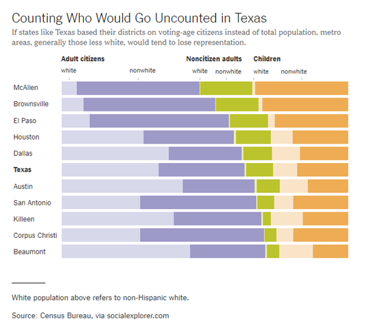

```{r setup, echo=FALSE}
knitr::opts_chunk$set(echo = FALSE)
suppressMessages(suppressWarnings(library(dplyr)))
suppressMessages(suppressWarnings(library(ggplot2)))
suppressMessages(suppressWarnings(library(knitr)))
suppressMessages(suppressWarnings(library(magrittr)))
suppressMessages(suppressWarnings(library(readr)))
pd_text <- "This image was produced by Steve Simon and is placed in the public domain. You are welcome to use this image any way you see fit. An acknowledgement would be appreciated, but is not required."
initiate_image <- function() {
  fn <- opts_current$get("label")
  png(filename=paste0("../images/", fn, ".png"))
  return(fn)
}
finalize_image <- function() {
  quiet <- dev.off()
  write(pd_text, file=paste0("../images/", fn, ".txt"))
}
```


### To prepare for this section


### To prepare for this section

Download the scotus_cases.csv data set, or go to the original source, the Kaggle datasets repository.

Import the data and create a bar chart showing the frequency of opinions written by year_filed. Note that there are a few typos and a few rows that do not belong. You can remove these, but they will not affect any of the analyses we are considering.

```{r clean, eval=FALSE}
scotus_full <- read_csv("../data/opinions_since_1970.csv")
scotus_full %>% select(-c(7, 8, 14)) %>% data.frame -> scotus
scotus$author_name <- 
  sub("justice [[author]]ginsburg[[/author]]", 
      "justice ginsburg", scotus$author_name, fixed=TRUE)
scotus$author_name <- sub("justice black;", "justice black", scotus$author_name)
scotus$author_name <- sub("justice bruger", "justice burger", scotus$author_name)
scotus$author_name <- sub("justice connor", "justice o'connor", scotus$author_name)
scotus$author_name <- sub("justice o2122", "justice o'connor", scotus$author_name)
scotus$author_name <- sub("justice waite", "justice white", scotus$author_name)
table(scotus$author_name, scotus$year_filed)
scotus %>%
  data.frame(stingsAsFactors=FALSE) %>%
  filter(category != "per_curiam") %>%
  select(-scdb_decision_direction) %>%
  select(-scdb_votes_majority) %>%
  select(-scdb_votes_minority) %>%
  write.csv(file="../data/scotus_opinions.csv", row.names=FALSE)
scotus %>%
  data.frame(stingsAsFactors=FALSE) %>%
  filter(category=="majority") %>%
  select(-author_name) %>%
  select(-category) %>%
  select(-per_curiam) %>%
  write.csv(file="../data/scotus_cases.csv", row.names=FALSE)
```

```{r read}
opinions <- read.csv("../data/scotus_opinions.csv", stringsAsFactors=FALSE)           
sc_cases <- read.csv("../data/scotus_cases.csv", stringsAsFactors=FALSE) 
fn <- "https://dasl.datadescription.com/download/data/3484"
titanic <- read_tsv(fn, col_types=cols())
```

### Python code to get started

((Add later))

### R code to get started

((Add later))

### Tableau steps to get started

((Add later))

### This is what your bar chart should look like

```{r scotus-bar, message=FALSE}
fn <- initiate_image()
sc_cases <- read.csv(file="../data/scotus_cases.csv")
ggplot(sc_cases, aes(year_filed)) +
  geom_bar()
finalize_image()
```


### Group exercise (1 of 2)



<div class="notes">

This is one of two graphs. It was published in

Badger, E. (2019). People Who Can’t Vote Still Count Politically in America. What if That Changes?. Retrieved June 24, 2019, from The New York Times website: https://www.nytimes.com/2019/06/22/upshot/america-who-deserves-representation.html


Split into pairs. Review the article briefly (about 5 minutes) and look at the graph. Explain to your partner what the graph is trying to show. Your partner will get a different graph and do the same thing with you listening this time.

</div>

### Group exercise (2 of 2)

((Image is not yet available.))

### A framework for graph perception


<div class="notes">

Much of the work on the psychology of perception that I will be discussing next is drawn from this 1987 article by Simkin and Hastie.

</div>


### Which is better? A bar chart...

```{r bar-chart}
n <- c(49, 124, 55, 26)
fn <- initiate_image()
marital_status <- data.frame(
  class=c("Divorced/Separated", "Married", "Single/Never married", "Widowed"),
  n=n,
  prop=round(100*n/sum(n), 1)
)
ggplot(marital_status, aes(x=class, y=prop)) +
  geom_col()
finalize_image()
```


### ... or a pie chart

```{r pie-chart}
fn <- initiate_image()
ggplot(marital_status, aes(x = "", y = prop, fill = class)) +
  geom_col() +
  coord_polar("y", start = 0) +
  theme_void()
finalize_image()
```


### Answer. It depends.
+ What question are you trying to answer?
  + What proportion of the patients are single?
  + Are there more single or divorced patients?
  
<div class="notes">

The answer really depends on what question you are asking. There are a variety of questions that you might ask. Two are illustrated above.

You can run an experiment (people have done this) where randomize and show half of them a bar chart and half of them a pie chart. Then you ask a question, like one of the questions above. Then you note the speed and accuracy of the response. Depending on the question, sometimes pie charts give faster and more accurate answers. Sometimes bar charts give faster and more accurate answers. It turns out that the results match up nicely with what we know about the psychology of perception.

</div>

### Visual processing (1 of 3)
+ Projection
  + Shifting an object in a horizontal or vertical direction to make a comparison
+ Superimposition
  + Shifting in other directions (e.g., diagonal shifts, rotation) in order to make a comparison
  + Much harder than projection


### Projection (first yellow bar versus last yellow bar)


<div class="notes">

The position means the vertical or horizontal location. Does the first yellow bar in 1931 (Glabron seeds planted in Wasica) extend further to the right than the last yellow bar (Wisconsin No. 38 seeds planted in Wasica)?

</div>

### Superimposition (first green bar versus last blue bar)


<div class="notes">

The length means either the width or the height. Does the first green bar in 1931 (Glabron seeds planted in University Farm) extend further to the right than the last yellow bar (Wisconsin No. 38 seeds planted in Crookston)?

</div>

### Visual processing (2 of 3)
+ Scanning
  + Quantifying distance throug the use of a mental tape measure
  + Shorter distances are easier
+ Anchoring
  + Implicit or explicit development of reference points
  + Assists with scanning
  
### Scanning

```{r scanning}
png("../images/simon_fuel_gauge1.png", width=240, height=480)
df <- data.frame(pct=c(35, 65
                       ), x=factor(rep(1, 2)), z=factor(1:2))
ggplot(df, aes(y=pct, x=x, fill=z)) +
  geom_col(position="stack") +
  theme(legend.position="none") +
  scale_x_discrete(name=NULL, breaks=NULL) +
  scale_y_continuous(name=NULL, breaks=c(0, 100), minor_breaks=NULL, labels=c("Empty", "Full")) +
  scale_fill_manual(values=c("white", "black")) +
  theme(axis.text.y  = element_text(size=24))
quiet <- dev.off()
```


  
<div class="notes">

To understand scanning, think of a gas gauge. Usually it is a semicircular dial, but let's set up the gas gauge as a rectangle. If the level is at the top, you have a full tank. If the level is at the bottom, you have an empty tank. This gauge shows a tank that is 65% full. Trust me, I drew the gauge. It is at 65%. Now how would you estimate the gas level?

You would take a mental tape measure, starting at the bottom and measure up to where the black box ends.

Now if you were smart, you'd start at the top and scan downwards. Less distance means that you can do this faster and more accurately.

Now if you were Albert Einstein, you'd split the gauge at the halfway point and measure from the halfway point to the top of the black box. Actually, there's a little of Albert Einstein in all of us. That halfway point is something that all of us do subconciously. You did, because you recognized almost immediately that the tank was more than half full.

</div>

### Assisting scanning with anchors
  
```{r scanning-with-anchors}
png("../images/simon_fuel_gauge2.png", width=240, height=480)
df <- data.frame(pct=c(35, 65
                       ), x=factor(rep(1, 2)), z=factor(1:2))
ggplot(df, aes(y=pct, x=x, fill=z)) +
  geom_col(position="stack") +
  theme(legend.position="none") +
  scale_x_discrete(name=NULL, breaks=NULL) +
  scale_y_continuous(name=NULL, 
    breaks=c(0, 25, 50, 75, 100), minor_breaks=NULL, 
    labels=c("Empty", "1/4", "Half", "3/4", "Full")) +
  scale_fill_manual(values=c("white", "black")) +
  theme(axis.text.y  = element_text(size=24))
quiet <- dev.off()
```


<div class="notes">

Here's the same gas gauge, still at 65% full, but now we have added anchors at 1/4, half, and 3/4. You can read this gauge faster and more accurately, because you can scane from half up to 65% or from 3/4 down to 65%.

</div>

### Visual processing (3 of 3)
+ Visually simple tasks
  + Position
  + Length
  + Angle/slope
+ Visually demanding tasks
  + Area
  + Volume
  + Density/Saturation/Hue
  
<div class="notes">

There are a variety of perceptual tasks that you use when making comparisons within an image. These are arranged on this slide roughly in order of difficulty, with the easiest tasks at the top.

</div>

### Position (first yellow bar versus last yellow bar)


<div class="notes">

The comparison of the two yellow bars is a comparison of position. Which yellow bar extends further to the right?

</div>

### Length (first green bar versus last blue bar)


<div class="notes">

The comparison of the green and blue bars is a length comparison. The two bars start at different spots, so the position can't help you.

Length is harder to judge than position, because it involves a superimposition rather than a projection.

</div>

### Angle/slope (first month decline versus last month decline)


<div class="notes">

This graph shows sales trends over a twelve month span. If you want to assess whether the first month decline (the dip in sales between January and February) was worse than the last month decline (the dip in sales between November and December), you would probably do this by judging the angle of the first line segment to the angle of the second line segment. This is not quite as easy as a position or length judgement, but it isn't too bad either.

</div>

### Area


### Area


<div class="notes">

This graph shows exposure and margin trends on the x and y axes. Larger values are worse on both axes. The size of the bubble is the size of the company (annual sales). There is some ambiguity here--is size measured in terms of diameter or in terms of area. Which is bigger, the brown circle (Metro) or the dark blue circle (Tesco)?

</div>

### Volume


### Color


<div class="notes">

What city gets more snowfall, Remington, in the southwester corner of the state, or Newport, in the northeast corner of the state?

</div>

### Adding depth (1/4)


<div class="notes">

Some sotware packages allow you to add some depth to your pie chart. This can catch your eye, at first, but almost all experts hate this approach. The most common complaint is that the three dimensional effects make a graph worse.

Worse means that it slows you down and it decreases the accuracy of your response. So here's a question. What percentage of your sample is single/never married? THe three dimensional effects slow you down. So for this three dimensional bar chart, do you measure the height of the single/never married bar by projecting the front of the bar to the axis on the left or by projecting the back of the bar? Actually, you need to first project to the back "wall" because the bars are placed a small distance in front.

</div>

### Adding depth (2/4)


<div class="notes">

Once you realize that you need to project to the back wall, you have to do this accurately. Notice that it is not a simple horizontal or vertical projection. Instead you have to do a couple of superimpositions, shifts at a 45 degree angle. You can do this, but it degrades your accuracy.

</div>

### Adding depth (3/4)


### Adding depth (4/4)

```{r pie-3d-2}
theta <- seq(0, 2*pi, length=200)
fn <- initiate_image()
plot(-1:1, -1:1, axes=FALSE, type="n", xlab=" ", ylab=" ")
lines(sin(theta), 0.5*cos(theta))
lines(c( 1,  1), c( 0, -0.3))
lines(c(-1, -1), c( 0, -0.3))
lines(sin(theta[51:150]), 0.5*cos(theta[51:150])-0.3)
lines(sin(theta[c( 25, 125, 125)]), 0.5*cos(theta[c( 25, 125, 125)])-c(0,0,0.3))
lines(sin(theta[c(175,  75,  75)]), 0.5*cos(theta[c(175,  75,  75)])-c(0,0,0.3))
finalize_image()
```


### Bars
+ Fewer in numbers than points
+ Usually a summary statistic
  + Count
  + Percent
  + Average
  + Total
+ A bar chart is NOT a histogram
  
<div class="notes">

Bar charts are different than point charts. There are usually only a few bars. These bars usually represent a summary statistic, like a count, percent, average, or total.

There is a technical distinction between a bar chart and a histogram. Histograms are a great diagnostic tool, but usually ends up on the cutting room floor. So I won't be talking about it much, if at all, in this workshop.

</div>

### Aesthetics for bars
+ Review
  + Location
  + Size
  + Color
  + NOT shape!!!
  
<div class="notes">

Recall that aesthetics are visual attributes associated with a geometry/mark. You can map variables to the location, size, and/or color of bars, but you cannot assign a variable to the shape of a bar.

</div>

### Notes about this talk
+ Do not include this slide in the final presentation
+ If I do a flipped classroom, here would be a good place to split with most of the material before this slide being in lectures to be viewed before the class. Then the classrom lecture would start from about here (after a very quick review) and focus on the "On your own" exercises.

### Location (1 of 2)

```{r location-horizontal}
fn <- initiate_image()
ggplot(titanic, aes(Class)) +
  geom_bar()
finalize_image()
```


<div class="notes">


</div>


### Location (2 of 2)

```{r location-vertical}
fn <- initiate_image()
ggplot(titanic, aes(Class)) +
  geom_bar() +
  coord_flip()
finalize_image()
```


<div class="notes">


</div>
### On your own
+ Draw a horizontal and vertical bar chart showing the number of people in each gender (use the Sex variable).

### Wait before showing

((Python code))

((R code))

((Tableau steps))

### What your visualization might look like

((Show visualization))

### Thoughts on location
+ Axis labels often fit better on vertical location
+ Cannot vary both X and Y

<div class="notes">

The default for most visualization software is vertical bars, but you should give thoughtful consideration to horizontal bars. The labels often fit better when the bars are horizontal. You also often have more room left to right than you do up and down in a graph, so the bars can stretch out more, allowing you to more easily discern small and subtle differences.

Remember the fault of default principle. Always try different ways of displaying your data. It costs nothing other than a few electrons to display a horizontal alternative to the typical vertical bar chart format, so why not indulge yourself?

</div>

### Size

+ Length varies, width doesn't
  + Exception, mosaic plots
  + Think about gaps between bars
  
### Don't make gaps equal to widths


<div class="notes">

If the space between the bars is equal to the width of the bars themselves, you get an unsettling vibratory effect. This is because your eye is constantly shifting perspective. Sometimes it perceives the black as the foreground and the white as the background. Sometimes it perceives the white as the foreground and the black as the background.

"I'm ten years old, my life's half over. And I don't even know if I'm black with white stripes or white with black stripes." Marty the Zebra in the movie Madagascar.

</div>

### Optical illusion


<div class="width">

If the widths are the same and the bars are empty, then you can get a differnt problem. You might get confused as to what is the bar and what is the gap, as in this optical illusion.

As a general rule, the gap between bars should be about 10 to 20 percent of the width of the bars. Most visualization software has sensible defaults, but beware when you have a very large number of bars. There's always a bit of rounding when you place pixels on a screen or on a page. Your software is trying to fill the available plotting area, so it may have to squeeze or stretch one gap or another. This unevenness can become noticeable when the gaps are only a few pixels wide.

((Show an example of this using the scotus data))

<div>

### Color

```{r bar-color}
fn <- initiate_image()
ggplot(titanic, aes(x=Class, fill=Class)) +
  geom_bar() +
  scale_fill_manual(values=c("darkgrey", "darkgrey", "red", "darkgrey"))
finalize_image()

```

### On your own
+ Make the first class bar red to show Leonardo di Caprio's perspective on the Titanic.

### Wait before showing

((Python code))

((R code))

((Tableau steps))

### What your visualization might look like

((Show visualization))

### Color
+ Use for emphasis in simple bar charts
+ Very important for stacked or side-by-side bar charts

<div class="notes">

For simple bar charts like all the ones we've seen so far, color is not really needed. You already can distinguish between the passenger classes using the location. If you do use color in a simple bar chart, it is often to emphasize a point. In the previous bar chart, I used red for third class, because Kate Winslet, a rich first class passenger, found true love in third class, with the adorable Leonardo di Caprio.

Color becomes very important in just a minute when we add another layer of complexity.

</div>

### On your own
+ Revise this visualization so the first class bar is red.

### Wait before showing

((Python code))

((R code))

((Tableau steps))

### What your visualization might look like

((Show visualization))

### Stack versus dodge
+ Summarize by two categories
+ Facet
  + Separate plots
+ Dodge
  + Side by side
+ Stack
  + One on top, one on bottom

<div class="notes">

Bar charts that represent a summary across a single categorical variable are fairly simple and easy to handle. But when you want to summarize by two categories simultaneously, things get interesting. Interesting in a good way.

</div>

### Titanic passenger count by gender

```{r count-by-gender}
fn <- initiate_image()
ggplot(titanic, aes(x=Sex)) +
  geom_bar()
finalize_image()
```


<div class="notes">


</div>
### Titanic passenger count by passenger class

```{r count-by-passenger-class}
fn <- initiate_image()
ggplot(titanic, aes(x=Class)) +
  geom_bar()
finalize_image()
```


<div class="notes">


</div>

### Titanic facet

```{r count-by-facet}
fn <- initiate_image()
titanic %>%
  ggplot(aes(x=Class, fill=Sex)) +
    geom_bar() + 
    facet_grid(cols=vars(Sex))
finalize_image()
```


<div class="notes">


</div>

### Titanic dodge

```{r count-by-dodge}
fn <- initiate_image()
titanic %>%
  ggplot(aes(x=Class, fill=Sex)) +
    geom_bar(position="dodge")
finalize_image()
```


<div class="notes">


</div>

### Titanic stack

```{r count-by-stack}
fn <- initiate_image()
titanic %>%
  ggplot(aes(x=Class, fill=Sex)) +
    geom_bar(position="stack")
finalize_image()
```


<div class="notes">


</div>

### On your own
+ Draw a bar chart showing counts involving both mortality and gender. Use a panel, then stacking, then dodging. Which do you like best?

<div class="notes">

Mortality on the Titanic reflects the fact that this was an era when people really did believe in the concept of "women and children first." Someone like me, I'd be shoving the little kids aside so I could get on one of the lifeboats.

Anyway, examine how mortality is related to gender. It's a spoiler alert, but on the Titanic, Kate survives, but Leonardo, I am so sad to say this, didn't make it.

</div>

### Wait a bit before showing the code
+ Did you make the panel/stack/dodge Survived or did you make it Sex? Here's some code, but yours might be different.

((Show Python code))

R code
```{}
fn <- initiate_image()
titanic %>%
  ggplot(aes(x=Sex, fill=Survived)) +
    geom_bar() +
    facet_grid(cols=vars(Survived))
finalize_image()
```

((Show Tableau))

### Panel, one approach

```{r mortality-by-panel}
fn <- initiate_image()
titanic %>%
  ggplot(aes(x=Sex, fill=Survived)) +
    geom_bar() +
    facet_grid(cols=vars(Survived))
finalize_image()
```


<div class="notes">


</div>

### Panel, alternate approach

```{r mortality-by-panel-alt}
fn <- initiate_image()
titanic %>%
  ggplot(aes(x=Survived, fill=Sex)) +
    geom_bar(position="stack") +
    facet_grid(cols=vars(Sex))
finalize_image()
```


<div class="notes">


</div>

### Stack, one approach

```{r mortality-by-stack}
fn <- initiate_image()
titanic %>%
  ggplot(aes(x=Sex, fill=Survived)) +
    geom_bar(position="stack")
finalize_image()
```

### Stack, alternate approach

```{r mortality-by-stack-alt}
fn <- initiate_image()
titanic %>%
  ggplot(aes(x=Survived, fill=Sex)) +
    geom_bar(position="stack")
finalize_image()
```


<div class="notes">


</div>

### Dodge, one approach

```{r mortality-by-dodge}
fn <- initiate_image()
titanic %>%
  ggplot(aes(x=Sex, fill=Survived)) +
    geom_bar(position="dodge")
finalize_image()
```


<div class="notes">


</div>

### Dodge, alternate approach

```{r mortality-by-dodge-alt}
fn <- initiate_image()
titanic %>%
  ggplot(aes(x=Survived, fill=Sex)) +
    geom_bar(position="dodge")
finalize_image()
```


<div class="notes">


</div>

### Group exercise
+ Review the following visualization in your group
  + Summarize what aesthetics appear in the graph
  + What variables map to each aesthetic?
  
((Provide visualization. Maybe use the visualization from the earlier exercise?))

### Summarizations
+ One number summary (mean or percentage)
+ Two number summary (error bars)
+ Five number summary (boxplots)
+ All the data
  + Jittering
  + Opacity
  
<div class="notes">

((note to myself: maybe this goes better in the talk about lines.))

</div>
  
### Switching from count to percent

((Show the code in Python, R, and Tableau. Explain why you might want counts versus percents.))

### Example with means

((Need to find the right data set to illustrate this. Maybe the Saratoga house prices?))

### Example with totals

((Same data. What means tell you versus totals.))

### Boxplots example

((Include an explanation of what a boxplot is))

### Jittering example

((Include an explanation on when it doesn't work.))

### Opacity example

((Note the computational expense.))

### On your own

((Find a totally different data set and get the students to draw four different visualizations. Have them divide into groups that like the same visualization software and have each person do a different visualization.))

### Summary
+ "A mapping of data to the visual aesthetics of geometries/marks" 
  + Bars are a type of geometry/mark
  + Aesthetics for bars include location, size, color
  + Stack versus dodge
+ Basic tips
  + Place comparators close
  + Use axis ticks, light grid lines

### On your own

((Find a totally different data set and get the students to draw four different visualizations. Have them divide into groups that like the same visualization software and have each person do a different visualization.))

```{r save-everything}
save.image("../data/data-visualization-02-bar.RData")
```