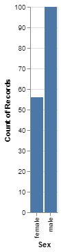
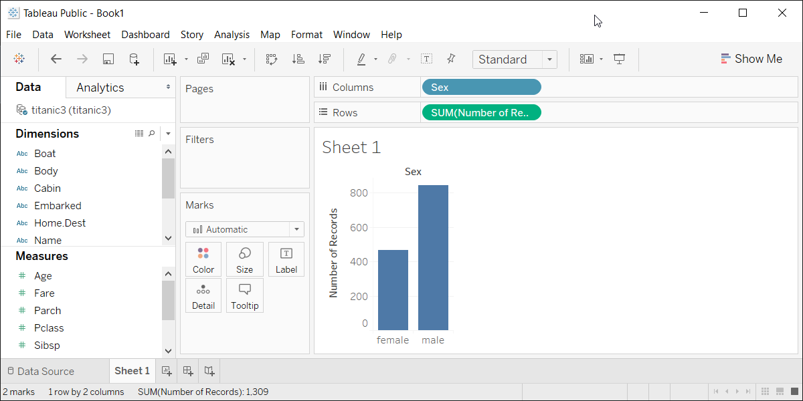

```{r echo=FALSE, message=FALSE}
knitr::opts_chunk$set(echo = FALSE)
source("../../common-files/setup.R")
suppressMessages(suppressWarnings(library(reticulate)))
titanic <- read_tsv("../data/titanic.txt")
```

### Barchart fundamentals, Gender barchart
+ Draw a bar chart showing the number of people in each gender (use the Sex variable).

### Barchart fundamentals, Gender barchart, Python code
+ Python code

```{}
ch = alt.Chart(df).mark_bar().encode(
    x='Sex',
    y='count()'
)
```

### Barchart fundamentals, Gender barchart, Python results

```{python}
import pandas as pd
import altair as alt
df = pd.read_csv("../data/titanic.txt", delimiter="\t")
ch = alt.Chart(df).mark_bar().encode(
    x='Sex',
    y='count()'
)
ch.save("gender-barchart.html")
```



### Barchart fundamentals, Gender barchart, R code
+ R code

```{}
ggplot(titanic, aes(Pclass)) +
  geom_bar()
```

### Barchart fundamentals, Gender barchart, R results

```{r bender-barchart}
ggplot(titanic, aes(Sex)) +
  geom_bar()
```

### Barchart fundamentals, Gender barchart, Tableau steps

((Tableau steps))

### Barchart fundamentals, Gender barchart, Tableau results




