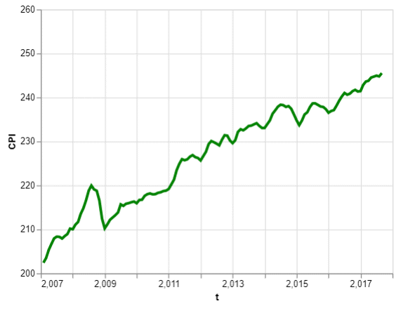

```{r child="../../common-files/src/component-header.Rmd"}
```

```{r}
load("../../common-files/data/cpi.RData")
load("../../common-files/data/houses.RData")
```

### Exercise, change defaults
+ Draw a line graph with the cpi data
  + x=t
  + y=CPI
+ Change the defaults for the line
  + Make the width equal to 3
  + Make the color green
  + Make the Y-axis start at 200 and end at 260

<div class="notes">

Take the CPI line graph and modify some of the default options. Make the line green and increase the thickness to three pixels. Modify the y-axis to start at 200 and end at 260.

</div>

### Exercise, Python code
+ Here's the Python code
```{python}
import pandas as pd
import altair as alt
df = pd.read_csv("../../common-files/data/cpi.csv")
```

```{python, echo=TRUE}
ch = alt.Chart(df).mark_line(
    color='green',
    size=3
).encode(
    alt.X('t'),
    alt.Y('CPI', 
        scale=alt.Scale(domain=(200, 260)))
)
```

```{python}
ch.save("../images/python/dotted-line.html")
```

<div class="notes">

HEre is the Python code. Notice that the color and width are changed inside the mark_line function.

</div>

### Exercise, Python output



<div class="notes">

Here is the Python output.

</div>

### Exercise, R code
+ Here's the R code
```
ggplot(cpi, aes(x=t, y=CPI)) +
  geom_line(size=3, color="green")
```

<div class="notes">

Here is the R code. Notice that you change the size and color inside the geom_line function.

</div>

### Exercise, R output

```{r width-shape-color}
initiate_image()
ggplot(cpi, aes(x=t, y=CPI)) +
  ylim(c(200, 260)) +
  geom_line(size=3, color="green")
finalize_image()
```

`r display_image`

<div class="notes">

Here is the R output.

</div>

### Exercise, Tableau steps
+ Drag T to coumns, CPI to rows
  + Set both as Dimension, Continuous (Green pill)
+ Change Marks pull-down to Line
+ Click on the color button, select green
+ Click on size button, move slider to the right
+ Double click on Y axis
  + Select Range, Fixed
  + Enter 200, 260 as fixed start, fixed end
  
<div class="notes">

Here are the Tableau steps.

</div>

### Exercise, Tableau output


<div class="notes">

Here is the Tableau output.

</div>
