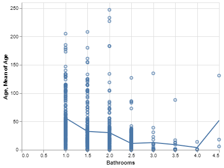
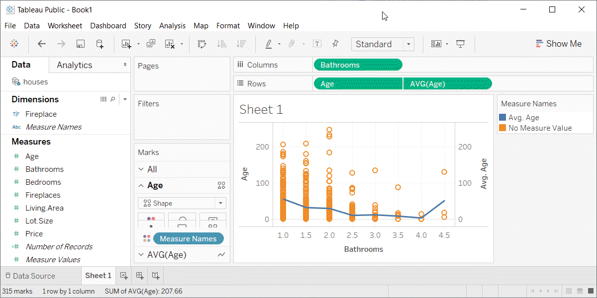

```{r child="../../common-files/src/component-header.Rmd"}
```

```{r}
load("../../common-files/data/cpi.RData")
load("../../common-files/data/houses.RData")
```

### Exercise, Connect individual averages
+ Draw a scatterplot showing
  + X = Bathrooms
  + Y = Age
+ Add a line connect the individual averages

<div class="notes">

On your own, draw a scatterplot. Put the number of bathrooms on the X axis and the age of the house on the Y-axis. Add a line conencting the individual averages.

</div>

### Exercise, Python code

```{python}
import pandas as pd
import altair as alt
df = pd.read_csv("../../common-files/data/houses.csv")
```

```{python, echo=TRUE}
pts = alt.Chart(df).mark_point().encode(
    x='Bathrooms',
    y='Age'
)
avg =alt.Chart(df).mark_line().encode(
    x='Bathrooms',
    y='mean(Age)'
)
ch = pts+avg
```

```{python}
ch.save("../images/python/average-age.html")
```


### Exercise, Pyhton output



### Exercise, R code
+ Here's the R code
```
ggplot(saratoga_houses, aes(Bathrooms, Age)) +
  geom_point() +
  stat_summary(fun.y=mean, geom="line")
```

<div class="notes">

The geom_point function creates the scatterplot and the stat_summary function adds the line.

</div>

### Exercise, R output
```{r exercise-average}
initiate_image()
ggplot(saratoga_houses, aes(Bathrooms, Age)) +
  geom_point() +
  stat_summary(fun.y=mean, geom="line")
finalize_image()
```

`r display_image`

<div class="notes">

There is a clear and consistent trend in the average age. The average age declines as the number of bathrooms increase. There is a blip at the end, but this is probably just an artefact due to the small sample size.

</div>


### Exercise, Tableau steps

<div class="notes">


</div>

### Exercise, Tabeleau output



<div class="notes">

Here is the Tableau graph.

</div>

