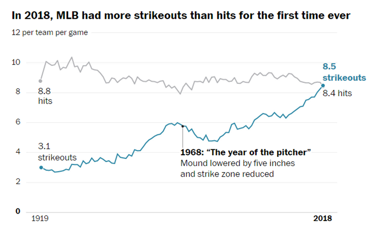
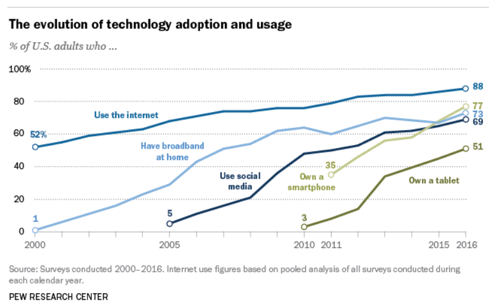

```{r echo=FALSE}
knitr::opts_chunk$set(echo = FALSE)
source("../../common-files/setup.R")
```


### Group exercise (1 of 2)



<div class="notes">

This is one of two graphs. It was published in

Popvich, N., Fountain, H., & Pearce, A. (2017, September 22). We Charted Arctic Sea Ice for Nearly Every Day Since 1979. You’ll See a Trend. - The New York Times. The New York Times. Retrieved from https://www.nytimes.com/interactive/2017/09/22/climate/arctic-sea-ice-shrinking-trend-watch.html

Split into pairs. Review the article briefly (about 5 minutes) and look at the graph. Explain to your partner what the graph is trying to show. Your partner will get a different graph and do the same thing with you listening this time.

</div>

### Group exercise (2 of 2)



<div class="notes">

Aaron Smith, Record shares of Americans now own smartphones, have home broadband. Pew Research Center, January 12, 2017. Retrived August 14, 2019 from https://www.pewresearch.org/fact-tank/2017/01/12/evolution-of-technology/.

</div>

