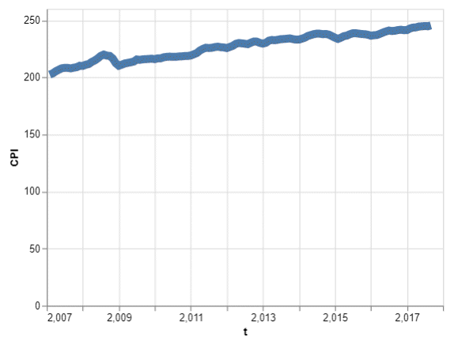
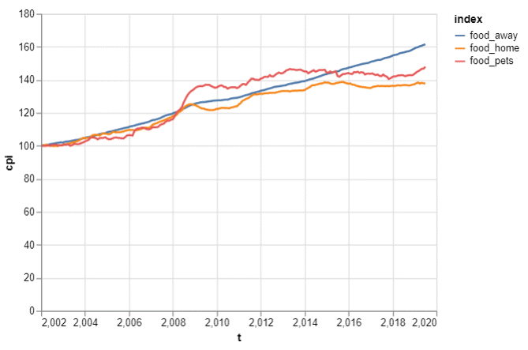
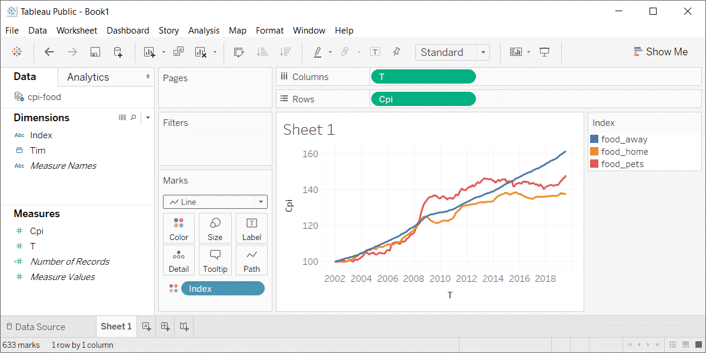
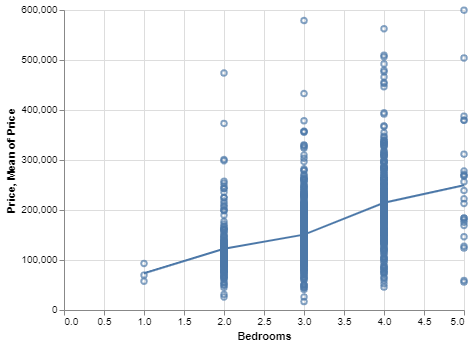
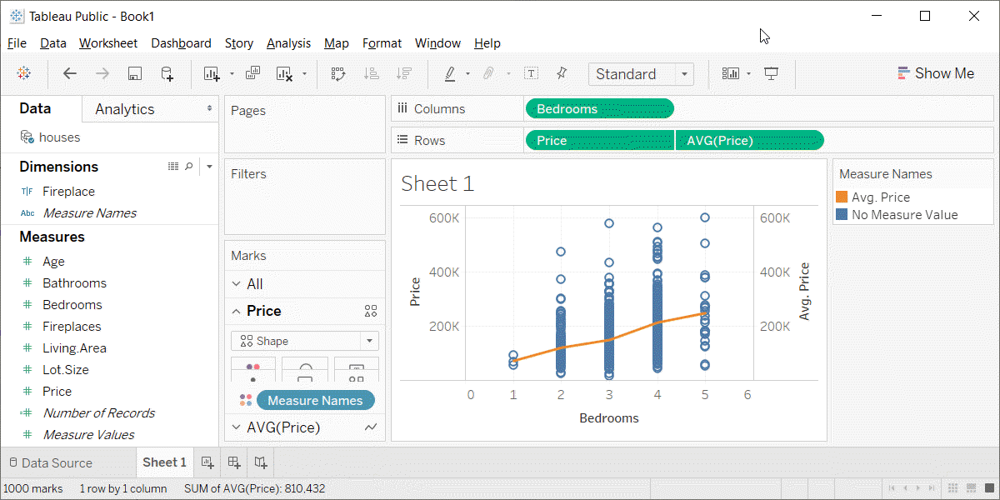

```{r child="../../common-files/src/component-header.Rmd"}
```

```{r}
load("../../common-files/data/cpi.RData")
load("../../common-files/data/cpi-food.RData")
load("../../common-files/data/houses.RData")
```

### Fundamentals, how to produce a line graph
+ The key step in Python
```
mark_line()
```
+ The key step in R
```
geom_line()
```
+ The key step in Tableau
  + Choose Line from the Marks pulldown list
  
<div class="notes">

The basic steps to producing a line graph are fairly easy in each of the systems. In Tableau, you use the mark_line function. In R, you use the geom_line function. In Tableau, if you are lucky, the default graph choice will be a line graph. If not, select Line from the Marks list.

</div>

### Fundamentals, Changing axis range
+ Python
```
alt.Y(scale=alt.Scale(zero=False))
```
or
```
alt.Y(scale=alt.Scale(domain=(100, 200)))
```
+ R code
```
expand_limits(y=0)
```
or
```
ylim(100, 200)
```
+ Tableau steps
  + Double click on axis
 
<div class="notes">

This example is the first one where you can see a big difference between the default options. Python wants to include zero on the y-axis, no matter what. It may make sense for a barchart to always include zero, but it is less obvious for a line graph.

To override the default Python option of showing zero on the Y axis, include the zero=False statement in the Scale function. Or you can specify a particular set of limits using the domain option in the Scale function.

R does not always include zero, but if you want, you can force R to include zero with the expand_limits function. Or you can specify a lower and upper limit with the ylim function.

Tableau also does not always include zero. To modify the limits of an axis in Tableau, you double click on it to get a dialog box.

</div>

### Fundamentals, Aesthetics for lines
+ Location
+ Size
+ Shape (linetype)
+ Color

<div class="notes">

A line could mean a straight line or a curved line, a single line segment, a connected series of line segments or a polygon. It's a pretty complex thing, but generally a line represents a two dimensional relationship.

You can vary the size, shape, and color of a line. Shape is not what you think it is. It is a linetype, which can be solid, dotted, or dashed. Among the dotted lines, you have a choice of whether the dots are very close or somewhat distant. Among the dashed lines, you have a choice of the size of the dash and the size of the gap between the dashes. You can also mix dots and dashes together.

</div>

### Fundamentals, Location
+ Sequence of x,y pairs
  + sorted by x
  + Connected in order (cannot double back)
+ Alternatives to lines
  + Paths
  + Polygons

<div class="notes">

A line could mean a straight line or a curved line. You get a curve by connecting small straight line segments. If the segments are small enough, you don't even notice. One requirement of a line is that the X values are sorted from low to high and are connected in order. This means that the line cannot double back on itself.

An alternative to a line is a path, which is allowed to meander in any direction including reversing course in the X direction one or more times. A polygon is a path that does not intersect itself and which returns at the end to the point at which it started. Paths and polygons will not be a major focus in this presentation, but the principles that apply to lines generally apply equally well to paths and polygons.

</div>

### Fundamentals, Size

```{python}
import pandas as pd
import altair as alt
df = pd.read_csv("../../common-files/data/cpi.csv")
ch = alt.Chart(df).mark_line(strokeDash=[5, 2]).encode(
    x='t',
    y='CPI'
)
ch.save("../images/python/thicker-line.html")
```




### Fundamentals, Size

```{r line-size}
initiate_image()
ggplot(cpi, aes(x=t, y=CPI)) +
  geom_line(size=8)
finalize_image()
```

`r display_image`

<div class="notes">

Lines can change size, but some systems refer to this as line width rather than size. You might use a thick line at times to create a greater emphasis, but it does tend to obscure small sudden changes in this current graph.

</div>

### Fundamentals, Size
+ Python code
```
mark_line(size=8)
```
+ R code
```
geom_line(size=8)
```
+ Tableau
  + Click on size button
  
<div class="notes">

To change the line thickeness in R, use the size= option inside the geom_line function.

</div>

### Fundamentals, Shape

```{r line-shape}
initiate_image()
ggplot(cpi, aes(x=t, y=CPI)) +
  geom_line(linetype="dotted")
finalize_image()
```

`r display_image`

<div class="notes">

The shape of a line is not whether it is curved or straight. The shape of a line is whether it is represented using solid, dashed, or dotted lines. Most visualizations call this a line type rather than a line shape.

</div>

### Fundamentals, Shape

```{r dots-and-dashes}
p <- c("13", "16", "19", "33", "63", "93", "99", "9333", "9939")
p <- rev(p)
n <- length(p)
tx <- paste0('linetype="', p, '"')
initiate_image()
g <- ggplot(data.frame(x=c(0, 2), y=c(0, n+1)), aes(x, y)) + 
  geom_point(color="white") +
    theme_void() 
for (i in 1:n) {
  g <- g + geom_segment(x=1, y=i, xend=2, yend=i, linetype=p[i])
  g <- g + geom_text(x=0.1, y=i, label=tx[i], adj=0, size=8)
}
g
finalize_image()
```

`r display_image`

<div class="notes">

There is a code for dotted and dashed line patterns that works pretty much the same way for both Python and R. You specify a sequence of two (sometimes four) numbers. The odd numbered values (first, third, etc.) represent an "on" number of pixels which specifies the length of the dash. The even numbered values (second, fourth, etc.) represent an "off" number of pixels. This is the gap or space between the marks.

The code "13" is a tight dotted line. One pixel on represents the dot and three pixels off represents the tight space between the dots. Note that anything tighter that 3 for a space is hard to distinguish from a solid line.

The code "16" puts a moderate amount of space between the dots and "19" puts a large space between the dots.

The codes "33" and "63" and "93" create short medium and long dashes with just a small space between the dashes. The code "99" creates long dashes with large spaces between them.

A set of four numbers usually produces an alternating pattern. The pattern "9333" produces a dash-dot pattern. The "9" produces a long dash. The first "3" produces a small space. The second "3" produces a short dash and the last "3" produces a short space. The pattern "9939" produces a similar dash-dot pattern, but the "9"'s in the second a fourth position widens the spaces between the dashes and dots quite a bit.

There are an infinite number of possibilities here.

</div>

### Fundamentals, Shape
+ Tableau code
```
mark_line(strokeDash=[5, 2, 2, 2])
```
+ R code
```
geom_line(linetype="5222")
```
+ Tableau
  + No easy solution
  
<div class="notes">

In Python, set the strokeDash argument to create various dotted and dashed lines. In R, use the linetype argument.

Tableau allows you a lot of freedom in choosing between dotted and dashed lines when you have two or more lines on a single graph, but it is surprisingly hard to deviate from the formal default of a solid line when you only have a single line on your graph. This is annoying, but quite honestly, there is little reason to deviate from a solid line when you only have one line on your graph.

</div>

### Fundamentals, Color
+ Tableau code
```
mark_line(color="red")
```
+ R code
```
geom_line(color="red")
```
+ Tableau
  + Click on color button
  
<div class="notes">

To change the default color of a single line, use the color argument in mark_line (Python) or geom_line (R). In Tableau, you change the default color by clicking on the color button.

</div>
  
<!---HOmework--->
```{r child="../component/change-defaults.Rmd"}
```

### Fundamentals, Multiple lines
+ New data set, consumer price index for food
  + Food consumed at home
  + Food consumed away from home
  + Pet food
+ Set January 2002 as 100.

<div class="notes">

There is a similar data set that I want to switch to. It provides the consumer price index for food, separated into three series. The first series is a price index for food consumed at home. That includes things you buy at the store like Pop Tarts, assuming that you don't try to eat them in the store. There is a second series for food consumed away from home, such as the 1300 calorie Monster Thickburger that you got at Hardee's.  There is a third series for pet food. 

There's a bad joke about this. I took my dog shopping and he was unhappy with how much the price of Alpo has risen. It was 99 cents. That may not seem like a lot to you, but you have to realize that this is almost seven dollars in dog money.

</div>

### Fundamentals, Coding for multiple lines
+ Python code
```
ch = alt.Chart(df).mark_line().encode(
    x='t',
    y='cpi',
    color='index'
)
```
+ R code
```
ggplot(cpi, aes(x=t, y=cpi)) +
  geom_line(aes(color=index))
```
+ Tableau
  + Drag index onto the color button

<div class="notes">

When you want to have a different line for each consumer price index series, you specify a different color for each line. Notice how this goes inside the encode function in Python and inside the aes function in R because you are encoding a third variable, index, to an aesthetic.

</div>

### Fundamentals, Python output

```{python}
import pandas as pd
import altair as alt
df = pd.read_csv("../../common-files/data/cpi-food.csv")
ch = alt.Chart(df).mark_line().encode(
    x='t',
    y='cpi',
    color='index'
)
ch.save("../images/python/cpi-food-linegraph.html")
```



<div class="notes">

This is what the Python output looks like.

</div>

### Fundamentals, R output

```{r cpi-food-linegraph}
initiate_image()
cpi <- read.csv("../../common-files/data/cpi-food.csv")
ggplot(cpi, aes(x=t, y=cpi)) +
  geom_line(aes(color=index))
finalize_image("Line graph showing increase over time of the consumer price index")
```

`r display_image`

<div class="notes">

Here is what the graph looks like in R.

</div>

### Fundamentals, Python output



<div class="notes">

This is what the Tableau graph looks like.

</div>

<!---HOmework--->
```{r child="../component/modify-colors.Rmd"}
```

### Fundamentals, Adding lines to a scatterplot

+ Lines can emphasize patterns in a scatterplot
  + Connect means
  + Linear regression (not covered)
  + Moving average (not covered)
  + Smoothing splines (not covered)

<div class="notes">

If you have a lot of data, a line can sometimes emphasize patterns or trends that you might miss with just a scatterplot.

You can do this by connecting lines between individual point means, a linear regression trend line, moving averages, or smoothing splines.

We will only cover the first approach connecting means. The other approaches are quite good and definitely worth talking about. Unfortunately, these alternative approaches are implemented inconsistently across the different programs.

</div>

### Fundamentals, Review an earlier scatterplot

```{r old-friend}
initiate_image()
ggplot(saratoga_houses, aes(x=Bedrooms, y=Price)) +
  geom_point()
finalize_image()
```

`r display_image`

<div class="notes">

Here's the housing data set that we looked at earlier. This scatterplot shows the relationship between number of bedrooms and price.

</div>

### Fundamentals, Lines at individual averages, Python
+ Here's the Python code
```{python}
import pandas as pd
import altair as alt
df = pd.read_csv("../../common-files/data/houses.csv")
```

```{python, echo=TRUE}
pts = alt.Chart(df).mark_point().encode(
    x='Bedrooms',
    y='Price'
)
avg = alt.Chart(df).mark_line().encode(
    x='Bedrooms',
    y='mean(Price)'
)
ch = pts + avg
```

```{python}
ch.save("../images/python/average-summary.html")
```

### Python graph



### Fundamentals, Lines at individual averages, R
+ Here's the code in R
```
ggplot(saratoga_houses, aes(Bedrooms, Price)) +
  geom_point() +
  stat_summary(fun.y=mean, geom="line")
```

<div class="notes">

Here is the R code. You need the stat_summary function to create averages for y at each discrete value of X.

</div>

### R output

```{r average-with-data}
initiate_image()
ggplot(saratoga_houses, aes(Bedrooms, Price)) +
  geom_point() +
  stat_summary(fun.y=mean, geom="line")
finalize_image()
```

`r display_image`

<div class="notes">

There is a clear and consistnet trend in the average price. As the number of bedrooms increase, the average price increases.

</div>

### Fundamentals, Lines at individual averages, Tableau steps
+ Draw your normal scatterplot
+ Drag Price to opposite Y axis
  + Change to Measure(Average)
+ Change Marks for first plot to Shape
+ Right click on either Y axis
  + Select Synchronize Axis

### Fundamentals, Lines at individual averages, Tableau plot



<!---Exercise--->
```{r child="../component/connect-averages.Rmd"}
```

### Summary
+ Lines have the same aesthetics as points and bars
  + Location
  + Size (width)
  + Shape (solid, dashed, dotted)
  + Color
+ Use mark_line (Python), geom_line (R) or a drop down menu (Tableau)
+ Lines added to a scatterplot can emphasize trends and patterns

<div class="notes">

The same aesthetics that you learned about for points and bars also apply to lines. The have an x and y location, a size (meaning width of the line), a shape (solid, dashed, dotted, and various combinations), and color.

In Python, use the mark_line function to draw a line graph. In R, use the geom_line function. In Tableau, there is a pull-down menu.

Linegraphs can show a single relationship or compare multiple relationships. You can add a line to a scatterplot to emphasize a trend or pattern. 

</div>