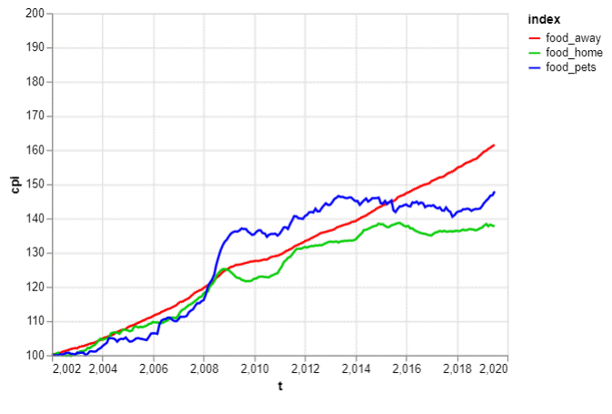
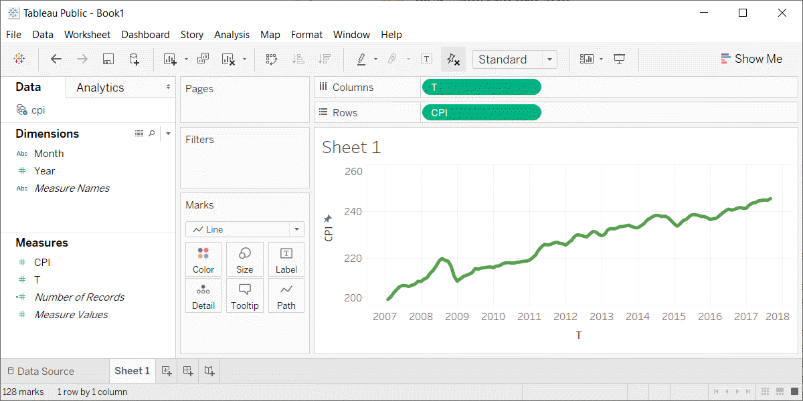

```{r child="../../common-files/src/component-header.Rmd"}
```

```{r}
load("../../common-files/data/cpi.RData")
load("../../common-files/data/houses.RData")
```

### Exercise, change defaults
+ Draw a line graph with the cpi-food data
  + x=t
  + y=cpi
  + color=index
+ Change the default line colors
  + food-home=darkgreen
  + food-away=red
  + food-pets=blue
  + Make the Y-axis start at 100 and end at 200

<div class="notes">

Take the cpi-food linegraph and modify some of the default options. Highlight the food-home in darkgreen, food-away in red, and food-pets in blue. Modify the y-axis to start at 100 and end at 200.

</div>

### Exercise, Python code
+ Here's the Python code
```{python}
import pandas as pd
import altair as alt
df = pd.read_csv("../../common-files/data/cpi-food.csv")
```

```{python, echo=TRUE}
ch = alt.Chart(df).mark_line().encode(
    alt.Color('index',
        scale=alt.Scale(
            range=['#FF0000', '#00CC00', '#0000FF']
        )
    ),
    alt.X('t'),
    alt.Y('cpi', 
        scale=alt.Scale(domain=(100, 200))),
    
)
```

```{python}
ch.save("../images/python/modify-colors.html")
```

<div class="notes">

HEre is the Python code. Notice that the color and width are changed inside the mark_line function.

</div>

### Exercise, Python output



### Exercise, R code
+ Here's the R code
```
ggplot(cpi-food, aes(x=t, y=CPI)) +
  geom_line(aes(color=index)) +
  scale_color_manual(values=c("#FF0000", "#00CC00", "#0000FF")) +
  ylim(100, 200)
```

<div class="notes">

Here is the R code. Notice that you change the size and color inside the geom_line function.

</div>

### Exercise, R output

```{r modify-colors}
cpi_food <- read.csv("../../common-files/data/cpi-food.csv")
initiate_image()
ggplot(cpi_food, aes(x=t, y=cpi)) +
  geom_line(aes(color=index)) +
  scale_color_manual(values=c("#FF0000", "#00CC00", "#0000FF")) +
  ylim(100, 200)
finalize_image()
```

`r display_image`

<div class="notes">

Here is the R output.

</div>

### Exercise, Tableau steps
+ Drag T to coumns, CPI to rows
  + Set both as Dimension, Continuous (Green pill)
+ Change Marks pull-down to Line
+ Drag index to colors button
+ Click on boxes in legend
+ Click on size button, move slider to the right
+ Double click on Y axis
  + Select Range, Fixed
  + Enter 100, 200 as fixed start, fixed end
  
<div class="notes">

Here are the Tableau steps.

</div>

### Exercise, Tableau output



<div class="notes">

Here is the Tableau output.

</div>
