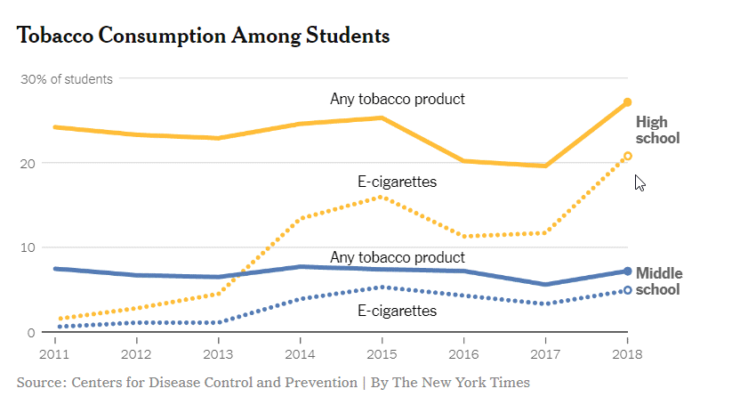

### Group exercise
+ These bar charts come from recent newspaper articles.
  + [More Strikeouts Than Hits? Welcome to Baseball’s Latest Crisis.](https://www.nytimes.com/2018/08/16/sports/baseball-mlb-strikeouts.html)
  + [Record shares of Americans now own smartphones, have home broadband.](https://www.pewresearch.org/fact-tank/2017/01/12/evolution-of-technology/)
  + [F.D.A. Seeks Restrictions on Teens’ Access to Flavored E-Cigarettes and a Ban on Menthol Cigarettes.](http://nytimes.com/2018/11/15/health/ecigarettes-fda-flavors-ban.html)

The following images are taken from various newspaper articles or press releases. Look at the graph and read/skim the article.

### Graphs in the news, baseball strikeouts

Tyler Kepner. More Strikeouts Than Hits? Welcome to Baseball’s Latest Crisis. The New York Times, Augst 16, 2018. Retrieved from https://www.nytimes.com/2018/08/16/sports/baseball-mlb-strikeouts.html.

### Graphs in the news, technology adaptation

Aaron Smith, Record shares of Americans now own smartphones, have home broadband. Pew Research Center, January 12, 2017. Retrived August 14, 2019 from https://www.pewresearch.org/fact-tank/2017/01/12/evolution-of-technology/.

### Graphs in the news, Tobacco and e-cigarette consumption

Sheila Kaplan and Jan Hoffman, F.D.A. Seeks Restrictions on Teens’ Access to Flavored E-Cigarettes and a Ban on Menthol Cigarettes. The New York Times, November 15, 2018. Retrieved from http://nytimes.com/2018/11/15/health/ecigarettes-fda-flavors-ban.html

