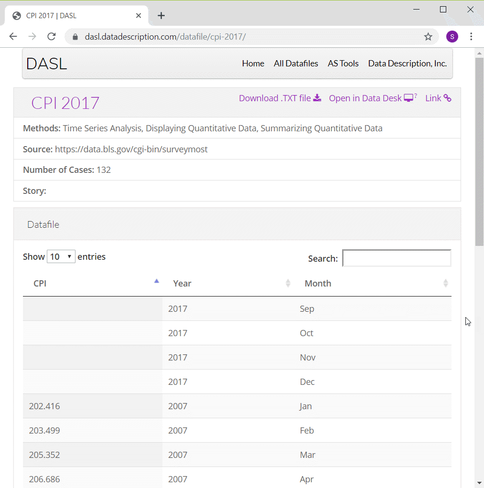
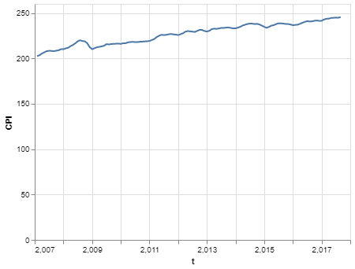
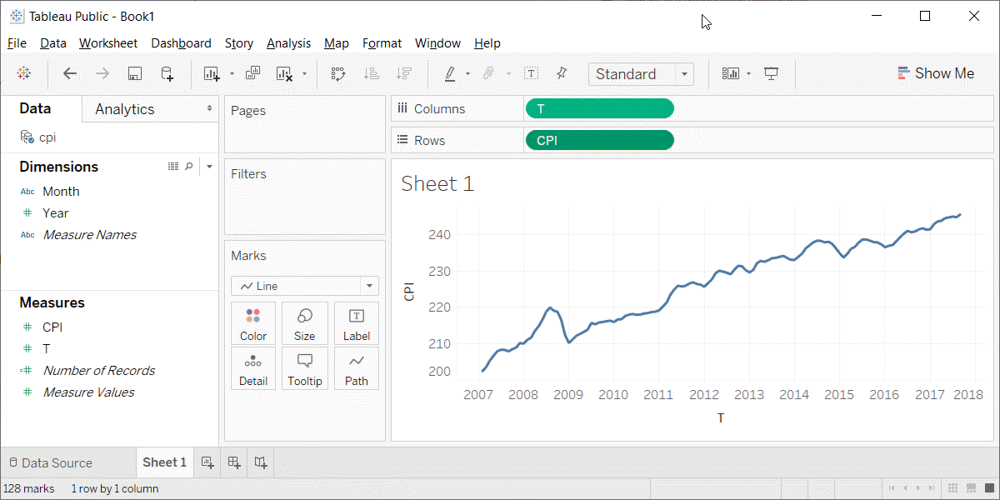

```{r child="../../common-files/src/component-header.Rmd"}
```

```{r read-cpi}
load("../../common-files/data/cpi.RData")
```

### Preparation, DASL Consumer Price Index data



<div class="notes">

One of the data sets that I will use in this moldule on line graphs is monthly values of the Consumer Price Index from 2007 through 2016. I have to make some minor modifications to the data, adding a continuous variable for time and deleting four rows of data.

You can find information about this data set on the DASL website, but use the csv file that I created instead of the one from the DASL website.

</div>

### Preparation, Pyhton code
+ Here's the code in Python
```
import pandas as pd
import altair as alt
df = pd.read_csv("../../common-files/data/cpi.csv")
ch = alt.Chart(df).mark_line().encode(
    x='t',
    y='CPI'
)
ch.save("../images/python/basic-lineplot.html")
```

<div class="notes">

Here is the Python code to read in the data and produce a simple line graph.

</div>

### Preparation, Python graph

```{python}
import pandas as pd
import altair as alt
df = pd.read_csv("../../common-files/data/cpi.csv")
ch = alt.Chart(df).mark_line().encode(
    x='t',
    y='CPI'
)
ch.save("../images/python/cpi-linegraph.html")
```



<div class="notes">

This is what the graph would look like.

</div>

### Preparation, R code
+ Here's the code in R
```
cpi <- read.csv("../data/cpi-food.csv")
ggplot(cpi, aes(x=t, y=CPI)) +
  geom_line()
```

<div class="notes">

Here is the R code to read in the data and produce a simple line graph.

</div>

### Preparation, R graph

```{r cpi-graph}
initiate_image()
cpi <- read.csv("../../common-files/data/cpi.csv")
ggplot(cpi, aes(x=t, y=CPI)) +
  geom_line()
finalize_image("Line graph showing increase over time of the consumer price index")
```

`r display_image`

<div class="notes">

Here is what the graph looks like in R. See if you can reproduce it.

</div>

### Preparation, Tableau steps
+ Import cpi.csv
+ Drag t to Columns
  + Change t to Dimension Continuous
+ Drag CPI to Rows
  + Chage CPI to Dimension Continuous
+ Change Marks to Line

<div class="notes">

Here are the steps in creating a line graph in Tableau.

</div>

### Preparation, Tableau graph



<div class="notes">

This is what the Tableau graph looks like.

</div>