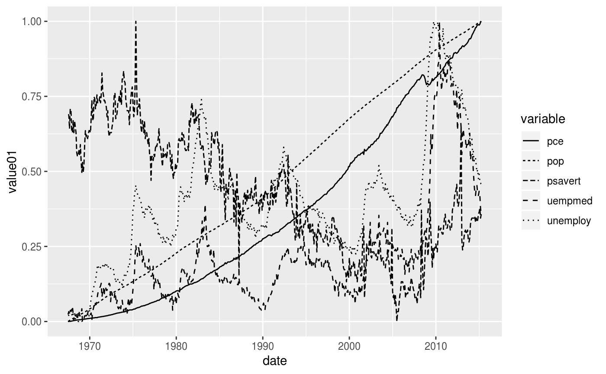

```{r child="../../common-files/src/component-header.Rmd"}
```

### Recommendation, Avoid dashed lines for high frequency data

```{r thick-versus-thin}
load("../../common-files/data/cpi.RData")
initiate_image()
ggplot(cpi, aes(t, CPI)) +
  geom_line(size=3, linetype="33", color="black") +
  geom_line(size=1, linetype="solid", color="red")
finalize_image()
```

`r display_image`

<div class="notes">

High frequency events are sudden surges and dips in a line over a narrow range. If your data has high frequency events (think stock market prices), then avoid thick lines or long dashes. These can hide some of the high frequency events.

</div>

### Recommendations, Avoid error bars (1/3)

```{r average-with-standard-deviation}
load("../../common-files/data/houses.RData")
saratoga_houses %>%
  group_by(Bedrooms) %>%
  summarize(avg_price=mean(Price), sd_price=sd(Price), n=n()) -> aggregated_prices
initiate_image()
ggplot(aggregated_prices, aes(Bedrooms, avg_price)) +
  geom_line() +
  geom_errorbar(aes(ymin=avg_price-sd_price, ymax=avg_price+sd_price), width=0.1)
finalize_image("Average price shown with error bar equal to one standard deviaiton")
```

`r display_image`

<div class="notes">

This graph shows error bars for the average price of a house given a fixed number of bedrooms. There is indeed an upward trend in prices. The more bedrooms you have, the higher the average price. But these error bars, equal to plus or minus one standard deviation, emphasize that there is a lot of overlap in individual prices.

</div>

### Recommendations, Avoid error bars (2/3)

```{r average-with-standard-error}
load("../../common-files/data/houses.RData")
saratoga_houses %>%
  group_by(Bedrooms) %>%
  summarize(avg_price=mean(Price), sd_price=sd(Price), n=n()) -> aggregated_prices
initiate_image()
ggplot(aggregated_prices, aes(Bedrooms, avg_price)) +
  geom_line() +
  geom_errorbar(aes(ymin=avg_price-sd_price/sqrt(n), ymax=avg_price+sd_price/sqrt(n)), width=0.1)
finalize_image("Average price shown with error bar equal to one standard error")
```

`r display_image`

<div class="notes">

Here is the same graph, but with the error bar representing plus or minus one standard error. The standard error is the standard deviation divided by the square root of the sample size. It shows how variable the mean is rather than how variable an individual observation is. This picture is quite different, and implies a much stronger trend. Which graph is better? Well, neither in my opinion.

</div>

### Recommendations, Avoid error bars (3/3)
+ No agreed upon definition for error bars
  + One standard deviation?
  + One standard error?
  + Confidence interval?
  + Range?
+ Error bars may hide asymmetric distributions
+ What does an overlap, non-overlap mean?

<div class="notes">

The first problem with error bars is that they do not have a commonly agreed upon definition. Is it plus or minus one standard deviation or plus or minus one standard error?

The general rule is that you use a standard deviation or a range when you want to place the emphasis on individual values and a standard error or confidence interval when you want to place the emphasis on the average.

A big problem with error bars is that they may falsely imply a symmetry to your data. If your data is skewed, then try to avoid error bars.

The other problem with error bars is that people make up rules, such as if two sets of error bars overlap, there is not a statistically significant difference between the two means. That only works for a confidence interval and it doesn't quite work then even. Standard errors and confidence intervals are not additive, and a small amount of overlap between two confidence intervals proves nothing.

</div>

### Recommendations, Alternatives to error bars (1/3)

```{r boxplots}
load("../../common-files/data/houses.RData")
initiate_image()
ggplot(saratoga_houses, aes(factor(Bedrooms), Price)) +
  geom_boxplot()
finalize_image("Boxplot of house prices by number of bedrooms")
```

`r display_image`

<div class="notes"> 

The box plot provides a more useful summary because, among other reasons, it shows whether your data is skewed in one direction or another.
  
</div>

### Recommendations, Alternatives to error bars (2/3)

```{r scatterplot-revised}
load("../../common-files/data/houses.RData")
initiate_image()
ggplot(saratoga_houses, aes(Bedrooms, Price)) +
  geom_point() +
  stat_summary(fun.y=mean, geom="line")
finalize_image("Scatterplot with line connecting means")
```

`r display_image`

<div class="notes"> 

There is often no substitute, however, for showing every individual data point.

</div>

### Recommendations, Alternatives to error bars (3/3)

```{r jittered-scaterplot}
load("../../common-files/data/houses.RData")
initiate_image()
ggplot(saratoga_houses, aes(Bedrooms, Price)) +
  geom_jitter(width=0.25, height=0) +
  stat_summary(fun.y=mean, geom="line")
finalize_image("Jittered scatterplot with line connecting means")
```

`r display_image`

<div class="notes"> 

There is a fair amount of overprinting in this graph, so jittering (randomly shifting data points around) can help you see where there are just a few points and where there are many points.

</div>

### Recommendations, when to start at zero
+ Bargraphs almost always start at zero, linegraphs have more latitude.
+ Not relevant when data has negative values
+ Is there a "natural zero"?
  + Counterexamples: temperature, IQ
+ Start at zero allows relative comparisons
  + Twice as big, half as big
+ Start at minimum Y improves resolution

<div class="notes">

There is a controversy that never seems to end about whether your y-axis should include the value of zero. It doesn't seem to be as much of a controversy about the X axis, for what it's worth. It is also not much of a controversy for bargraphs, as the strong consensus is that bargraphs should always start at zero.

You should resign yourself to the fact that if you come down on one side of this controversy, your boss is probably going to be on the other side. So get in the habit of knowing how to change from one type of graph to another.

First of all, recognize that if you have negative values in your data set, the controversy is moot. You include zero and keep on going down to include all of the negative values.

You also need to ask yourself whether your data contains a natural zero, a value that is well accepted as meaning "nothing". Two counterexamples are temperature and IQ. Unless you are talking about the Kelvin scale where zero represents the physical concept of absolute zero, temperature does not have a natural zero. It doesn't matter whether you are talking 0 Fahrenheit or ) Celsius. Neither temperature represents the absence of all heat.

IQ also does not have a natural zero. There is no IQ rather represents the absence of all intelligence.

Starting at zero allows you to make relative comparisons. You can see when one Y value is twice as big or half as big as another value. Do relative comparisons make sense for your data. They certainly don't for IQ, because you can't say that a person with an IQ of 150 is twice as intelligent as a person with an IQ of 75.

You lose something though, when you start at zero rather than the starting at the minimum possible Y value. The extra space required by including zero forces your entire linegraph into a narrow range, making it harder for you to make absolute comparisons.

I think that debates about whether to include zero or not are often silly, but the safe thing to do is to include a zero whenever you think the reader might be interested in relative comparisons.

</div>

### Recommendations, differentiating lines

```{r fictional-example}
exam <- rep(1:4, 3)
score <- c(80, 50, 20, 22, 90, 70, 30, 28, 20, 30, 70, 73)
id <- rep(1:3, each=4)
name <- rep(c("Able", "Baker", "Charlie"), each=4)
fiction <- data.frame(id=id, name=name, exam=exam, score=score)
initiate_image()
ggplot(fiction, aes(exam, score, color=name)) +
  geom_line() + 
  geom_point(size=5) +
  scale_color_manual(values=rep("black",3 ))
finalize_image("Fictional data on exam scores for three subjects")
```

`r display_image`

<div class="notes">

How do you best differentiate among lines. In this graph, you can't tell which line represents which subject.

</div>

### Recommendations, differentiating by shape

```{r distinguish-by-shape}
initiate_image()
ggplot(fiction, aes(exam, score)) +
  geom_line(aes(color=name)) + 
  geom_point(aes(shape=name), size=5) +
  scale_color_manual(values=rep("black",3 ))

finalize_image("Linegraph distinguished by point shape")
```

`r display_image`

<div class="notes">

I deliberately added points to the lines because it gives you an extra chance to differentiate the lines. In this graph, the square, circle, and triangle allow you to tell which subject is which.

You'd be a bit better off if you compared an open symbol with a closed symbol versus an "X" or a "+" that is neither open nor closed. Even so, the use of symbols, by itself, is not very helpful in allowing you to distinguish which line is associated with which subject.

</div>

### Recommendations, differentiating by linetype

```{r distinguish-by-linetype}
initiate_image()
ggplot(fiction, aes(exam, score)) +
  geom_line(aes(linetype=name, color=name)) +
  geom_point(size=5) +
  scale_color_manual(values=rep("black", 3))
finalize_image("Linegraph distinguished by linetype")
```

`r display_image`

<div class="notes">

You can also differentiate by linetype. This works fine for two groups, perhaps because a solid line looks quite different than any dotted or dashed line. The problem with three or more groups is that the various dotted and dashed lines look very similar. Even this simple graph, it is a bit difficult to distinguish the short dashed line of Baker from the long dashed line of Charlie.

</div>

### Recommendations, a graph with five different linetypes



<div class="notes">

I hesitate to show this graph, because it was drawn mostly just to illustrate the variety of linetypes that R has. But it does illustrate how confusing a graph can be when the only thing you have to distinguish among five different lines is the linetype.

</div>

### Recommendations, differentiating by color

```{r distinguish-by-color}
initiate_image()
ggplot(fiction, aes(exam, score, color=name)) +
  geom_line() + 
  geom_point(size=5)
finalize_image("Linegraph distinguished by color")
```

`r display_image`

<div class="notes">

Color works a little bit better and it is not hard to find four or five colors that are fairly easy to distinguish from one another.

</div>

### Recommendations, differentiating by labels

```{r distinguish-by-label}
initiate_image()
ggplot(fiction, aes(exam, score, color=name)) +
  geom_line() + 
  geom_point(size=5) +
  scale_color_manual(values=rep("black",3 )) +
  geom_text(x=3.5, y=24, label="Able", size=8, angle=4) +
  geom_text(x=3.5, y=32, label="Baker", size=8, angle=-4) +
  geom_text(x=3.5, y=75, label="Charlie", size=8, angle=8) +
  theme(legend.position="none")
  
finalize_image("Linegraphs with labels directly on the graph")
```

`r display_image`

<div class="notes">

Labels take advantage of the Gestalt principle of proximity. They often require a bit of hand tweaking, so they are tedious. But labels are the best approach by themselves to distinguishing among different lines.

Of course, you can and should consider doubling up and combining two elements like color and linetype, if you want to make the lines readily distinguishable from one another.

</div>

### Recommendations, lines imply continuity, bars don't

```{r scatterplot-revised-again}
load("../../common-files/data/houses.RData")
initiate_image()
ggplot(saratoga_houses, aes(Bedrooms, Price)) +
  geom_point() +
  stat_summary(fun.y=mean, geom="line")
finalize_image("Boxplot of house prices by number of bedrooms")
```

`r display_image`

<div class="notes"> 

The line connecting the one bedroom house mean to the two bedroom house mean to the three bedrood house mean, etc. is thought by some people to imply that intermediate values are possible. But you can't have 2.2 bedrooms. It has to be a whole number. This does not bother me, but if it bothers you, then convert this graph to a bar chart or use discontinuous line segments.

</div>

### Recommendations, Aspect ratio
+ Aspect ratio = width to height ratio
  + Square has 1:1 aspect ratio
  + Older televisions have 4:3 aspect ratio
  + Newer televisions have 16:9 ratio
+ You can vary the aspect ratio of your graphs as well

<div class="notes">

The aspect ratio is the ratio of the length of a rectangle to its height. An aspect ratio of 1 to 1 is a square.

If you remember when televisions switched from a big tube to a flat panel, you will also remember that the rectangular shape of the screen changed as well. The older tube televisions had an almost square 4 to 3 ratio. They were just a little bit wider than they were tall. This was the standard from all the way back in the 1950's.

The newer televisions were much wider, like a movie screen and had an aspect ratio of 16 to 9.

You can choose a variety of different aspect ratios for your graphs as well.

</div>

### Recommendations, Which is better?

```{r scatterplot-2-to-1-ratio}
load("../../common-files/data/houses.RData")
initiate_image(w=960, h=480)
ggplot(saratoga_houses, aes(Bedrooms, Price)) +
  geom_point() +
  stat_summary(fun.y=mean, geom="line")
finalize_image("Scatterplot with a 2:1 aspect ratio")
```

`r display_image`

<div class="notes"> 

This is a graph which is (roughly) twice as wide as it is tall. Sometimes this is called landscape orientation. Compare this to the next graph.

</div>

### Recommendations, Which is better?

```{r scatterplot-1-to-2-ratio}
load("../../common-files/data/houses.RData")
initiate_image(w=480, h=960)
ggplot(saratoga_houses, aes(Bedrooms, Price)) +
  geom_point() +
  stat_summary(fun.y=mean, geom="line")
finalize_image("Scatterplot with a 1:2 aspect ratio")
```

`r display_image`

<div class="notes"> 

This graph has an aspect ratio of 1 to 2. It is twice as tall as it is wide. Which one is better?

</div>

### Recommendations for aspect ratio
+ When changes in slope are important
  + Very flat lines (angle close to zero) are difficult to compare
  + Very steep lines (angle close to plus or minus 90 degrees) are also difficult to compare
  + Size your graph so that most lines have angles of plus or minus 45 degrees.
+ Use square graph when comparing measurements of the same thing
  + Predicted versus actual
  + New lab method versus gold standard method

### Recommendations, sort your data or hope that your software does

```{r ragged-path}
x <- -10:10
y <- x^2
o <- order(runif(length(x)))
df <- data.frame(x, y, xa=x[o], ya=y[o])
tmp <- write.csv(df, file="../../common-files/data/ragged-path.csv", row.names=FALSE)
initiate_image()
ggplot(df, aes(xa, ya)) +
  # geom_line(linetype="dashed") +
  geom_path() +
  geom_text(label=1:length(x), size=8)
finalize_image()
```

`r display_image`

<div class="notes">

Another warning, that is not really relevant to these three graphics packages, but which you should look out for is whether a system plots a line in the order in which the data points appear or in the order in which the 
X-values occur. If you are not careful, you could end up with a graph like the one shown here.

</div>

### Recommendations, summary
+ Avoid dashed lines for high frequency data
+ Avoid error bars
+ Think about when your axis should start at zero
+ Dashed and dotted lines are easy to confuse
+ Avoid an aspect ratio that flattens out most of your slopes or places them  close to plus or minus 90 degrees.

<div class="notes">

Here are the main recommendations. High frequency events can sometimes be missed by the gaps between dashes in a dashed line. Error bars are ambiguous and confusing. Sometimes it makes sense to start your y-axis at zero, and sometimes it doesn't. A lot of different dashed and dotted lines just makes things chaotic and confusing. The aspect ratio of your graph should aim for slopes of roughly plus or minus 45 degrees. If your slopes are mostly flat or if they are nearly vertical (close to plus or minus 90 degrees) then your graph will be hard to interpret.

</div>
