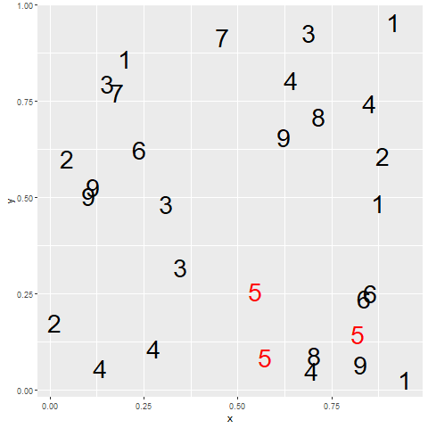
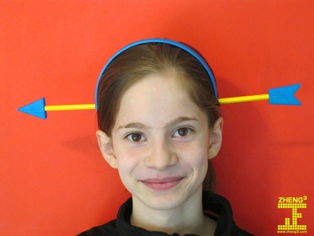

```{r child="../../common-files/src/component-header.Rmd"}
```

### Gestalt, introduction

+ These ideas drawn from the Bergen and Iverson workshop.
+ Gestalt definition
  + "The whole is greater than the sum of the parts"
+ How do you draw someone's eye to quickly make certain associations?
  
<div class="notes">

I am borrowing heavily from https://github.com/WSU-DataScience/SDSS19-dataviz-workshop.

The Gestalt school of Psychology developed several principles that are very useful in helping to make an effective visualization. A simple definition of Gestalt is that the whole is more than just the individual items. There is a lot to Gestalt psychology, but the portion that is relevant to you is the ability to draw someone's eye not to individual components of a graph, but to a group of related components that allow the viewer to see patterns or associations.

</div>

### Gestalt theory in artistic design
+ Many lesssons in effective artistic design
  + [The Gestalt Principles](https://graphicdesign.sfcc.spokane.edu/dZine/tutorials/process/gestaltprinciples/gestaltprinc.htm) Spokane Falls Community College. 
  + [Gestalt Theory](https://www.sophia.org/tutorials/gestalt-theory-2) Sophia.
  + [Gestalt Principles Applied to Design](https://www.grayboxpdx.com/blog/post/gestalt-principles-applied-to-design) The Graybox blog, January 19, 2015.
  + [Gestalt Principles](https://www.interaction-design.org/literature/topics/gestalt-principles) Interaction Design Foundation.
  
<div class="notes">

The field of artistic design is more commonly called graphic design, but I use the former term to distinguish it from statistical graphics. Artistic design is the use of typography, photography, and illustration to effectively convey a message. Artistic designers work on commercial logos, magazines and brochures, and product packaging.

These are interesting, and well worth some time viewing, even though they don't speak directly to the process of developing effective visualizations.

</div>

### Gestalt, A block of points - no emphasis

```{r block-no-emphasis}
initiate_image()
df <- data.frame(
  x=rep(1:5, 4),
  y=rep(1:4, each=5)
)
ggplot(df, aes(x=x, y=y)) +
  scale_x_continuous(name=NULL, breaks=NULL) +
  scale_y_continuous(name=NULL, breaks=NULL) -> g
g + geom_point(size=5)
finalize_image()
```

`r display_image`

<div class="notes">

What you see in this graph is 20 individual points. When you design a graph, you want people to group things in a way to reveal patterns.

</div>

### Gestalt, Similarity (shape)

```{r block-shape}
initiate_image()
f <- rep(c("triangle", "square", "triangle", "square", "triangle"), 4)
f <- rep(c(4, 1, 4, 1, 4), 4)
g + geom_point(shape=f, size=5)
finalize_image()
```

`r display_image`

<div class="notes">

Items that are similar tend to be grouped together.

The use of common shapes causes you to see five columns rather than twenty individual data points.

</div>

### Gestalt, Similarity (color)

```{r block-color}
initiate_image()
f <- rep(c("red", "darkgreen", "red", "darkgreen"), each=5)
g + geom_point(color=f, size=5)
finalize_image()
```

`r display_image`

<div class="notes">

Notice how the use of color tends to draw the eye in and see the graph as not 20 separate points, but rather four rows of points.

The effect of color is a lot stronger than the effect of shape.

</div>


### Gestalt, Double up for stronger emphasis

```{r block-double-up}
initiate_image()
f1 <- rep(c("red", "darkgreen", "red", "darkgreen"), each=5)
f2 <- rep(c("triangle", "square", "triangle", "square"), each=5)
f2 <- rep(c(4, 1, 4, 1), each=5)
g + geom_point(color=f1, shape=f2, size=5)
finalize_image()
```

`r display_image`

<div class="notes">

You can double up by using a common shape AND a common color to develop an even stronger association.

</div>

### Gestalt, Connectedness

```{r block-connectedness}
initiate_image()
g + geom_point(size=5) +
  geom_segment(x=1, y=1, xend=5, yend=1) + 
  geom_segment(x=1, y=2, xend=5, yend=2) + 
  geom_segment(x=1, y=3, xend=5, yend=3) + 
  geom_segment(x=1, y=4, xend=5, yend=4) 
finalize_image()
```

`r display_image`

<div class="notes">

A connection between individual points causes you to perceive those connected points as part of a single group. Here, you see four rows rather than five columns.

</div>

### Gestalt, Proximity

```{r block-proximity}
initiate_image()
g + geom_point(size=5) +
  expand_limits(y=c(-3, 8))
finalize_image()
```

`r display_image`

<div class="notes">

Points that are close to one another also tend to encourage their grouping. Notice that the scaling change caused the points within a column to be a lot closer than the points within a row. So you tend to see this as five columns rather than four rows.

</div>

### Gestalt, Enclosure for emphasis, eight special points

```{r block-enclosure}
initiate_image()
g + geom_point(size=5) +
  expand_limits(y=c(0.8, 4.2)) +
  expand_limits(x=c(0.8, 5.2)) +
  geom_segment(x=3.8, y=0.8, xend=5.2, yend=0.8) +
  geom_segment(x=3.8, y=4.2, xend=5.2, yend=4.2) +
  geom_segment(x=3.8, y=0.8, xend=3.8, yend=4.2) +
  geom_segment(x=5.2, y=0.8, xend=5.2, yend=4.2)
finalize_image()
```

`r display_image`

<div class="notes">

An enclosure is a strong way to emphasize grouping. Here the box provides an emphasis on a special group of eight points.

</div>

### Gestalt, contrast



<div class="notes">

The one pattern that deviates from the others tends to draw your eye toards it. There are nine different groups here, 1 through 9, but because of the contrast, you tend to view it as 5 versus all the other numbers.

</div>

### Gestalt, Continuity and common fate

```{r common-fate}
initiate_image()
t <- c(1, 5, 6, 7)
x <- rep(t, 2)
y <- c(5*t, 55-5*t)
g <- rep(1:2, each=4)
ggplot(data.frame(x, y, g), aes(x, y)) + 
  geom_point() +
  geom_segment(x=x[1], xend=x[2], y=y[1], yend=y[2]) +
  geom_segment(x=x[3], xend=x[4], y=y[3], yend=y[4], linetype="longdash") +
  geom_segment(x=x[5], xend=x[6], y=y[5], yend=y[6]) +
  geom_segment(x=x[7], xend=x[8], y=y[7], yend=y[8], linetype="longdash")
finalize_image("Line graph showing present and future trends")
```

`r display_image`

<div class="notes">

A consistent trend or pattern between two elements of a graph will encourage you to group those elements together.

In this graph there are two solid lines representing the present trend in two (fictional) time series. There are two dashed lines that represent future projected trends. Your eye tends to associate the upward solid line with the upward dashed line rather than the downward dashed line. This is in spite of the fact that the distance is less between the upward solid line and the downward dashed line. There are no color or shape clues to help you. The reason you associate the solid upward trend with the dashed upward trend is that you eye wants to fill in any missing information with the simplest form possible.

</div>

### Gestalt, Continuity and common fate



<div class="notes">

The reason this works is that your brain is trained to think that when part of an object is hidden by another object, you realize that this is one object rather than two.

This image of an gag toy looks almost like it is real, but for the band that goes up an over the head.

</div>


### Gestalt, Summary
+ Perceptual principles to develop groupings
  + Shape
  + Color
  + Connectedness
  + Proximity
  + Enclosure
  + Continuity, common fate
  
<div class="notes">

Gestalt is a set of perceptual principles that you can use to develop groupings in your visualizations. You tend to perceive groups that have similar shape or color, that are connected, or that are close to one another. You can use enclosure to define groupings. your eye also tends to group items to preserve continuity or items that share a common fate.

</div>