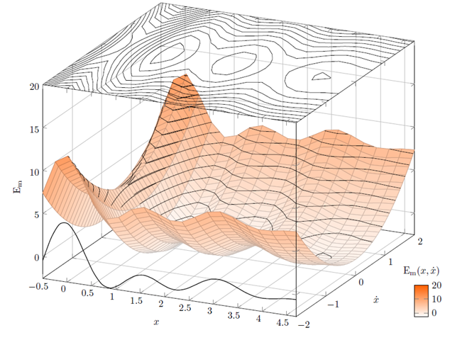

```{r setup, echo=FALSE}
source("../../common-files/setup.R")
knitr::opts_chunk$set(echo = FALSE)
```


### Contour plot



<div class="notes">

Here's an example of how you might convert a three dimensional surface into a contour plot.

Note to myself: This may not be the best image to use. I have some alternatives on different slides. Or I might draw an image from scratch.

</div>

### Contour plot


### Contour plot


### Ternary plot


<div class="notes">

+ Note to myself: It might be nice to place a simple example of a ternary plot here. It might also fit in better later on.

</div>

### Interactivity

+ Examples
  + Sliders
  + Hover
+ Excellent for exploratory graphics
+ Not within the scope of this talk

<div class="notes">

Note to myself: I might try to find a website or two that has interactivity, just to show what you can accomplish with sliders and hovering. But it is not something that I plan to cover in this course. Potentially, it could be a separate two hour module, but I suspect that a lot of this will be covered in the workshop on dashboards.

</div>

### Drawing contour plots

((Like before. Find a simple data set, show them how to draw something basic and then ask them to modify things slightly.))