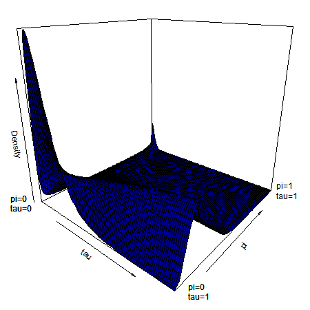
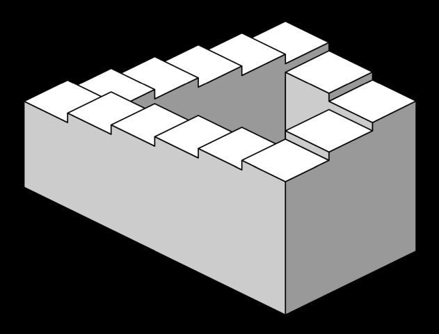
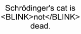

```{r echo=FALSE}
source("../../common-files/setup.R")
knitr::opts_chunk$set(echo = FALSE)
```

### No animations, interactivity, three dimensional effects, virtual reality



<div class="notes">

There are times when you do need three dimensions or animation. Here's a plot I drew for a talk back in 2015. Notice a hump in one dimension that shrinks until it is replaced by two "bunny ears" in the back. Bunny ears is a cultural reference to a practice where you sneak up behind someone with two fingers upraised with the hope that those fingers will appear above the person's head when the photo is taken, giving the person bunny ears. Anyway, those bunny ears were important and I couldn't think of a good way to emphasize this other than a three dimensional surface. But normally, I shy away from the third dimension.

I want this workshop to cover static two dimensional images. That means no z-axis for those of you with a mathematical bent, only an x-axis and a y-axis.

It also means no animation. Animation is a third dimension of time. While I have used animation from time to time, I tend to shy away from it, for reasons I'll explain in a minute.

</div>

### Stuck in a two-dimensional world


<div class="notes">

I read this book when I was ten years old, and I loved it. It's terribly mysoginistic, unfortunately, but back then I didn't know any better. All my work is going to be in Flatland.

Everything is going to be two dimensions. No z-axis, only x and y axes. I also am not going to talk about animation. This is a different third dimension, a dimension of time.

</div>

### Static two dimensional images - no distortions



<div class="notes">

Anytime you try to display a three dimensional object on a flat surface like a piece of paper or a projection screen, you get distortions. This image, the Penrose stairs, developed by Lionel and Roger Penrose in 1958, and an inspiration for much more imaginative drawings by M.C. Esher, shows how a clever person can use these distortions to create impossible objects that look deceptively real. If you are displaying three dimensional surfaces, you are constantly having to look at it from a variety of angles. What is hidden in one perspective becomes visible in a different perspective. What is easily subtle and easily overlooked in one perspective becomes a dominant feature in a different perspective.

</div>

### Static two dimensional images - fewer complications

    + Three dimensional plots are tricky. According to the Wikipedia entry on azimuth, 'In mathematics, the azimuth angle of a point in cylindrical coordinates or spherical coordinates is the anticlockwise angle between the positive x-axis and the projection of the vector onto the xy-plane.' The value of theta is defined as the azimuthal angle according to the help file of persp3D. So, assuming a colatitude (phi) of 0, the default of value of 0 for theta means that you are staring straight down the X-axis, and the value of 90 means that you are staring straight down the Y-axis."
  
<div class="notes">

Here is a note I wrote to myseslf when I was drawing the three dimensional surface with "bunny ears." I am look at this note three years later and shaking my head in amazement that I was even trying to understand this stuff back then.

</div>

### Static two dimesional images - no distractions



<div class="notes">

I found this image on Wikipedia. It illustrates a cheap gimmick that was popular in the infancy of the World Wide Web. People back then would code their web pages directly and typed in the various html tages by hand. The one thing that everyone got really annoyed with really quickly was the blink tag. It would flash on and off repeatedly. Researchers who did usability tests on web pages back then found that end users who encountered a page with the blink tag would quicky hit the back button, if they could. If they needed something on the page desperately enough, they would cover the blinking text with one hand while trying to read the other parts of the web page.

No one uses blink tags today, but sometimes animations can produce a distracting effect. Your eye is instantly drawn towards the animation. If you try to focus on a different location, the animation draws your eye back to it repeatedly. It is next to impossible to read any static text on a page with animation.

</div>

### Static two dimensional images - focus on what's important

+ Master two dimensions first
+ Find substitutes for the third dimension
  + Panels
  + Heat maps
  + Contour plots

<div class="notes">

I like the idea of confining myself to two dimensions. You won't be able to master the complexities of a third dimension until you first understand how to display things well in two dimensions.

It's also worth the effort to try to capture the information in the third dimension using alternatives that are easily produced in a static two-dimiensional world.

</div>

