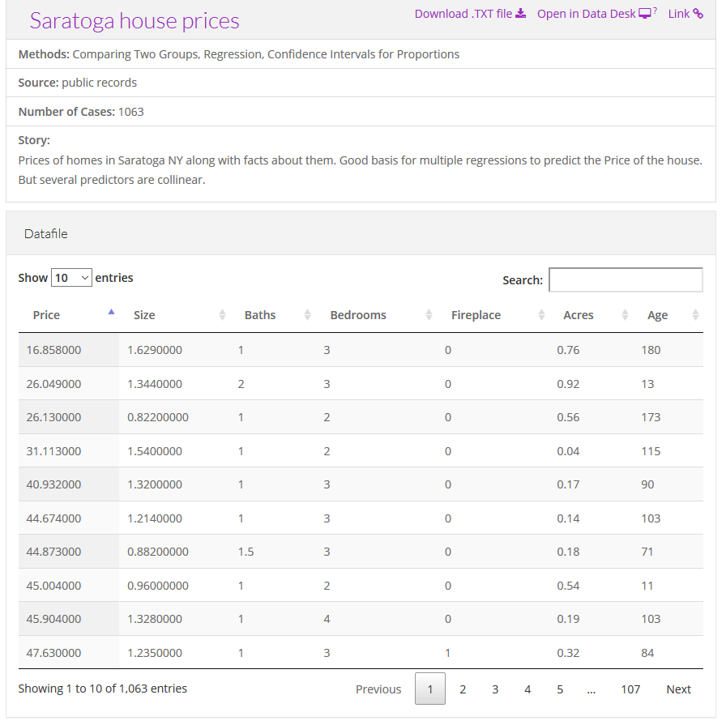

```{r setup, echo=FALSE}
knitr::opts_chunk$set(echo = FALSE)
library(ggplot2)
library(magrittr)
```

### Notes about this talk
+ This slide should not to be included in the final presentation
+ Present 00-overview first
+ After this talk, either 02-bars or 03-lines

### To prepare for this section
+ Download and install Python, R, and Tableau
  + For R, also install the ggplot2 library
+ Go to the DASL website and review the "Housing Prices" data set
+ Import this data into Pyhton, R, and Tableau
+ Draw a scatterplot with Age on the x-axis and Price on the y-axis.
  + Don't bother with changing any of the default options

<div class="notes">

Please do some work now, to get ready for the work in this section. If you do not already have Python, R, or Tableau installed on your computer, please do so now.

I want you to import a particular data file and draw a simple scatterplot.

</div>

### DASL https://dasl.datadescription.com/


<div class="notes">

DASL is an acronym for Data And Story Library. It used to sit on a website, Statlib, at Carnegie Mellon, but the company, Data Description, which makes a data analysis program, DataDesk, took over when the Statlib site went dark. It's a very nice site for small data sets useful for teaching.

I want to use a file on housing prices in Saratoga, New York, and you can find it through the search function on the main page. Look for housing or Saratoga, and you'll find it pretty quickly.

</div>

### Choose "Saratoga House Prices" (not "Saratoga Houses")


  
<div class="notes">
  
There are two files actually, that look very similar. You want the "Saratoga House Prices" file and not the one called "Saratoga Houses". The Saratoga House Prices file has 1063 records and the variables are Price, Living.Area, Bathrooms, Bedrooms, Fireplaces, Lot.Size, Age, Fireplace.

This is the file that you want to download and run a scatterplot.

</div>

### Python code

Here is the Python code that will download the data and create a simple scatterplot.

```{}
((Python code to be added later))
```

### R code

Here is the R code that will download the data and create a simple scatterplot.

```{}
library(ggplot2)
fn <- "https://dasl.datadescription.com/download/data/3275"
saratoga_houses <- read.table(fn, header=TRUE, sep="\x09")
ggplot(saratoga_houses, aes(x=Age, y=Price)) +
  geom_point()
```

<div class="notes">

Here's a brief bit of R code that should work. You may need to make some minor changes to get this to work.

</div>

### Tableau

Here are the directions on how to import the file into Tableau and produce a simple scatterplot.

+ ((To be added later))

<div class="notes">

Tableau uses a graphical user interface, so there is no "program" to run. Here are the steps you need to take to get the data in and produce a simple scatterplot.

</div>

### What your scatterplot should look like (R version)

```{r simple-scatterplot}
fn <- "https://dasl.datadescription.com/download/data/3275"
saratoga_houses <- read.table(fn, header=TRUE, sep="\x09")
saratoga_houses$i <- 1:1057
ggplot(saratoga_houses, aes(x=Age, y=Price)) +
  geom_point()
```

<div class="notes">

If you run your program successfully, you should get something that looks like this. This is the R version.

</div>

### Theoretical foundation of data visualization
+ Why is theory important?
  + "An unexamined [visualization] is not worth [drawing]." Socrates
  + "The man who has no tincture of [theory] goes through life imprisoned in the prejudices derived from common sense, from the habitual beliefs of his age or his nation, and from convictions which have grown up in his mind without the co-operation or consent of his deliberate reason." Bertrand Russell

<div class="notes">

I'm a big fan of theory, but I understand that not everyone else is. I found some quotes to support my perspective, although I had to make a few minor corrections.

Like Socrates, I am always curious what is "under the hood." If a visualization works, why wouldn't you want to dig down and figure out why it works?

It's more than that, though. Bertrand Russell warns you about the dangers of not having an underlying theoretical framework. Without it, your visualizations will be limited by your own prejudices and convictions that were derived without careful thought or reason.

</div>

### Theoretical foundation of data visualization
+ Why is theory important?
  + "Never trust [a visualization program] that can think for itself if you can't see where it keeps its brain" Arthur Weasley, in Harry Potter and the Chamber of Secrets.
  + "Give a man a [a single type of visualization] and you feed him for a day; teach a man [how to develop all types of visualizations] and you feed him for a lifetime." Maimonides
  
<div class="notes">

I also distrust software that makes certain choices for you. It got Ginny Weasley into lots of trouble in J.K. Rowling's Harry Potter and the Chamber of Secrets. I call it the fault of default principle. To be fair, the people who write these visualization software programs are a lot smarter than I am and their choices are on the mark way more often than mine might be. But you have to think carefully about your visualizations and understand where they are coming from. Redraw them as often as you rewrite your text.

But most importantly, Maimonides, the famous Jewish philosopher of the twelfth century, explains the benefits of knowing how and why. If you understand the theoretical framework of visualization, you are capable of drawing a lifetime of different visualizations.

</div>

### Theoretical foundation of data visualization


<div class="notes">

Most of the current designers of data visualization software have based their work on the theoretical foundations of Leland Wilkinson. This includes ggplot2 in r, altair inPython, and Tableau, among others. Dr. Wilkinson wrote a book, The Grammar of Graphics, in 1999 (second edition in 2006) that laid out the principles for the development of pretty much any data visualizaton that you could imagine. The work is mathematically rigorous, and I do not recommend that you read this book unless you enjoy that sort of thing. I do want to highlight a few of the fundamental ideas in the book

</div>

### Visualization before Wilkinson (1 of 3)


<div class="notes">

Here's the help function from the program R for the barplot function. This function and the following were developed before Wilkinson's work and show the problem without using his framework.

</div>

### Visualization before Wilkinson (2 of 3)


<div class="notes">

Here's the help function from the program R for the hist function.

</div>

### Visualization before Wilkinson (3 of 3)


<div class="notes">

Here's the help function from the program R for the boxplot function. Notice how each function has a different set of arguments, listed in a different order and with different default options. This is only the beginning of the parade of confusion. There is a pie function for pie charts, a contour function for contour plots, a persp3d function for three dimensional surfaces, a stem function for stem and leaf diagrams, and many others.  

Adopting the framework developed in The Grammar of Graphics provides you with one stop shopping. It is a bit daunting at first, because it includes everything and the kitchen sink. But once you get comfortable with it, you will find that each new visualization that you try uses the same syntax, more or less. 

</div>

### Helpful resource


<div class="notes">

In this section, I am going to borrow heavily from a short course I attended at the 2019 Symposium on Statistics and Data Science. The presenters are nice enough to share their materials on their github site. You can find it easily with a google search of bergen iversion sdss2019 data visualization.

</div>

### Definition of data visualization
+ "A mapping of data to the visual aesthetics of geometries/marks" 
  + Bergen and Iverson 2019
  
<div class="notes">

A definition of visualization, based on the Grammar of Graphics framework is provided in the Bergan and Iverson presentation that I mentioned on the previous slide.

There are four nouns in this definition.

Data. I hope I don't have to define data other than to say that it is an interesting set of numbers. I won't talk about non-numeric data like text in this workshop. Ideally these numbers have enough structure that you can put them into a rectangular grid like a spreadsheet or database table.

Aesthetics is a work that Dr. Wilkinson likes, but I'm not so sure that I care for it. An aesthetic is a visual feature.

The compound noun geometries/marks is a deliberate choice of Bergen and Iverson. If you use ggplot2 in R, you will be more comfortable with the noun geometries. If you use altair in Python, or if you use Tableau, you will be more comfortable with the noun marks.

Mapping means a transformation. You are taking data and converting it into various visual features.

It will help to see some examples.

</div>
  
### Examples  
+ Geometries/marks
  + Points
  + Lines
  + Bars
  + Text
+ Aesthetics
  + Position
  + Shape
  + Size
  + Color

<div class="notes">

Think of geometries/marks are ink placed on a sheet of paper. They could represent points, lines, or bars, among other things. 

There are five (more or less) major visual properties of points, lines, and bars.

The aesthetics fall into five major classes: position, shape, size, color, and text.

Not every geometry/mark will have every possible aesthetic. Some of these aesthetics can be combined to great effect, but sometimes they work antagonistically. Do consider every possible aesthetic in your graph, but intentionally ignoring an aesthetic can sometimes work to your advantage. Some aesthetics map very nicely to continuous data, but others only work well with categorical data.

</div>

### Aesthetics for points - location (1 of 2)

```{r point-aesthetics-x}
x <- c(212, 103) # earlier, I used 860, 928
# x <- 1:1057
x_range <- range(saratoga_houses$Age)
y_range <- range(saratoga_houses$Price)
g <- ggplot(saratoga_houses[x, ], aes(x=Age, y=Price)) + 
  expand_limits(x=x_range) +
  expand_limits(y=y_range)
g + geom_text(aes(label=Age))
```

### Aesthetics for points - location (2 of 2)

```{r point-aesthetics-y}
g + geom_text(aes(label=Price))
```

### On your own

+ Revise the plot so that the location of the points represents x=Bedrooms and Y=Price.

### Wait before showing

Here's the Python code.

```{}
((To be added later))
```

Here's the R code.

```{}
ggplot(saratoga_houses, aes(x=Bedrooms, y=Price)) + 
  geom_point())
```

Here are the steps in Tableau.

((To be added later))

### What your visualization might look like.

```{r bedrooms-and-living-space}
ggplot(saratoga_houses, aes(x=Bedrooms, y=Price)) + 
  geom_point()
```

### Aesthetics for points - shape

```{r point-aesthetics-shape}
g + 
  geom_point(aes(shape=factor(Bedrooms)))
```

### On your own

+ Draw a plot where the location is x=Age and y=Price and the symbol represents the number of bedrooms.

### Wait before showing

Here's the Python code.

```{}
((To be added later))
```

Here's the R code.

```{}
ggplot(saratoga_houses, aes(x=Age, y=Price)) + 
  geom_point(aes(shape=factor(Bedrooms)))
```

Here are the steps in Tableau.

((To be added later))

### What your visualization might look like.

```{r shapes-bedrooms}
ggplot(saratoga_houses, aes(x=Age, y=Price)) + 
  geom_point(aes(shape=factor(Bedrooms)))
```

### Aesthetics for points - size

```{r point-aesthetics-size}
g + 
  geom_point(aes(size=Living.Area))
```

### On your own

+ Draw a plot where the location is x=Age and y=Price and the size represents the living area.

### Wait before showing

Here's the Python code.

```{}
((To be added later))
```

Here's the R code.

```{}
ggplot(saratoga_houses, aes(x=Age, y=Price)) + 
  geom_point(aes(size=Living.Area))
```

Here are the steps in Tableau.

((To be added later))

### What your visualization might look like.

```{r size-bedrooms}
ggplot(saratoga_houses, aes(x=Age, y=Price)) + 
  geom_point(aes(size=Living.Area))
```

### Aesthetics for points - color (1 of 2)

```{r point-aesthetics-color-1}
g +
  geom_point(aes(color=factor(Bathrooms)))
```

### On your own

+ Draw a plot where the location is x=Age and y=Price and the color represents the number of bathrooms.

### Wait before showing

Here's the Python code.

```{}
((To be added later))
```

Here's the R code.

```{}
ggplot(saratoga_houses, aes(x=Age, y=Price)) + 
  geom_point(aes(color=factor(Bathrooms)))
```

Here are the steps in Tableau.

((To be added later))

### What your visualization might look like.

```{r size-bedrooms}
ggplot(saratoga_houses, aes(x=Age, y=Price)) + 
  geom_point(aes(color=factor(Bathrooms)))
```

### Group exercise

+ Review the following visualization in your group.
  + Summarize what aesthetics (location, size, shape, color) appear in the graph
  + What variables map to each aesthetic?
  + What is the story that this graph is telling you?
  + Was there anything confusing?
  + Was there anything you might change?

### Panels

### Some tips
+ Don't try to squeeze in too much
+ Double up to emphasize
+ Shape is only good for categories
+ Shape and size don't mix

### Don't try to squeeze in too much.

((Show and example with four variables: shape and color))

### Double up to emphasize

((Show an example where shape and color are mapped from the same variable))

### Shape is only good for categories

((Explain why))

### Shape and size don't mix

((Explain why))

### On your own

((Find a totally different data set and get the students to draw four different visualizations.))

### Summary
+ "A mapping of data to the visual aesthetics of geometries/marks" 
  + Points are a type of geometry/mark
  + Aesthetics for points include location, shape, size, color
+ Basic tips
  + Don't try to squeeze in too much
  + Double up to emphasize
  + Shape is only good for categories
  + Shape and size don't mix

