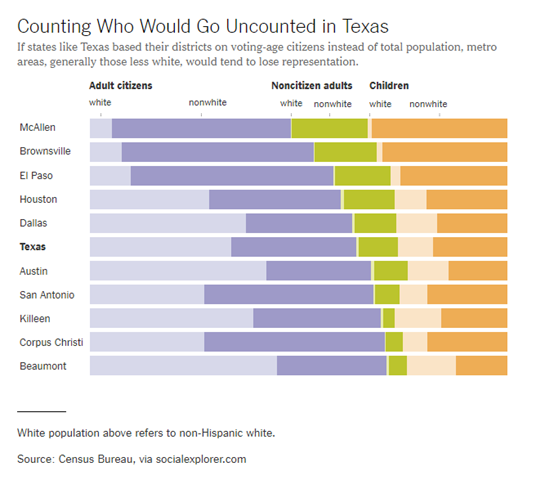
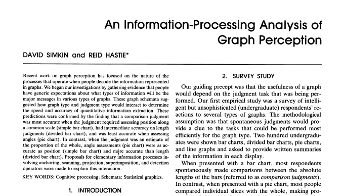
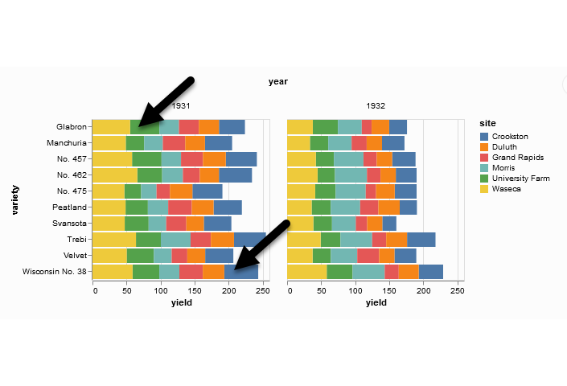
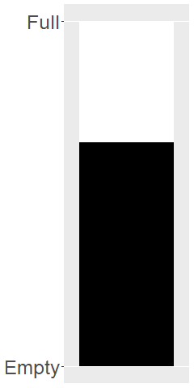
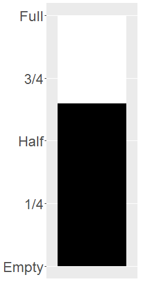
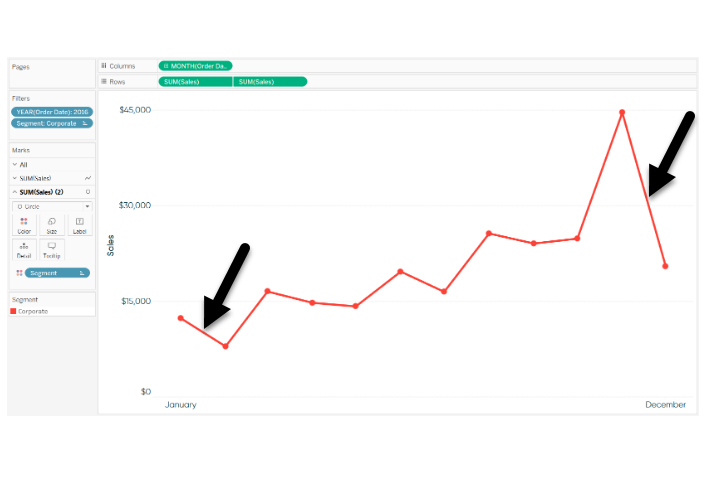

```{r setup, echo=FALSE}
knitr::opts_chunk$set(echo = FALSE)
library(dplyr)
library(ggplot2)
library(magrittr)
```

### Notes about this talk
+ This slide should not to be included in the final presentation
+ 01-points MUST come before
+ 03-lines could come before or after

### To prepare for this section

((Find a data set))

### Group exercise (1 of 2)



<div class="notes">

This is one of two graphs. It was published in

Badger, E. (2019). People Who Can’t Vote Still Count Politically in America. What if That Changes?. Retrieved June 24, 2019, from The New York Times website: https://www.nytimes.com/2019/06/22/upshot/america-who-deserves-representation.html


Split into pairs. Review the article briefly (about 5 minutes) and look at the graph. Explain to your partner what the graph is trying to show. Your partner will get a different graph and do the same thing with you listening this time.

</div>

### Group exercise (2 of 2)

((Image is not yet available.))

### A framework for graph perception



<div class="notes">

Much of the work on the psychology of perception that I will be discussing next is drawn from this 1987 article by Simkin and Hastie.

</div>


### Which is better? A bar chart...

```{r bar-chart}
marital_status <- data.frame(
  class=c("Divorced/Separated", "Married", "Single/Never married", "Widowed"),
  n=c(49, 124, 55, 22),
  prop=c(19.6, 49.6, 22.0, 8.8)
)
ggplot(marital_status, aes(x=class, y=prop)) +
  geom_col()
```

### ... or a pie chart

```{r pie-chart}
ggplot(marital_status, aes(x = "", y = prop, fill = class)) +
  geom_col() +
  coord_polar("y", start = 0) +
  theme_void()
```

### Answer. It depends.
+ What question are you trying to answer?
  + What proportion of the patients are single?
  + Are there more single or divorced patients?
  
<div class="notes">

The answer really depends on what question you are asking. There are a variety of questions that you might ask. Two are illustrated above.

You can run an experiment (people have done this) where randomize and show half of them a bar chart and half of them a pie chart. Then you ask a question, like one of the questions above. Then you note the speed and accuracy of the response. Depending on the question, sometimes pie charts give faster and more accurate answers. Sometimes bar charts give faster and more accurate answers. It turns out that the results match up nicely with what we know about the psychology of perception.

</div>

### Visual processing (1 of 3)
+ Projection
  + Shifting an object in a horizontal or vertical direction to make a comparison
+ Superimposition
  + Shifting in other directions (e.g., diagonal shifts, rotation) in order to make a comparison
  + Much harder than projection


### Projection (first yellow bar versus last yellow bar)


<div class="notes">

The position means the vertical or horizontal location. Does the first yellow bar in 1931 (Glabron seeds planted in Wasica) extend further to the right than the last yellow bar (Wisconsin No. 38 seeds planted in Wasica)?

</div>

### Superimposition (first green bar versus last blue bar)



<div class="notes">

The length means either the width or the height. Does the first green bar in 1931 (Glabron seeds planted in University Farm) extend further to the right than the last yellow bar (Wisconsin No. 38 seeds planted in Crookston)?

</div>

### Visual processing (2 of 3)
+ Scanning
  + Quantifying distance throug the use of a mental tape measure
  + Shorter distances are easier
+ Anchoring
  + Implicit or explicit development of reference points
  + Assists with scanning
  
### Scanning

```{r scanning}
png("../images/02/simon_fuel_gauge1.png", width=240, height=480)
df <- data.frame(pct=c(35, 65
                       ), x=factor(rep(1, 2)), z=factor(1:2))
ggplot(df, aes(y=pct, x=x, fill=z)) +
  geom_col(position="stack") +
  theme(legend.position="none") +
  scale_x_discrete(name=NULL, breaks=NULL) +
  scale_y_continuous(name=NULL, breaks=c(0, 100), minor_breaks=NULL, labels=c("Empty", "Full")) +
  scale_fill_manual(values=c("white", "black")) +
  theme(axis.text.y  = element_text(size=24))
quiet <- dev.off()
```


  
<div class="notes">

To understand scanning, think of a gas gauge. Usually it is a semicircular dial, but let's set up the gas gauge as a rectangle. If the level is at the top, you have a full tank. If the level is at the bottom, you have an empty tank. This gauge shows a tank that is 65% full. Trust me, I drew the gauge. It is at 65%. Now how would you estimate the gas level?

You would take a mental tape measure, starting at the bottom and measure up to where the black box ends.

Now if you were smart, you'd start at the top and scan downwards. Less distance means that you can do this faster and more accurately.

Now if you were Albert Einstein, you'd split the gauge at the halfway point and measure from the halfway point to the top of the black box. Actually, there's a little of Albert Einstein in all of us. That halfway point is something that all of us do subconciously. You did, because you recognized almost immediately that the tank was more than half full.

</div>

### Assisting scanning with anchors
  
```{r scanning-with-anchors}
png("../images/02/simon_fuel_gauge2.png", width=240, height=480)
df <- data.frame(pct=c(35, 65
                       ), x=factor(rep(1, 2)), z=factor(1:2))
ggplot(df, aes(y=pct, x=x, fill=z)) +
  geom_col(position="stack") +
  theme(legend.position="none") +
  scale_x_discrete(name=NULL, breaks=NULL) +
  scale_y_continuous(name=NULL, 
    breaks=c(0, 25, 50, 75, 100), minor_breaks=NULL, 
    labels=c("Empty", "1/4", "Half", "3/4", "Full")) +
  scale_fill_manual(values=c("white", "black")) +
  theme(axis.text.y  = element_text(size=24))
quiet <- dev.off()
```



<div class="notes">

Here's the same gas gauge, still at 65% full, but now we have added anchors at 1/4, half, and 3/4. You can read this gauge faster and more accurately, because you can scane from half up to 65% or from 3/4 down to 65%.

</div>

### Visual processing (3 of 3)
+ Visually simple tasks
  + Position
  + Length
  + Angle/slope
+ Visually demanding tasks
  + Area
  + Volume
  + Density/Saturation/Hue
  
<div class="notes">

There are a variety of perceptual tasks that you use when making comparisons within an image. These are arranged on this slide roughly in order of difficulty, with the easiest tasks at the top.

</div>

### Position (first yellow bar versus last yellow bar)


<div class="notes">

The comparison of the two yellow bars is a comparison of position. Which yellow bar extends further to the right?

</div>

### Length (first green bar versus last blue bar)


<div class="notes">

The comparison of the green and blue bars is a length comparison. The two bars start at different spots, so the position can't help you.

Length is harder to judge than position, because it involves a superimposition rather than a projection.

</div>

### Angle/slope (first month decline versus last month decline)



<div class="notes">

This graph shows sales trends over a twelve month span. If you want to assess whether the first month decline (the dip in sales between January and February) was worse than the last month decline (the dip in sales between November and December), you would probably do this by judging the angle of the first line segment to the angle of the second line segment. This is not quite as easy as a position or length judgement, but it isn't too bad either.

</div>

### Aesthetics for bars

### Summary
+ "A mapping of data to the visual aesthetics of geometries/marks" 
  + Bars are a type of geometry/mark
  + Aesthetics for bars include location, size, color
  + Stack versus dodge
+ Basic tips
  + Place comparators close

### Group exercise

+ Review the following visualization in your group.
  + Summarize what aesthetics (location, size, shape, color) appear in the graph
  + What variables map to each aesthetic?
  + What is the story that this graph is telling you?
  + Was there anything confusing?
  + Was there anything you might change?

