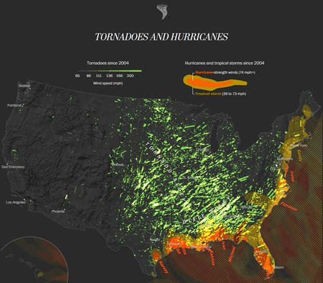

```{r setup, echo=FALSE}
knitr::opts_chunk$set(echo = FALSE)
suppressMessages(suppressWarnings(library(ggplot2)))
suppressMessages(suppressWarnings(library(magrittr)))
```

### To prepare for this section

((Just like the other sections. Find a data set. Give instructions on how to import the data into Python, R, or Tableau. Ask them to produce a VERY simple visualization.))

### Group exercise (1 of 2)




### Theory: the earth is not flat

Still in draft stage. Here are some talking points.

+ Peel off a section of an orange. Even a small piece cannot be perfectly flattened.
+ Look at the state of Colorado. It is rectangular, but the northern border is shorter than the southern border.
+ Do an imaginary trip from Seattle to Albany. NY. Same latitude, but you get there faster if you swing north into Canada. Trip from NYC to Hong Kong goes over the North Pole!!!
+ Basic geometry of a globe

### Show different perspectives
((More initial thoughts))

+ Australian map where South Pole is at the top
+ Maps the properly emphasize the size of third world countries

### Shape files
((What are they. How do you use them?))

### Google Earth
((How to download. Alternative sources for maps.))

### Points on a map

((Include simple examples and "On Your Own" exercises))

### Contours on a map

((Include simple examples and "On Your Own" exercises))

### Group exercise

((Look at the same image and article used at the beginning.))

+ What are the aesthetics?
+ What variables are mapped to these aesthetics?

### Summary

((Add material here))

### On your own

((Get a different data set. Split into groups by software, Python, R, Tableau. Ask for four different maps.))