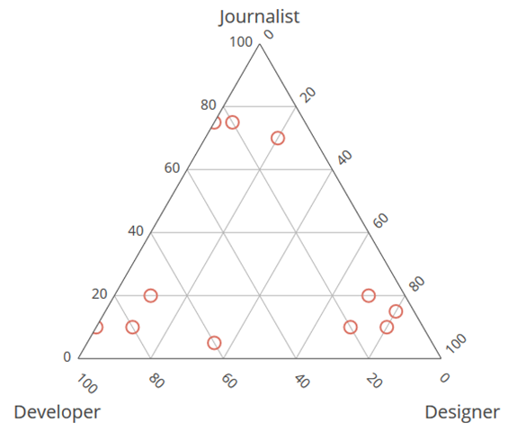
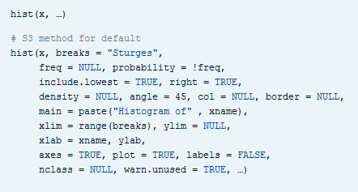

```{r setup, echo=FALSE}
knitr::opts_chunk$set(echo = FALSE)
library(ggplot2)
library(magrittr)
```

### Two short anecdotes

+ Guidelines for Good Graphics
  + Bad advice from my boss
  + My first audience
  
<div class="notes">

Before I start, I want to share a couple stories. This presentation is an update of a talk I gave back in the 1990s called Guidelines for Good Graphics. I was telling my boss about my plans for this talk and she suggested that I do some "before and after" comparisons of some graphics that she would provide. I politely declined. You hate to ignore advice from your boss, but I wasn't the sort of person who liked tearing down other people's work. I was also worried that someone would take one of my "after" pictures and show how much better they could make it look.

I'm never without an opinion, but I hope that I never get so arrogant as to think that my opinion is the final word on the matter. A lot of what I plan to talk about requires careful judgement and if your judgement differs from mine, please let me know. It makes the class more interesting.

The other story is that my first audience had a lot of psychologists in the audience. I was going to use the pyschology of perception to help decide what an effective graphic would be. I didn't like the thought of having people in the audience who probably knew more about the psychology of perception than I did. Not only would they point out things when I said something wrong, but they would point out how my toilet training when I was a child caused me to make that mistake.

</div>

### Software agnosticism

+ This course will show examples using
  + Python,
  + R, and 
  + Tableau
+ I do not play favorites
+ Use the software you like best
  + What does your boss use?
  + What do your co-workers use?
  + What software are you most comfortable with?
  
<div class="notes">

I am a big believer in software agnosticism. That means that when I teach something, I teach it with the expectation that the software used to do the assignments is software of your choosing. I have my own preferences, but those should not be your preferences.

It's a lot more work to teach a course that is not dependent on a particular software system, but I do not know what the best software choice would be for you. In this class, I will try to show examples using Python, R, and Tableau. I realize that there are other good choice, but I'm hoping that most of you will be happy with one of these three choices. Within Python, I will use the altair package. In R, I will use ggplot2. I realize that there are other graphics packages in these two languages, but altair and ggplot2 rely on modern graphics principles, so I will restrict my attention to these packages.

Tableau is a commercial product. If you don't currently have access to Tableau, the company offers a free version, Tableau Public. It has all the features of Tableau, but you have to store any data visualizations on a public server. That's just fine for someone like me who uses teaching examples with publicly available data sets. If you are using private or proprietary data, you need to pay the money for the commercial version.

If you are not sure what software package to use in this class, let me offer a few suggestions. First, your boss may have a strong opinion about what software that you should use. You can go to your boss and say "Steve Simon is a really smart guy and he says that the ggplot2 package in R is the best choice for data visualization." Try it and see what happens. Nothing, I suspect. One of the great tragedies in life is that the SSSS principle (Steve Simon Said So) carries very little weight in the real world.

If your boss doesn't care, see what most of your co-workers are using. They may not be as smart as I am (put on a false air of pride here) but they are a lot closer to your cubicle when this workshop ends and you have to find a quick answer.

There's also a comfort level here. Tableau develops its visualizations using a graphical user interface. Python and R are programming languages. A graphical interface is great for getting work done quickly. A programming language is great for reproducibility and reusability. What fits your working style better.

One more consideration. Some of you in this class are "ringers." You already know visualization better than I do because you've been doing it for longer, with bigger and more complex data sets. You're just here to see if I know one or two things that you don't already know. If you're a ringer, take the challenge of learning a new software system. It will keep you from getting too bored when I talk about all these things that you already know better than I do.

</div>
  + What fits yo
  

### No animations, interactivity, three dimensional effects, virtual reality


<div class="notes">

There are times when you do need three dimensions or animation. Here's a plot I drew for a talk back in 2015. Notice a hump in one dimension that shrinks until it is replaced by two "bunny ears" in the back. Bunny ears is a cultural reference to a practice where you sneak up behind someone with two fingers upraised with the hope that those fingers will appear above the person's head when the photo is taken, giving the person bunny ears. Anyway, those bunny ears were important and I couldn't think of a good way to emphasize this other than a three dimensional surface. But normally, I shy away from the third dimension.

I want this workshop to cover static two dimensional images. That means no z-axis for those of you with a mathematical bent, only an x-axis and a y-axis.

It also means no animation. Animation is a third dimension of time. While I have used animation from time to time, I tend to shy away from it, for reasons I'll explain in a minute.

</div>

### Stuck in a two-dimensional world


<div class="notes">

I read this book when I was ten years old, and I loved it. It's terribly mysoginistic, unfortunately, but back then I didn't know any better. All my work is going to be in Flatland.

Everything is going to be two dimensions. No z-axis, only x and y axes. I also am not going to talk about animation. This is a different third dimension, a dimension of time.

</div>

### Static two dimensional images - no distortions


<div class="notes">

Anytime you try to display a three dimensional object on a flat surface like a piece of paper or a projection screen, you get distortions. This image, the Penrose stairs, developed by Lionel and Roger Penrose in 1958, and an inspiration for much more imaginative drawings by M.C. Esher, shows how a clever person can use these distortions to create impossible objects that look deceptively real. If you are displaying three dimensional surfaces, you are constantly having to look at it from a variety of angles. What is hidden in one perspective becomes visible in a different perspective. What is easily subtle and easily overlooked in one perspective becomes a dominant feature in a different perspective.

</div>

### Static two dimensional images - fewer complications

    + Three dimensional plots are tricky. According to the Wikipedia entry on azimuth, 'In mathematics, the azimuth angle of a point in cylindrical coordinates or spherical coordinates is the anticlockwise angle between the positive x-axis and the projection of the vector onto the xy-plane.' The value of theta is defined as the azimuthal angle according to the help file of persp3D. So, assuming a colatitude (phi) of 0, the default of value of 0 for theta means that you are staring straight down the X-axis, and the value of 90 means that you are staring straight down the Y-axis."
  
<div class="notes">

Here is a note I wrote to myseslf when I was drawing the three dimensional surface with "bunny ears." I am look at this note three years later and shaking my head in amazement that I was even trying to understand this stuff back then.

</div>

*** Static two dimesional images - no distractions


<div class="notes">

I found this image on Wikipedia. It illustrates a cheap gimmick that was popular in the infancy of the World Wide Web. People back then would code their web pages directly and typed in the various html tages by hand. The one thing that everyone got really annoyed with really quickly was the blink tag. It would flash on and off repeatedly. Researchers who did usability tests on web pages back then found that end users who encountered a page with the blink tag would quicky hit the back button, if they could. If they needed something on the page desperately enough, they would cover the blinking text with one hand while trying to read the other parts of the web page.

No one uses blink tags today, but sometimes animations can produce a distracting effect. Your eye is instantly drawn towards the animation. If you try to focus on a different location, the animation draws your eye back to it repeatedly. It is next to impossible to read any static text on a page with animation.

</div>

### Static two dimensional images - focus on what's important

+ Master two dimensions first
+ Find substitutes for the third dimension
  + Panels
  + Heat maps
  + Contour plots

<div class="notes">

I like the idea of confining myself to two dimensions. You won't be able to master the complexities of a third dimension until you first understand how to display things well in two dimensions.

It's also worth the effort to try to capture the information in the third dimension using alternatives that are easily produced in a static two-dimiensional world.

</div>

### Contour plot


<div class="notes">

Here's an example of how you might convert a three dimensional surface into a contour plot.

Note to myself: This may not be the best image to use. I have some alternatives on different slides. Or I might draw an image from scratch.

</div>

### Contour plot


### Contour plot


### Ternary plot



<div class="notes">

+ Note to myself: It might be nice to place a simple example of a ternary plot here. It might also fit in better later on.

</div>

### Interactivity

+ Examples
  + Sliders
  + Hover
+ Excellent for exploratory graphics
+ Not within the scope of this talk

<div class="notes">

Note to myself: I might try to find a website or two that has interactivity, just to show what you can accomplish with sliders and hovering. But it is not something that I plan to cover in this course. Potentially, it could be a separate two hour module, but I suspect that a lot of this will be covered in the workshop on dashboards.

</div>

### Theoretical foundation of data visualization


<div class="notes">

Most of the current designers of data visualization software have based their work on the theoretical foundations of Leland Wilkinson. This includes ggplot2 in r, altair inPython, and Tableau, among others. Dr. Wilkinson wrote a book, The Grammar of Graphics, in 1999 (second edition in 2006) that laid out the principles for the development of pretty much any data visualizaton that you could imagine. The work is mathematically rigorous, and I do not recommend that you read this book unless you enjoy that sort of thing. I do want to highlight a few of the fundamental ideas in the book

</div>

### Visualization before Wilkinson (1 of 3)


<div class="notes">

Here's the help function from the program R for the barplot function. This function and the following were developed before Wilkinson's work and show the problem without using his framework.

</div>

### Visualization before Wilkinson (2 of 3)



<div class="notes">

Here's the help function from the program R for the hist function.

</div>

### Visualization before Wilkinson (3 of 3)


<div class="notes">

Here's the help function from the program R for the boxplot function. Notice how each function has a different set of arguments, listed in a different order and with different default options. This is only the beginning of the parade of confusion. There is a pie function for pie charts, a contour function for contour plots, a persp3d function for three dimensional surfaces, a stem function for stem and leaf diagrams, and many others.  

Adopting the framework developed in The Grammar of Graphics provides you with one stop shopping. It is a bit daunting at first, because it includes everything and the kitchen sink. But once you get comfortable with it, you will find that each new visualization that you try uses the same syntax, more or less. 

</div>

### Helpful resource


<div class="notes">

In this section, I am going to borrow heavily from a short course I attended at the 2019 Symposium on Statistics and Data Science. The presenters are nice enough to share their materials on their github site. You can find it easily with a google search of bergen iversion sdss2019 data visualization.

</div>

### Definition of data visualization
+ "A mapping of data to the visual aesthetics of geometries/marks" 
  + Bergen and Iverson 2019
  
<div class="notes">

A definition of visualization, based on the Grammar of Graphics framework is provided in the Bergan and Iverson presentation that I mentioned on the previous slide.

There are four nouns in this definition.

Data. I hope I don't have to define data other than to say that it is an interesting set of numbers. I won't talk about non-numeric data like text in this workshop. Ideally these numbers have enough structure that you can put them into a rectangular grid like a spreadsheet or database table.

Aesthetics is a work that Dr. Wilkinson likes, but I'm not so sure that I care for it. An aesthetic is a visual feature.

The compound noun geometries/marks is a deliberate choice of Bergen and Iverson. If you use ggplot2 in R, you will be more comfortable with the noun geometries. If you use altair in Python, or if you use Tableau, you will be more comfortable with the noun marks.

Mapping means a transformation. You are taking data and converting it into various visual features.

It will help to see some examples.

</div>
  
### Examples  
+ Geometries/marks
  + Points
  + Lines
  + Bars
+ Aesthetics
  + Position
  + Shape
  + Size
  + Color
  + Text

<div class="notes">

Think of geometries/marks are ink placed on a sheet of paper. They could represent points, lines, or bars, among other things. 

There are five (more or less) major visual properties of points, lines, and bars.

The aesthetics fall into five major classes: position, shape, size, color, and text.

Not every geometry/mark will have every possible aesthetic. Some of these aesthetics can be combined to great effect, but sometimes they work antagonistically. Do consider every possible aesthetic in your graph, but intentionally ignoring an aesthetic can sometimes work to your advantage. Some aesthetics map very nicely to continuous data, but others only work well with categorical data.

</div>

### Aesthetics for points - location (1 of 2)

```{r point-aesthetics-x}
df <- data.frame(
  x=c(110, 170),
  y=c(130, 150),
  s=c(  1,   5)
)
df$xlab <- paste0("x=", df$x)
df$ylab <- paste0("y=", df$y)
df$slab <- paste0("size=", df$s)
df$shape <- paste0("shape=", c("circle", "triangle"))
add_basics_to_plot <- function(g) {
  g +
    geom_point(size=5) + 
    expand_limits(x=c(100, 200)) +
    expand_limits(y=c(100, 200)) +
    geom_text(nudge_y=-5, size=5, color="black") +
    theme(legend.position = "none") +
    scale_x_continuous(breaks=100+20*(0:5)) +
    scale_y_continuous(breaks=100+20*(0:5)) 
}
```

```{r}
ggplot(df, aes(x=x, y=y, label=xlab)) %>%
  add_basics_to_plot
```

### Aesthetics for points - location (2 of 2)

```{r point-aesthetics-y}
ggplot(df, aes(x=x, y=y, label=ylab)) +
  geom_point(size=5) %>%
  add_basics_to_plot
```

### Aesthetics for points - shape

```{r point-aesthetics-shape}
ggplot(df, aes(x=x, y=y, shape=factor(s), label=shape))  +
  geom_point(size=5) %>%
  add_basics_to_plot
```

### Aesthetics for points - size

```{r point-aesthetics-size}
ggplot(df, aes(x=x, y=y, size=s, label=slab)) +
  geom_point() %>% add_basics_to_plot
```

### Aesthetics for points - color (1 of 2)

```{r point-aesthetics-color-1}
ggplot(df, aes(x=x, y=y, size=s, label=slab)) +
  geom_point(color=c("red", "blue")) %>% add_basics_to_plot
```


### Aesthetics for lines

### Aesthetics for bars

Position is the physical location of the geometry/mark. Since I have constrained myself to a static two-dimensional world, there are two dimensions to position. These correspond to the horizontal and vertical position, or to the x and y axes. Postion exists on a continuum. Shape is categorical. It can represent discrete values but not values on a continuum.

Size is on a continuum. Normally, you think of size as a single dimension, area, but you can vary size in both the horizontal and vertical dimension independently. I don't recommend this in most settings

</div>

### The myth of the objective visualization

### The psychology of perception

### Maps and projections